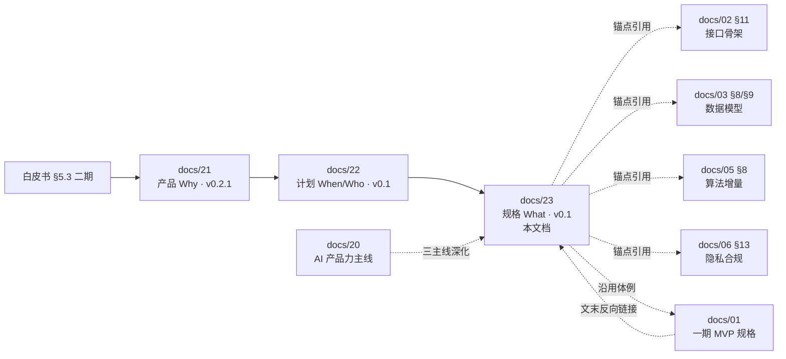

# 二期可编码规格说明书

> 版本：v0.1（评审输入稿 · 与 [`docs/22`](22-二期开发迭代计划.md) v0.1 同步落地）
> 日期：2026 年 5 月 25 日
> 关联：
>
> - 产品 Why：[`docs/21-二期产品需求规划.md`](21-二期产品需求规划.md) v0.2.1
> - 计划 When / Who：[`docs/22-二期开发迭代计划.md`](22-二期开发迭代计划.md) v0.1
> - 体例母版：[`docs/01-MVP功能需求规格说明书.md`](01-MVP功能需求规格说明书.md)（一期已上线模块的可勾验收清单母本，二期沿用其体例）
> - 接口真源：[`docs/02-API接口设计文档.md`](02-API接口设计文档.md) §11 二期接口骨架
> - 数据模型真源：[`docs/03-数据库设计文档.md`](03-数据库设计文档.md) §八 / §九 二期增量
> - 算法真源：[`docs/05-AI模型技术规格文档.md`](05-AI模型技术规格文档.md) §八 二期增量
> - 隐私合规真源：[`docs/06-数据安全与隐私合规文档.md`](06-数据安全与隐私合规文档.md) §十三 二期增量
> - 产品力主线：[`docs/20-AI引擎产品力迭代设计.md`](20-AI引擎产品力迭代设计.md)
>
> **本文档每个三级章节（§三 ~ §十）对应 [`docs/22 §五`](22-二期开发迭代计划.md) 一个 `P2-Mx-Nn` 任务**，唯一职责是把"做什么 / 验收什么 / 风险与回滚"按 docs/01 体例落到可勾选清单粒度。

---

## 目录

- [一、文档定位](#一文档定位)
- [二、与 docs/01 / docs/21 / docs/22 / docs/02 / docs/03 / docs/05 / docs/06 的关系](#二与-docs01--docs21--docs22--docs02--docs03--docs05--docs06-的关系)
- [三、M7 · AI 视频分析引擎 V2（16 任务）](#三m7--ai-视频分析引擎-v216-任务)
- [四、M8 · 教练工作台（10 任务）](#四m8--教练工作台10-任务)
- [五、M9 · 用户画像 2.0（6 任务）](#五m9--用户画像-206-任务)
- [六、M10 · 短杆 & 推杆 AI 分析（5 任务）](#六m10--短杆--推杆-ai-分析5-任务)
- [七、M11 · 课程体系 & 学习路径（6 任务）](#七m11--课程体系--学习路径6-任务)
- [八、M12 · 职业球手对比库（10 任务）](#八m12--职业球手对比库10-任务)
- [九、M13 · 球友约球 & 轻社交（10 任务）](#九m13--球友约球--轻社交10-任务)
- [十、M14 · 多端扩展 / RN App 上架（4 任务）](#十m14--多端扩展--rn-app-上架4-任务)
- [十一、跨模块约定（命名 / UI / 灰度 / 错误码 / 文档同步）](#十一跨模块约定命名--ui--灰度--错误码--文档同步)
- [十二、文档变更记录](#十二文档变更记录)

---

## 一、文档定位

| 项 | 说明 |
|---|------|
| **是什么** | 把 [`docs/22 §五`](22-二期开发迭代计划.md) 67 个 `P2-Mx-Nn` 任务按 [`docs/01`](01-MVP功能需求规格说明书.md) 体例展开为 **可勾选 FR / NFR / AC / 灰度 / 文档同步** 清单 |
| **不是什么** | 不复制 docs/21 的「为什么做」与产品边界；不重复 docs/02 / docs/03 的接口字段表 / 表结构 DDL（**只用 §X.Y 锚点引用**）；不替代 docs/22 的 Phase 节奏与依赖矩阵 |
| **谁读** | 工程 leader / 模块负责人在领任务时按 FR / AC 自检；测试 / QA 按 AC 设计回归用例；产品 review 验收时按本文件勾选 |
| **更新节奏** | docs/22 评审通过后转 v1.0；每个 `P2-Mx-Nn` 进 Phase 时由负责人就地补充实现细节（commit 信息引用本文档 §X.Y）；不再回填 docs/22 |
| **命名空间** | `P2-Mx-Nn` / `FR-x` / `NFR-x` / `AC-x` / `DEP-NN` / `RISK-NN`，与一期 `O-*` / `ENG-*` / `DOC-*` / `Q-*` 完全隔离 |

### 1.1 每一节强制结构（与 [`docs/22 §七`](22-二期开发迭代计划.md#七验收口径骨架与一期一致--落到-docs01-体例) 一致）

> 每个 `P2-Mx-Nn` 章节按以下 8 个子标题落地，**任何一节都不许整段省略**（无内容写 "（无）" 并附 1 行原因）。

```markdown
### X.Y P2-Mx-Nn · 任务标题

> 来源 docs/22 §5.x / 优先级 / Phase / 估时 / 依赖 / 负责

#### 用户场景
#### 功能需求（FR）
- [ ] FR-1 …
#### 接口契约
- [ ] 与 docs/02 §11.x 对齐
#### 数据模型
- [ ] 与 docs/03 §8.x 对齐
#### NFR
#### 验收口径（AC）
- [ ] AC-1 …
#### 灰度 / 回滚
#### 文档同步
- [ ] docs/02 §x.y / docs/03 §x.y / AGENTS.md / 白皮书
```

### 1.2 写作硬约束（避免文档塌方）

| 约束 | 反例（禁止） | 正例（必须） |
|------|------|------|
| FR / AC 可勾、可量化 | "优化体验 / 完善流程 / 性能更好" | "首屏 < 1.5s / 准确率 ≥90% / IoU ≥0.8 / 24h SLA ≥90%" |
| 接口 / 数据模型引用 | 整段抄 docs/02 / docs/03 字段表 | 只写「与 docs/02 §11.2.3 对齐」+ 1-3 行 highlight |
| 依赖描述 | "需要先做完教练相关功能" | "依赖 P2-M8-03 / DEP-02" |
| 灰度策略 | "上线后观察" | "engine_version 灰度 5%→25%→50%→100%，每档观察 ≥3 天" |
| 链接 | 裸 URL / 锚点拼错 | `[显示文本](相对路径#锚点)`，锚点遵循 docs/22 命名规范 |

---

## 二、与 docs/01 / docs/21 / docs/22 / docs/02 / docs/03 / docs/05 / docs/06 的关系



| 文档 | 与本文档关系 | 谁覆盖谁 |
|------|--------------|---------|
| [`docs/21`](21-二期产品需求规划.md) | **上游 · Why** | 21 调整→23 跟进；23 不反向影响 21 |
| [`docs/22`](22-二期开发迭代计划.md) | **同级 · When/Who** | 22 § 五 / § 六任务变动→23 §三~§十 跟进；23 不反向修改 22 |
| [`docs/02`](02-API接口设计文档.md) | **真源 · 接口** | 23 只引用 docs/02 §11.x 锚点；接口字段冲突时以 docs/02 为准；23 仅记录"FR 决定了哪些接口字段" |
| [`docs/03`](03-数据库设计文档.md) | **真源 · 数据模型** | 23 只引用 docs/03 §8 / §9 锚点；DDL 冲突时以 docs/03 为准 |
| [`docs/05`](05-AI模型技术规格文档.md) | **真源 · 算法** | M7 章节大量引用 docs/05 §八；算法细节冲突时以 docs/05 为准 |
| [`docs/06`](06-数据安全与隐私合规文档.md) | **真源 · 隐私合规** | M8 / M9 / M12 / M13 章节大量引用 docs/06 §十三；冲突时以 docs/06 为准 |
| [`docs/01`](01-MVP功能需求规格说明书.md) | **体例母版** | docs/01 只覆盖一期 MVP（M1-M6）；二期写到 docs/23，docs/01 文末加反向链接（见 §收尾 commit） |
| [`docs/19`](19-产品开发迭代计划-当前队列.md) | **关联 · 当期队列** | Phase 2.0 启动后由 PM 在 docs/19 Q-E1 加 docs/23 链接 |
| [`docs/20`](20-AI引擎产品力迭代设计.md) | **关联 · 产品力主线** | M7 章节交叉引用 docs/20 §6.2 / §6.3 |
| [`AGENTS.md`](../AGENTS.md) | **关联 · AI 协同约定** | docs/22 转正后由维护者把 "二期可编码规格 → docs/23" 加到 §9（已加 docs/21 / docs/22；docs/23 待收尾 commit 补） |

### 2.1 跨文档锚点速查（高频）

| 主题 | 主真源章节 |
|------|----------|
| M7 V2 字段（engine_version / analysis_mode / analysis_confidence / new_features_payload / camera_angle_offset_deg / engine_warnings） | [`docs/03 §8.1`](03-数据库设计文档.md#81-m7-v2--swing_analyses-增量列) + [`docs/05 §八`](05-AI模型技术规格文档.md#八二期-ai-引擎-v2-技术规格增量v01-草案) + [`docs/02 §11.1`](02-API接口设计文档.md#111-m7-v2--既有接口字段增量) |
| M8 教练 6 张表 | [`docs/03 §8.2`](03-数据库设计文档.md) + [`docs/02 §11.2`](02-API接口设计文档.md#112-m8-教练工作台-v1coach) + [`docs/06 §十三`](06-数据安全与隐私合规文档.md) |
| M9 user_profiles_v2 / user_clubs | [`docs/03 §8.3`](03-数据库设计文档.md) + [`docs/02 §11.3`](02-API接口设计文档.md#113-m9-画像-20-v1usersmeprofile-v2) |
| M11 课程 4 张表 | [`docs/03 §8.4`](03-数据库设计文档.md) + [`docs/02 §11.5`](02-API接口设计文档.md#115-m11-课程体系-v1courses) |
| M12 球手 6 张表 | [`docs/03 §8.5`](03-数据库设计文档.md) + [`docs/02 §11.6`](02-API接口设计文档.md#116-m12-职业球手对比-v1pros) |
| M13 约球 5 张表 | [`docs/03 §8.6`](03-数据库设计文档.md) + [`docs/02 §11.7`](02-API接口设计文档.md#117-m13-球友约球-v1meetup) + [`docs/06 §十三`](06-数据安全与隐私合规文档.md) |
| Drill 视频专属素材重建 | [`docs/release-notes/drill-demo-video-revamp.md`](release-notes/drill-demo-video-revamp.md)（DEP-03） |
| 灰度策略通用规约 | [`docs/02 §11.8`](02-API接口设计文档.md#118-灰度策略--通用规约) |
| UI / 交互一致性 | [`docs/22 §九`](22-二期开发迭代计划.md#九ui--交互一致性约束二期延续一期) + 白皮书 §7.2 |

---

## 三、M7 · AI 视频分析引擎 V2（16 任务）

> 详 [`docs/22 §5.1`](22-二期开发迭代计划.md#51-m7--ai-视频分析引擎-v2p0--125-156-pw) · 优先级 P0 · 估时 125-156 PW · Phase 2.0 ~ 2.5
>
> **模块战略**：M7 是二期核心护城河，对应 [`docs/20`](20-AI引擎产品力迭代设计.md) 三主线（Trust / Calibration / Coach Consensus）的全面落地。本节 16 个任务按 [`docs/22 §5.1`](22-二期开发迭代计划.md#51-m7--ai-视频分析引擎-v2p0--125-156-pw) PLAN-ID 顺序展开。
>
> **公共依赖**：DEP-01（ECS v2 标定集） / DEP-02（教练 BD） / DEP-06（拍摄团队）
> **公共数据模型锚点**：[`docs/03 §8.1`](03-数据库设计文档.md#81-m7-v2--swing_analyses-增量列) `swing_analyses` 增量列 + [`docs/03 §9.1`](03-数据库设计文档.md#91-swing_analysesnew_features_payloadm7-v2) `new_features_payload` JSONB schema
> **公共接口锚点**：[`docs/02 §11.1`](02-API接口设计文档.md#111-m7-v2--既有接口字段增量) 既有接口字段增量
> **公共算法锚点**：[`docs/05 §八`](05-AI模型技术规格文档.md#八二期-ai-引擎-v2-技术规格增量v01-草案)
> **灰度统一策略**：所有 M7 任务受 P2-M7-14 `engine_version` 灰度（5%→25%→50%→100%，每档 ≥3 天）；V1 保留 ≥6 个月。

### 3.1 P2-M7-01 · ECS v2 标定集采集与标注

> 来源 [`docs/22 §5.1`](22-二期开发迭代计划.md#51-m7--ai-视频分析引擎-v2p0--125-156-pw) / 优先级 P0 / Phase 2.0-2.1 / 估时 10 PW / 依赖 DEP-01 + DEP-02 / 负责：算法 + 教研 BD

#### 用户场景

不直接面向 C 端用户。本任务是 M7-04 / M7-05 / M7-07 / M7-08 / M7-10 所有评分与诊断算法的"参考真值"来源；ECS v2 标定集采集质量直接决定二期评分公平性（详 [`docs/20 §五`](20-AI引擎产品力迭代设计.md#五世界顶尖样本标定集elite-calibration-set-ecs)）。

#### 功能需求（FR）

- [ ] FR-1 按 4 杆型分桶采集顶尖样本：Driver / Iron / Wedge / Putter 各 ≥20 段，总计 ≥80 段
- [ ] FR-2 每段 metadata：球手 ID（或匿名编号）/ 杆型 / 机位（face_on / dtl）/ 拍摄帧率 / 拍摄设备 / source_credit
- [ ] FR-3 每段标注：阶段边界（setup / top / impact / follow 帧号）+ 关键特征值（人工测量 tempo_ratio / 接力时差等）
- [ ] FR-4 标注双盲：≥2 位资深教练独立标注，差异 > 阈值的样本走仲裁
- [ ] FR-5 数据集走 [`docs/06`](06-数据安全与隐私合规文档.md) 数据安全规范（脱敏 + 加密落 MinIO，不出公网）
- [ ] FR-6 ECS v2 维护 `ecs_metadata.json` 单文件 manifest，git 跟踪；视频文件走 LFS / 对象存储不进 git

#### 接口契约

- 无外部接口。内部数据集消费由 `ai_engine/calibration/` 模块直接读 manifest

#### 数据模型

- 无新表。manifest 走文件系统 + git；样本归档走对象存储

#### NFR

- 标注吞吐：≥10 段 / 教练 / 周
- 标注一致性：阶段边界 ±3 帧；特征值差异 < 5%
- 数据集版本：按 `ecs_v2.0.0` 语义版本管理；新增样本走 minor 升级

#### 验收口径（AC）

- [ ] AC-1 ECS v2 manifest 提交，含 ≥80 段，4 杆型分桶覆盖率 100%
- [ ] AC-2 双盲标注一致性报告产出，阶段边界 IoU ≥ 0.9
- [ ] AC-3 [`docs/20 §五`](20-AI引擎产品力迭代设计.md#五世界顶尖样本标定集elite-calibration-set-ecs) 同步更新 ECS v2 章节
- [ ] AC-4 至少一次回归脚本跑 ECS v2 ⇒ 一期 V1 引擎，作为基线分数表
- [ ] AC-5 教练 BD 签约清单（≥5 位）入档，含 1 位 PGA + 1 位中国大区

#### 灰度 / 回滚

- 数据集采集本身不上线；纯研发资产
- 单条样本被投诉时 24h 内从 manifest 移除并备份归档

#### 文档同步

- [ ] [`docs/20 §五`](20-AI引擎产品力迭代设计.md#五世界顶尖样本标定集elite-calibration-set-ecs) 更新 ECS v2 进度
- [ ] [`docs/06`](06-数据安全与隐私合规文档.md) §十三 教练样本采集合规章节复核
- [ ] [`docs/22 §四`](22-二期开发迭代计划.md#四前置依赖phase-20-前必须就绪) DEP-01 / DEP-02 状态从「待启」改为「进行中」/「已就绪」

### 3.2 P2-M7-02 · 视频读取增强

> 来源 [`docs/22 §5.1`](22-二期开发迭代计划.md#51-m7--ai-视频分析引擎-v2p0--125-156-pw) / 优先级 P0 / Phase 2.1 / 估时 8 PW / 依赖 — / 负责：AI 工程

#### 用户场景

用户用 iPhone 15 / 华为 Mate 60 / iPhone 慢动作 240fps / 安卓厂商 HDR 模式拍视频，**一次拍摄就能成功上传分析**，不必"换格式重拍"。

#### 功能需求（FR）

- [ ] FR-1 支持 HEVC / H.265 / VP9 解码（详 [`docs/05 §8.1`](05-AI模型技术规格文档.md#81-视频读取增强对应-22-模块--升级)）
- [ ] FR-2 支持 24 / 30 / 60 / 120 / 240 fps 原生输入，统一归一化到 60fps 时间轴
- [ ] FR-3 支持 10-bit HDR → sRGB 转换（libzscale）
- [ ] FR-4 慢动作元数据识别：读 mov `nominal_fps`，归一化到真实时间轴（避免 240fps 慢动作被当成 60fps 普通片）
- [ ] FR-5 竖屏短边阈值按设备类型分层（720 / 1080）
- [ ] FR-6 音频通道保留（不上传到对象存储，仅供 M8 教练语音批注对齐）

#### 接口契约

- [ ] 与 [`docs/02 §11.1`](02-API接口设计文档.md#111-m7-v2--既有接口字段增量) `engine_warnings[]` 字段对齐：解码降级 / 帧率舍入信息写入

#### 数据模型

- [ ] 与 [`docs/03 §8.1`](03-数据库设计文档.md#81-m7-v2--swing_analyses-增量列) `engine_warnings` JSONB 列对齐

#### NFR

- 10s 240fps 慢动作视频解码 + 归一化 ≤ 8s（CPU）
- Dockerfile 编入完整 ffmpeg codec（libx265 / libvpx / libzscale）后镜像膨胀 ≤ +200MB

#### 验收口径（AC）

- [ ] AC-1 推荐机型矩阵（详 [`docs/05 §2.2`](05-AI模型技术规格文档.md#22-模块视频预处理) 拓展）≥30 段真机回归通过率 ≥95%
- [ ] AC-2 HEVC / 10-bit HDR / 240fps 各至少 5 段 sample 通过完整 pipeline
- [ ] AC-3 解码失败时返回 `50120` 错误码，客户端展示中文文案"视频格式暂不支持"

#### 灰度 / 回滚

- ffmpeg 镜像独立 tag `ai-engine:v2.0-ffmpeg`，灰度切流可只切容器 image 不动代码
- 回滚：恢复 `ai-engine:v1.x` 镜像

#### 文档同步

- [ ] [`docs/05 §2.2`](05-AI模型技术规格文档.md#22-模块视频预处理) 推荐机型矩阵扩到 V2
- [ ] [`docs/02 §11.1`](02-API接口设计文档.md#111-m7-v2--既有接口字段增量) 错误码 `50120` 文案

### 3.3 P2-M7-03 · 错误码扩展（从 50100-50105 扩到 20+）

> 来源 [`docs/22 §5.1`](22-二期开发迭代计划.md#51-m7--ai-视频分析引擎-v2p0--125-156-pw) / 优先级 P0 / Phase 2.1 / 估时 2 PW / 依赖 P2-M7-02 / 负责：AI 工程 + 客户端

#### 用户场景

用户上传失败 / 分析失败时，**看到的不是"未知错误"而是带"如何重拍"建议的中文文案**，自助率提升，客服压力下降。

#### 功能需求（FR）

- [ ] FR-1 错误码段沿用一期 5xxxx 段（详 §11.4），新增 ≥15 个码（含 50120-50123 + 视频时长 / 分辨率 / 光照 / 关键点缺失等）
- [ ] FR-2 每个码必须有：英文 enum + 中文文案 + "如何重拍"建议 + 严重度（fatal / warning / info）
- [ ] FR-3 客户端 `analysisEngineErrors.ts` 同步映射，无对应文案 fallback `服务暂时不可用，请稍后再试`
- [ ] FR-4 precheck 阶段（`POST /precheck`）尽量在上传前命中，减少无效上传

#### 接口契约

- [ ] 与 [`docs/02 §11.1`](02-API接口设计文档.md#111-m7-v2--既有接口字段增量) 错误码表对齐；新增码必须先入 docs/02
- [ ] 与 [`docs/02 §1.3.1`](02-API接口设计文档.md#131-ai-engine-内部--post-precheckO-08v1212) precheck 响应字段对齐

#### 数据模型

- 无新列

#### NFR

- 客户端文案 ≤30 字，"如何重拍" ≤80 字

#### 验收口径（AC）

- [ ] AC-1 错误码总数 ≥20；每个码都有中文文案 + 重拍建议
- [ ] AC-2 客户端 `analysisEngineErrors.ts` 100% 覆盖；缺文案 PR 阻断
- [ ] AC-3 真机回归：故意拍 3s / 暗光 / 抖动 / 半身 4 种视频，4 个错误码都能命中且文案可读

#### 灰度 / 回滚

- 错误码 enum 仅扩展不收紧，客户端可向前兼容
- 灰度阶段所有新码先告警（log + Sentry），3 天稳定后再开用户可见文案

#### 文档同步

- [ ] [`docs/02 §11.1`](02-API接口设计文档.md#111-m7-v2--既有接口字段增量) 错误码表
- [ ] [`docs/01 §4.4`](01-MVP功能需求规格说明书.md#44-视频质量检测) 视频质量检测章节追加二期增量提示（链接到 docs/23 §3.3）

### 3.4 P2-M7-04 · 机位独立标尺（face_on / dtl 双套）

> 来源 [`docs/22 §5.1`](22-二期开发迭代计划.md#51-m7--ai-视频分析引擎-v2p0--125-156-pw) / 优先级 P0 / Phase 2.1 / 估时 8 PW / 依赖 P2-M7-01 / 负责：算法

#### 用户场景

用户在 face_on（正对镜头）和 down_the_line（沿挥杆线背后）两种机位拍同一动作，**得到的综合分波动 ≤5 分**；今天上传时镜头不正、稍偏 10°-15° 不会被错判。

#### 功能需求（FR）

- [ ] FR-1 机位检测：用关键点几何（肩 / 髋 / 脚的相对位置）自动判断 `camera_angle ∈ {face_on, dtl, oblique}`
- [ ] FR-2 偏角度量：输出 `camera_angle_offset_deg`（详 [`docs/03 §8.1`](03-数据库设计文档.md#81-m7-v2--swing_analyses-增量列)）
- [ ] FR-3 双套 `PHASE_WEIGHTS_BY_ANGLE`：face_on 权重侧重躯干旋转 / 头部稳定；dtl 侧重 swing plane / 脊柱角
- [ ] FR-4 偏角 ≤15° 时光流补偿（轻量 warp），否则降低 `analysis_confidence` 并提示"镜头偏角较大，建议重拍"
- [ ] FR-5 双机位 ideal 范围分别校准，禁止机位间套用

#### 接口契约

- [ ] 与 [`docs/02 §11.1`](02-API接口设计文档.md#111-m7-v2--既有接口字段增量) `camera_angle_offset_deg` 响应字段对齐

#### 数据模型

- [ ] 与 [`docs/03 §8.1`](03-数据库设计文档.md#81-m7-v2--swing_analyses-增量列) `camera_angle_offset_deg` 列对齐

#### NFR

- 机位检测准确率 ≥95%（ECS v2 验证集）
- 光流补偿延迟 ≤2s

#### 验收口径（AC）

- [ ] AC-1 同一段挥杆在 0° / 10° / 20° 偏角下综合分波动 ≤5 分
- [ ] AC-2 ECS v2 验证集上机位识别准确率 ≥95%
- [ ] AC-3 偏角 >15° 时 `analysis_confidence` 自动降到 < 0.5 并触发"建议重拍"提示

#### 灰度 / 回滚

- 双套标尺通过 `engine_version` 灰度（P2-M7-14）
- 回滚到 V1：忽略 `camera_angle_offset_deg`，按 V1 单套权重打分

#### 文档同步

- [ ] [`docs/05 §2.6`](05-AI模型技术规格文档.md#26-模块动作评分) 评分权重章节追加 V2 双套说明
- [ ] [`docs/20 §3.2`](20-AI引擎产品力迭代设计.md#32-标尺与公平性calibration) Calibration 主线进度同步

### 3.5 P2-M7-05 · 球杆差异化标尺（Driver / Iron / Wedge / Hybrid 独立 ideal）

> 来源 [`docs/22 §5.1`](22-二期开发迭代计划.md#51-m7--ai-视频分析引擎-v2p0--125-156-pw) / 优先级 P0 / Phase 2.1 / 估时 8 PW / 依赖 P2-M7-01 / 负责：算法

#### 用户场景

用户用 Driver 拍一段挥杆，**报告页明确写"按 Driver 应有的标准评分"**，不再被 Iron 的标尺套用而误判"杆面过于打开"。

#### 功能需求（FR）

- [ ] FR-1 新增 `ai_engine/pipeline/club_profiles.py`，提供 `to_club_category(club_type) -> {driver,wood,hybrid,iron,wedge,putter}`（**派生**自一期 `swing_analyses.club_type`，**不**新增 DB 列；详 [`docs/05 §8.4`](05-AI模型技术规格文档.md#84-球杆差异化标尺对应-25--26-升级)）
- [ ] FR-2 `PHASE_WEIGHTS_BY_CATEGORY` 提供至少 5 套独立权重（driver / wood / hybrid / iron / wedge；putter 走 P2-M7-11 独立 pipeline）
- [ ] FR-3 关键特征（站位宽 / 击球点位置 / 节奏比 / swing plane）的 ideal 范围按 category 覆盖
- [ ] FR-4 报告 UI（与客户端联动）展示"按你的 {club_display_name} 评分"
- [ ] FR-5 ECS v2 必须按球杆分桶覆盖（每杆型 ≥20 段，与 P2-M7-01 联动）

#### 接口契约

- [ ] 与 [`docs/02 §11.1`](02-API接口设计文档.md#111-m7-v2--既有接口字段增量) 响应字段 `club_category` 对齐（应用层派生，不入库）

#### 数据模型

- 无新列（`club_type` 字段复用一期，详 [`docs/03 §8.1`](03-数据库设计文档.md#81-m7-v2--swing_analyses-增量列) 复用提示）

#### NFR

- club_profiles 模块零外部依赖（pure Python），可独立单测
- 派生函数 `to_club_category` 100% 覆盖一期 `club_type` 所有枚举值

#### 验收口径（AC）

- [ ] AC-1 4 大杆型至少 3 套独立 ideal 范围；同一动作不同 club_type 评分差异 ≥10 分（合理体现差异化）
- [ ] AC-2 客户端报告页明示"按你的 {球杆} 评分"文案
- [ ] AC-3 单测覆盖率 ≥90%（`tests/pipeline/test_club_profiles.py`）

#### 灰度 / 回滚

- 通过 `engine_version` 灰度（P2-M7-14）
- 回滚：club_profiles 模块禁用，PHASE_WEIGHTS 回退一期单一套

#### 文档同步

- [ ] [`docs/05 §8.4`](05-AI模型技术规格文档.md#84-球杆差异化标尺对应-25--26-升级) 已就位；进 Phase 实现时补"实际权重表"附录
- [ ] [`docs/20 §3.2`](20-AI引擎产品力迭代设计.md#32-标尺与公平性calibration) Calibration 主线进度同步

### 3.6 P2-M7-06 · 置信度上链路化（特征 + 诊断 + 整体三层）

> 来源 [`docs/22 §5.1`](22-二期开发迭代计划.md#51-m7--ai-视频分析引擎-v2p0--125-156-pw) / 优先级 P0 / Phase 2.1 / 估时 5 PW / 依赖 P2-M7-04 / 负责：算法

#### 用户场景

用户上传一段光线差 / 角度偏 / 关键点丢失严重的视频，**报告页强引导"建议重拍"**，而不是给一个低分让用户困惑；高置信度报告则明确"高可信"。

#### 功能需求（FR）

- [ ] FR-1 三层置信度：每特征 `feature_confidence` + 每诊断 `issue_confidence` + 整体 `analysis_confidence`（详 [`docs/05 §8.8`](05-AI模型技术规格文档.md#88-置信度上链路化对应-docs20-31-trust-主线)）
- [ ] FR-2 诊断置信度分档：>0.85 "确诊"展示 / 0.6-0.85 "倾向"展示 / <0.6 隐藏到"非完美建议"折叠区
- [ ] FR-3 整体置信度 < 0.5 → 报告页强引导"建议重拍" + 一键重拍按钮
- [ ] FR-4 置信度计算来源透明：关键点 visibility 平均值 / 阶段分割边界稳定性 / 偏角程度等
- [ ] FR-5 报告页 UI 加置信度小标识（高/中/低色块），与 [`docs/20 §3.1`](20-AI引擎产品力迭代设计.md#31-可信度trust) Trust 主线对齐

#### 接口契约

- [ ] 与 [`docs/02 §11.1`](02-API接口设计文档.md#111-m7-v2--既有接口字段增量) `analysis_confidence` 响应字段对齐

#### 数据模型

- [ ] 与 [`docs/03 §8.1`](03-数据库设计文档.md#81-m7-v2--swing_analyses-增量列) `analysis_confidence` 列对齐
- [ ] 特征 / 诊断置信度写入 `new_features_payload` 与 `detected_issues` JSONB（详 [`docs/03 §9.1`](03-数据库设计文档.md#91-swing_analysesnew_features_payloadm7-v2)）

#### NFR

- 置信度计算耗时 < 100ms / 视频
- 报告页置信度展示不阻塞首屏渲染

#### 验收口径（AC）

- [ ] AC-1 三层置信度全链路输出，可在 `GET /v1/analyses/{id}` 响应观察到
- [ ] AC-2 故意上传暗光视频 → `analysis_confidence` < 0.5 → 报告页出现"建议重拍"提示
- [ ] AC-3 客服反馈"我的分数低但报告没解释为什么"案例下降 ≥50%（对比一期 Q-D1 ENG-04 留存数据）

#### 灰度 / 回滚

- 通过 `engine_version` 灰度（P2-M7-14）
- 回滚：默认所有报告 `analysis_confidence=1.0`，客户端隐藏"重拍引导"

#### 文档同步

- [ ] [`docs/05 §8.8`](05-AI模型技术规格文档.md#88-置信度上链路化对应-docs20-31-trust-主线) 已就位
- [ ] [`docs/20 §3.1`](20-AI引擎产品力迭代设计.md#31-可信度trust) Trust 主线进度同步

### 3.7 P2-M7-07 · 阶段分割算法 V2（多信号融合 + 轻量神经网络 + V1 fallback）

> 来源 [`docs/22 §5.1`](22-二期开发迭代计划.md#51-m7--ai-视频分析引擎-v2p0--125-156-pw) / 优先级 P0 / Phase 2.2 / 估时 12 PW / 依赖 P2-M7-01 / 负责：算法

#### 用户场景

用户拍慢挥 / 试挥 / 短挥杆视频，**不再被误判为"未检测到挥杆"**（NoSwingError）；多次挥杆视频能识别所有挥杆区间。

#### 功能需求（FR）

- [ ] FR-1 多信号融合：主手腕速度峰 + 杆头位置（若 P2-M7-09 启用）+ 双脚 y 压力变化代理 + 髋部旋转速度（详 [`docs/05 §8.2`](05-AI模型技术规格文档.md#82-阶段分割算法-v2对应-24)）
- [ ] FR-2 完整性检测：setup→top→impact→follow 完整序列；试挥（无 impact）不入正式记录
- [ ] FR-3 `MIN_DURATION_SEC` 从 2.0 → 1.5
- [ ] FR-4 轻量 1D CNN（或 Transformer-tiny）推理阶段软概率
- [ ] FR-5 启发式硬约束：top 必须在 setup 与 impact 之间
- [ ] FR-6 V1 启发式保留为 fallback：神经网络失败 / 置信度低时自动回退
- [ ] FR-7 训练数据走 ECS v2（P2-M7-01）+ 一期生产数据回流（≥10K 段）

#### 接口契约

- 无新接口；阶段边界写入 `swing_analyses.phase_scores` JSONB（一期既有字段，扩字段）

#### 数据模型

- [ ] 与 [`docs/03 §4.2`](03-数据库设计文档.md#42-swing_analysesphase_scores) `phase_scores` JSONB 兼容（追加 `segmentation_method ∈ {v1_heuristic, v2_nn}` 字段）

#### NFR

- 阶段分割 + 推理总耗时 ≤2s（10s 视频）
- V2 模型体积 ≤10MB（CPU 推理友好）
- V1 fallback 切换 < 50ms

#### 验收口径（AC）

- [ ] AC-1 ECS v2 验证集上阶段 IoU ≥0.8，准确率 ≥90%
- [ ] AC-2 一期反馈的 `NoSwingError` Top 100 视频在 V2 上 ≥70% 成功识别
- [ ] AC-3 试挥不入正式记录的成功率 ≥85%
- [ ] AC-4 神经网络推理失败自动回退 V1；V1 也失败才报 50100 `NoSwingError`

#### 灰度 / 回滚

- `engine_version` 灰度（P2-M7-14）：5% → 25% → 50% → 100%
- 灰度期失败率 > V1 基线 1.5x → 自动冻档并报警
- 回滚：禁用神经网络分支，纯走 V1 启发式

#### 文档同步

- [ ] [`docs/05 §8.2`](05-AI模型技术规格文档.md#82-阶段分割算法-v2对应-24) 已就位；进 Phase 实现补"模型架构 + 训练 recipe"附录

### 3.8 P2-M7-08 · 新特征 5 个（节奏 / 节拍稳定 / 重心 / 接力 / 头部稳定）

> 来源 [`docs/22 §5.1`](22-二期开发迭代计划.md#51-m7--ai-视频分析引擎-v2p0--125-156-pw) / 优先级 P0 / Phase 2.2 / 估时 10 PW / 依赖 P2-M7-07 / 负责：算法

#### 用户场景

用户在报告页展开"动力学详情"折叠区，**看到 5 个新维度**：节奏比、节拍稳定度、重心转移、运动链接力、头部稳定，并附自然语言点评。

#### 功能需求（FR）

- [ ] FR-1 5 个新特征按 [`docs/05 §8.3`](05-AI模型技术规格文档.md#83-新特征矩阵对应-25-升级) 表计算：
  - `tempo_ratio` = backswing_frames / downswing_frames（期望 3:1，容忍 2.5-3.5）
  - `tempo_consistency` = 多次挥杆 tempo 标准差
  - `pressure_shift_quality` = 足部 y / 髋部 x 偏移代理
  - `kinematic_sequence_quality` = 4 段速度峰时差（pelvis→torso→arms→wrists）
  - `head_stability` = 鼻关键点位移方差（< 20px @720p）
- [ ] FR-2 每个特征输出 `{value, score (0-100), narrative}` 三元组
- [ ] FR-3 写入 `swing_analyses.new_features_payload` JSONB（详 [`docs/03 §9.1`](03-数据库设计文档.md#91-swing_analysesnew_features_payloadm7-v2)）
- [ ] FR-4 报告 UI 展示在"动力学详情"折叠区（默认折叠，避免吓退用户）
- [ ] FR-5 LLM 报告渲染时引用新特征做点评（与 [`docs/05 §3.3`](05-AI模型技术规格文档.md#33-建议文案生成) 对齐）

#### 接口契约

- [ ] 与 [`docs/02 §11.1`](02-API接口设计文档.md#111-m7-v2--既有接口字段增量) `new_features` 响应字段对齐

#### 数据模型

- [ ] 与 [`docs/03 §9.1`](03-数据库设计文档.md#91-swing_analysesnew_features_payloadm7-v2) JSONB schema 对齐

#### NFR

- 5 个特征计算总耗时 ≤500ms（10s 视频）
- 每个 narrative ≤80 字，避免冗长

#### 验收口径（AC）

- [ ] AC-1 5 个新特征在报告"动力学详情"折叠区可见
- [ ] AC-2 ECS v2 标杆样本上：tempo_ratio 误差 < 0.2 / head_stability 误差 < 5px
- [ ] AC-3 LLM 报告至少引用 1 个新特征做点评
- [ ] AC-4 折叠区默认折叠，用户点击展开率 ≥30%（埋点验证）

#### 灰度 / 回滚

- 通过 `engine_version` 灰度（P2-M7-14）
- 回滚：`new_features_payload` 字段输出空对象，报告页折叠区不展示

#### 文档同步

- [ ] [`docs/05 §8.3`](05-AI模型技术规格文档.md#83-新特征矩阵对应-25-升级) 已就位
- [ ] [`docs/03 §9.1`](03-数据库设计文档.md#91-swing_analysesnew_features_payloadm7-v2) JSONB schema 已就位

### 3.9 P2-M7-09 · 杆 / 球追踪（best-effort · YOLO 微调）

> 来源 [`docs/22 §5.1`](22-二期开发迭代计划.md#51-m7--ai-视频分析引擎-v2p0--125-156-pw) / 优先级 P1 / Phase 2.2 / 估时 12 PW / 依赖 P2-M7-01 / 负责：算法

#### 用户场景

用户视频中杆识别成功时，**报告页出现"看到了杆"标签 + swing plane 可视化**；识别失败时静默回退，不影响主流程。

#### 功能需求（FR）

- [ ] FR-1 YOLO-v8 微调（小白盒标注 200 段视频）→ 输出杆头 / 杆身位置（详 [`docs/05 §8.6`](05-AI模型技术规格文档.md#86-杆--球追踪best-effort对应-25-升级--p1)）
- [ ] FR-2 击球瞬间杆面角度估计（杆身角度差分）
- [ ] FR-3 swing plane 3D 拟合（杆头轨迹平面）
- [ ] FR-4 球识别**二期不做**（详 [`docs/05 §8.6`](05-AI模型技术规格文档.md#86-杆--球追踪best-effort对应-25-升级--p1) 表）
- [ ] FR-5 识别失败静默回退：不影响其他特征 / 评分；报告页隐藏相关展示
- [ ] FR-6 报告 UI 加 "此功能仍在打磨" 标签（管理用户预期）

#### 接口契约

- 无新接口；杆头位置 / swing plane 走 `new_features_payload.club_tracking` JSONB

#### 数据模型

- [ ] 与 [`docs/03 §9.1`](03-数据库设计文档.md#91-swing_analysesnew_features_payloadm7-v2) JSONB schema 兼容追加 `club_tracking` 子键

#### NFR

- 杆识别推理 ≤3s（10s 视频，CPU）
- YOLO 模型体积 ≤30MB

#### 验收口径（AC）

- [ ] AC-1 ECS v2 标杆样本上杆识别准确率 ≥70%（best-effort，不强求）
- [ ] AC-2 识别失败静默回退，主流程评分不受影响
- [ ] AC-3 报告页"看到了杆"标签仅在识别成功时展示，文案明确"打磨中"

#### 灰度 / 回滚

- 通过 `engine_version` 灰度（P2-M7-14）+ 模块级 feature flag `enable_club_tracking`
- 回滚：feature flag 关闭，整个杆追踪模块不参与 pipeline

#### 文档同步

- [ ] [`docs/05 §8.6`](05-AI模型技术规格文档.md#86-杆--球追踪best-effort对应-25-升级--p1) 已就位

### 3.10 P2-M7-10 · 诊断规则 V2 引擎（抽象 RuleEngine + 规则 15 → 25-30 + i18n 抽离）

> 来源 [`docs/22 §5.1`](22-二期开发迭代计划.md#51-m7--ai-视频分析引擎-v2p0--125-156-pw) / 优先级 P0 / Phase 2.2 / 估时 6 PW / 依赖 P2-M7-08 / 负责：算法

#### 用户场景

用户报告出现的 issue 类型从一期 15 条扩到 25-30 条，**覆盖 `lift_off_back_foot` / `casting_late` / `chicken_wing` 等常见错误**，且文案精准、教练化。

#### 功能需求（FR）

- [ ] FR-1 抽象 `RuleEngine`：每条规则 = `Rule(name, conditions, severity, confidence)` 配置（详 [`docs/05 §8.7`](05-AI模型技术规格文档.md#87-诊断规则-v2对应-27)）
- [ ] FR-2 显式 `mutually_exclusive_with` 字段，不再依赖隐式阈值
- [ ] FR-3 文案抽离 i18n 字典；规则只产出 `issue_type + payload`
- [ ] FR-4 严重度动态：按"偏离理想区间的相对距离"线性映射
- [ ] FR-5 规则数 15 → 25-30；新增覆盖 `lift_off_back_foot` / `casting_late` / `chicken_wing` / `over_the_top` / `reverse_spine_angle` 等
- [ ] FR-6 每条规则带 `engine_version` tag，便于 AB 灰度

#### 接口契约

- 无新接口；issue 列表走 `swing_analyses.detected_issues` JSONB（详 [`docs/03 §4.3`](03-数据库设计文档.md#43-swing_analysesdetected_issues)）

#### 数据模型

- [ ] 与 [`docs/03 §4.3`](03-数据库设计文档.md#43-swing_analysesdetected_issues) `detected_issues` JSONB 兼容追加 `rule_engine_version` / `confidence` 字段

#### NFR

- RuleEngine 单测覆盖率 ≥90%
- 单个 issue 的"教练化"文案 ≤100 字 + "如何练习" ≤150 字

#### 验收口径（AC）

- [ ] AC-1 规则数 ≥25
- [ ] AC-2 新增 4 个 issue 类型客诉响应文案就位（产品 + 教研双签）
- [ ] AC-3 i18n 字典与代码完全解耦：改文案不需要发版引擎

#### 灰度 / 回滚

- 通过 `engine_version` 灰度（P2-M7-14）
- 回滚：RuleEngine V2 禁用，回退到一期 if-else 硬编码 15 条规则

#### 文档同步

- [ ] [`docs/05 §8.7`](05-AI模型技术规格文档.md#87-诊断规则-v2对应-27) 已就位
- [ ] [`docs/05 §2.7`](05-AI模型技术规格文档.md#27-模块问题诊断) 一期 15 条规则章节追加 V2 增量提示

### 3.11 P2-M7-11 · 推杆 mode 独立 pipeline

> 来源 [`docs/22 §5.1`](22-二期开发迭代计划.md#51-m7--ai-视频分析引擎-v2p0--125-156-pw) / 优先级 P0 / Phase 2.2 / 估时 6 PW / 依赖 P2-M7-07 / 负责：算法 + 客户端

#### 用户场景

用户在拍摄页选"推杆模式"，**得到的不是用全挥杆标尺套出来的低分**，而是专为推杆设计的 4 阶段（setup → backstroke → impact → follow）+ 钟摆稳定 / 头部稳定 / 推杆面方正 / 推杆节奏 4 大维度评分。

#### 功能需求（FR）

- [ ] FR-1 `ai_engine/pipeline/putting/` 独立子包：独立特征 + 阶段 + 评分 + 诊断（详 [`docs/05 §8.5`](05-AI模型技术规格文档.md#85-推杆--切杆-mode对应-25--27-全链路独立分支)）
- [ ] FR-2 `main.py` 按 `analyze_request.mode='putting'` 路由
- [ ] FR-3 putting 专属特征：肩部钟摆角 / 头部稳定 / 推杆面方正 / 推杆节奏
- [ ] FR-4 putting 专属评分权重：钟摆稳定 + 头部稳定占 60%
- [ ] FR-5 8-10 条 putting 专属诊断规则
- [ ] FR-6 客户端拍摄页"模式选择"UI（与 M10-01 联动）

#### 接口契约

- [ ] 与 [`docs/02 §11.1`](02-API接口设计文档.md#111-m7-v2--既有接口字段增量) `mode='putting'` 字段对齐
- [ ] 新增错误码 `50123` mode 与 club_type 不匹配（如 putter + full_swing）

#### 数据模型

- [ ] 与 [`docs/03 §8.1`](03-数据库设计文档.md#81-m7-v2--swing_analyses-增量列) `analysis_mode` 列对齐

#### NFR

- putting pipeline 与 full_swing 共享视频读取 / 关键点估计，仅特征 + 评分 + 诊断分支
- 推杆视频分析端到端耗时与 full_swing 相当（≤30s）

#### 验收口径（AC）

- [ ] AC-1 引擎层 `mode=putting` 可用，全链路打通
- [ ] AC-2 客户端拍摄页能选"推杆模式"
- [ ] AC-3 ≥10 段教练标定推杆样本评分与教练人工评分相关系数 r ≥0.7

#### 灰度 / 回滚

- 通过 `engine_version` 灰度（P2-M7-14）+ feature flag `phase2_putting_mode_enabled`
- 回滚：客户端隐藏"推杆模式"入口，引擎不路由

#### 文档同步

- [ ] [`docs/05 §8.5`](05-AI模型技术规格文档.md#85-推杆--切杆-mode对应-25--27-全链路独立分支) 已就位
- [ ] [`docs/02 §11.4`](02-API接口设计文档.md#114-m10-短杆--推杆) M10 接口已就位

### 3.12 P2-M7-12 · 切杆 mode 独立 pipeline

> 来源 [`docs/22 §5.1`](22-二期开发迭代计划.md#51-m7--ai-视频分析引擎-v2p0--125-156-pw) / 优先级 P1 / Phase 2.2 / 估时 4 PW / 依赖 P2-M7-07 / 负责：算法 + 客户端

#### 用户场景

用户在拍摄页选"切杆模式"，**得到的是专为切杆设计的 4 阶段评分**（setup → backswing → impact → follow），半挥幅度 / 杆面打开 / 击球点是核心维度。

#### 功能需求（FR）

- [ ] FR-1 `ai_engine/pipeline/chipping/` 独立子包（结构同 putting）
- [ ] FR-2 `main.py` 按 `analyze_request.mode='chipping'` 路由
- [ ] FR-3 chipping 专属特征：半挥幅度 / 杆面打开 / 击球点位置
- [ ] FR-4 6-8 条 chipping 专属诊断规则
- [ ] FR-5 客户端拍摄页"模式选择"UI（与 M10-02 联动）

#### 接口契约

- [ ] 与 [`docs/02 §11.1`](02-API接口设计文档.md#111-m7-v2--既有接口字段增量) `mode='chipping'` 字段对齐

#### 数据模型

- 同 P2-M7-11，复用 `analysis_mode` 列

#### NFR

- 同 P2-M7-11

#### 验收口径（AC）

- [ ] AC-1 引擎层 `mode=chipping` 可用，全链路打通
- [ ] AC-2 ≥10 段教练标定切杆样本评分与教练人工评分相关系数 r ≥0.65
- [ ] AC-3 客户端拍摄页能选"切杆模式"

#### 灰度 / 回滚

- 通过 `engine_version` 灰度（P2-M7-14）+ feature flag `phase2_chipping_mode_enabled`
- 回滚同 P2-M7-11

#### 文档同步

- 同 P2-M7-11

### 3.13 P2-M7-13 · 试挥 / 多挥杆识别

> 来源 [`docs/22 §5.1`](22-二期开发迭代计划.md#51-m7--ai-视频分析引擎-v2p0--125-156-pw) / 优先级 P1 / Phase 2.2 / 估时 4 PW / 依赖 P2-M7-07 / 负责：算法 + 客户端

#### 用户场景

用户拍了"两次试挥 + 一次正式挥"的视频，**系统识别出 3 段，让用户选要分析哪一段**；试挥不计入正式记录。

#### 功能需求（FR）

- [ ] FR-1 阶段分割算法 V2 输出多个挥杆候选区间（最多 5 段，超出报 50122）
- [ ] FR-2 客户端 UI：候选区间预览（缩略图 + 时长）让用户选
- [ ] FR-3 试挥自动检测：无 impact 阶段 / 杆头速度低于阈值
- [ ] FR-4 试挥不入 `swing_analyses` 主表；用户选的那一段才作为正式分析
- [ ] FR-5 多挥杆视频可一次拍多次分析（"再选另一段分析" UX）

#### 接口契约

- [ ] `POST /v1/analyses` 请求新增 `selected_swing_index` 字段（0-N 选择第几段；不填默认第一段非试挥）
- [ ] 新增错误码 `50122` 多挥杆候选超过上限（详 [`docs/02 §11.1`](02-API接口设计文档.md#111-m7-v2--既有接口字段增量)）

#### 数据模型

- [ ] 与 [`docs/03 §8.1`](03-数据库设计文档.md#81-m7-v2--swing_analyses-增量列) 字段无冲突；`engine_warnings` 列写入"识别到 N 段挥杆"提示

#### NFR

- 多挥杆识别耗时 ≤1.5x 单挥杆分析
- 候选区间预览图加载 < 1s

#### 验收口径（AC）

- [ ] AC-1 多挥杆视频识别所有挥杆区间，准确率 ≥85%
- [ ] AC-2 用户能从候选区间选要分析哪一段
- [ ] AC-3 试挥不入正式记录（自动判别 ≥80% 准确率）
- [ ] AC-4 超过 5 段报 `50122` 错误并文案提示

#### 灰度 / 回滚

- 通过 `engine_version` 灰度（P2-M7-14）+ feature flag `phase2_multi_swing_enabled`
- 回滚：只识别第一段挥杆，候选区间 UI 隐藏

#### 文档同步

- [ ] [`docs/02 §11.1`](02-API接口设计文档.md#111-m7-v2--既有接口字段增量) `50122` 错误码 + `selected_swing_index` 字段

### 3.14 P2-M7-14 · engine_version 字段 + AB 灰度 + V1 兜底保留

> 来源 [`docs/22 §5.1`](22-二期开发迭代计划.md#51-m7--ai-视频分析引擎-v2p0--125-156-pw) / 优先级 P0 / Phase 2.1-2.5 / 估时 4 PW / 依赖 — / 负责：AI 工程 + 后端

#### 用户场景

用户作为灰度对象（按 user_id 哈希分桶），**会先在小流量上体验 V2 引擎**；如有问题，运维可一键回滚 V1，已生成的 V2 报告永久按 V2 渲染原数据。

#### 功能需求（FR）

- [ ] FR-1 `swing_analyses.engine_version` 列入库（详 [`docs/03 §8.1`](03-数据库设计文档.md#81-m7-v2--swing_analyses-增量列)），值如 `v1.x` / `v2.0` / `v2.1`
- [ ] FR-2 按 user_id 哈希分桶灰度：5% → 25% → 50% → 100%，每档观察 ≥3 天
- [ ] FR-3 灰度比例由配置中心控制（或 env var `M7_V2_ROLLOUT_PCT`）
- [ ] FR-4 V1 引擎容器 / 代码保留 ≥6 个月：可一键回滚整体 / 按用户回滚
- [ ] FR-5 旧报告永久按 `engine_version` 字段渲染原数据，不二次评分
- [ ] FR-6 失败率监控：V2 失败率 > V1 基线 1.5x 自动冻档并报警

#### 接口契约

- [ ] 与 [`docs/02 §11.1`](02-API接口设计文档.md#111-m7-v2--既有接口字段增量) `engine_version` 响应字段对齐（每个报告响应必带）
- [ ] 与 [`docs/02 §11.8`](02-API接口设计文档.md#118-灰度策略--通用规约) 通用灰度规约对齐

#### 数据模型

- [ ] 与 [`docs/03 §8.1`](03-数据库设计文档.md#81-m7-v2--swing_analyses-增量列) `engine_version` 列对齐（Alembic 迁移 0007 加列）

#### NFR

- 分桶判定耗时 < 5ms
- 灰度比例切换生效时间 < 60s

#### 验收口径（AC）

- [ ] AC-1 灰度比例可在管理后台一键调整（5/25/50/100）
- [ ] AC-2 V1 / V2 容器双跑稳定 ≥4 周
- [ ] AC-3 历史报告无论灰度比例如何，渲染始终按落库时的 `engine_version` 数据
- [ ] AC-4 触发"失败率 > 1.5x 基线"演练，自动冻档并报警

#### 灰度 / 回滚

- 本任务即灰度框架本身；回滚 = V2 容器全量下线 + 客户端按 `engine_version` 渲染 V1 报告

#### 文档同步

- [ ] [`docs/05 §8.9`](05-AI模型技术规格文档.md#89-工程形态调整) 工程形态调整已就位
- [ ] [`docs/02 §11.8`](02-API接口设计文档.md#118-灰度策略--通用规约) 灰度策略已就位
- [ ] [`docs/20 §3.1`](20-AI引擎产品力迭代设计.md#31-可信度trust) Trust 主线 + §3.2 Calibration 主线复用本机制

### 3.15 P2-M7-15 · 用户报告"顶 / 踩"反馈回流到 ECS 候选池

> 来源 [`docs/22 §5.1`](22-二期开发迭代计划.md#51-m7--ai-视频分析引擎-v2p0--125-156-pw) / 优先级 P1 / Phase 2.5 / 估时 3 PW / 依赖 — / 负责：算法 + 后端 + 客户端

#### 用户场景

用户对报告页"对我有帮助 / 没帮助"做出反馈，**优质回馈样本（高分 + 顶 / 低分 + 踩）自动进入 ECS 候选池**，供下一轮模型迭代使用。

#### 功能需求（FR）

- [ ] FR-1 客户端报告页加"顶 / 踩"按钮 + 可选短文本（如"我觉得节奏分偏低"）
- [ ] FR-2 后端 `POST /v1/analyses/{id}/feedback`：写入反馈表
- [ ] FR-3 优质回馈自动进入 ECS 候选池表（admin 审核后转 ECS v2 正式集）
- [ ] FR-4 admin 审核 UI（最小 MVP）

#### 接口契约

- [ ] `POST /v1/analyses/{id}/feedback`（请求体：`{vote: 'up'|'down', comment?: str}`；新接口，docs/02 后续补节）

#### 数据模型

- [ ] 新增 `analysis_feedbacks` 表（user_id / analysis_id / vote / comment / created_at / promoted_to_ecs_at）；进 Phase 2.5 时补 docs/03 §8.x

#### NFR

- 反馈写入幂等（同一用户同一报告只算最新一次）
- ECS 候选池审核 SLA：7 天内决定

#### 验收口径（AC）

- [ ] AC-1 客户端报告页"顶 / 踩"入口上线
- [ ] AC-2 ECS 候选池表 + admin 审核 UI 上线
- [ ] AC-3 至少 1 轮"候选池 → ECS v2 正式集"端到端流程跑通

#### 灰度 / 回滚

- feature flag `phase2_user_feedback_enabled`
- 回滚：客户端隐藏入口，后端接口下线

#### 文档同步

- [ ] [`docs/02`](02-API接口设计文档.md) 后续补 `POST /v1/analyses/{id}/feedback` 节
- [ ] [`docs/03 §8.x`](03-数据库设计文档.md) 补 `analysis_feedbacks` 表

### 3.16 P2-M7-16 · 用户水平差异化文案（LLM 报告渲染阶段，不动评分）

> 来源 [`docs/22 §5.1`](22-二期开发迭代计划.md#51-m7--ai-视频分析引擎-v2p0--125-156-pw) / 优先级 P1 / Phase 2.5 / 估时 3 PW / 依赖 P2-M9-04 / 负责：LLM + 产品

#### 用户场景

新手与高差点球友拍同一种动作错误，**LLM 报告文案语气与建议练习不同**：新手"再加把劲！试试 P2-M4-N1 半挥练习"；高差点"这次你 chicken_wing 出现在下杆 60% 处，可对照职业球手 X 的 P2-M12-N5 clip"。

#### 功能需求（FR）

- [ ] FR-1 LLM 报告 prompt 注入 `user_profile_v2.golf_level` / `handicap_real` / `golf_age` 上下文
- [ ] FR-2 文案策略分层：beginner（≥36 差点）/ intermediate（18-36）/ advanced（<18）
- [ ] FR-3 不改动评分本身（评分继续按 P2-M7-04 / P2-M7-05 客观计算）
- [ ] FR-4 文案表存 git 而非 DB，便于产品 / 教研改字不发版（与 P2-M7-10 i18n 抽离共用机制）

#### 接口契约

- 无新接口；LLM 报告 prompt 内部修改

#### 数据模型

- 依赖 P2-M9-04 `user_profiles_v2.golf_level` 字段已就位

#### NFR

- 文案变更后 SSE 流首字延迟与一期持平（< 500ms）

#### 验收口径（AC）

- [ ] AC-1 同动作（同评分）不同 golf_level 文案明显不同
- [ ] AC-2 评分数值不变（数值层做回归校验，确保未引入 drift）
- [ ] AC-3 产品 / 教研可在 git 改文案不发版

#### 灰度 / 回滚

- feature flag `phase2_personalized_narrative_enabled`
- 回滚：LLM prompt 退回一期单层文案

#### 文档同步

- [ ] [`docs/05 §3.3`](05-AI模型技术规格文档.md#33-建议文案生成) LLM 建议文案章节追加二期增量提示

---

## 四、M8 · 教练工作台（10 任务）

> 详 [`docs/22 §5.2`](22-二期开发迭代计划.md#52-m8--教练工作台p0--38-47-pw) · 优先级 P0 · 估时 38-47 PW · Phase 2.0 ~ 2.4
>
> **模块战略**：教练侧 PGC 内容、IP、教学陪练能力是产品长期护城河。M8 不是"加个 B 端入口"，而是把 C 端 AI 教练与人教练联动起来。
>
> **公共依赖**：DEP-02（5-10 位种子教练 BD 签约） / DEP-06（拍摄团队）
> **公共数据模型锚点**：[`docs/03 §8.2.1`](03-数据库设计文档.md#821-coach_profiles) ~ [`§8.2.6`](03-数据库设计文档.md#826-course_session_recaps)
> **公共接口锚点**：[`docs/02 §11.2`](02-API接口设计文档.md#112-m8-教练工作台-v1coach)
> **公共隐私 / 合规锚点**：[`docs/06 §13.2`](06-数据安全与隐私合规文档.md#132-m8-教练工作台) + [`§13.5`](06-数据安全与隐私合规文档.md#135-法务与备案动作phase-20---23)
> **公共错误码段**：`40310 ~ 40314` / `42910`（详 [`docs/02 §11.2`](02-API接口设计文档.md#112-m8-教练工作台-v1coach)）
> **公共 UI 入口**："我的 → 切换教练身份"（详 docs/22 §九）

### 4.1 P2-M8-01 · `coach_profiles` / `coach_verifications` 数据模型 + 资质审核后台

> 来源 [`docs/22 §5.2`](22-二期开发迭代计划.md#52-m8--教练工作台p0--38-47-pw) / 优先级 P0 / Phase 2.0-2.1 / 估时 4 PW / 依赖 DEP-08 / 负责：后端 + 产品

#### 用户场景

教练侧用户在 App / 小程序填资料 + 上传资质照（PGA 证书 / 中高协证书 / 身份证），**24 小时内**得到审核结果；管理员后台一目了然待审核列表。

#### 功能需求（FR）

- [ ] FR-1 `coach_profiles` 表落地（详 [`docs/03 §8.2.1`](03-数据库设计文档.md#821-coach_profiles)），字段含 user_id / display_name / level / bio / certifications JSONB / specialties / service_cities / status
- [ ] FR-2 `coach_verifications` 表落地（详 [`docs/03 §8.2.2`](03-数据库设计文档.md#822-coach_verifications)），每次申请 / 复审独立一行
- [ ] FR-3 用户侧申请页：上传资质（PGA / 中高协 / 区域协会）+ 身份证照
- [ ] FR-4 管理后台：待审核列表 + 一键 approved / rejected / need_more + 备注
- [ ] FR-5 状态变更触发服务通知（详 [`docs/02 §1.4.1`](02-API接口设计文档.md#141-微信小程序--分析完成订阅消息服务端非-rest) 模板新增"教练审核完成"模板 ID）
- [ ] FR-6 资质材料走 [`docs/06 §四`](06-数据安全与隐私合规文档.md#四数据存储安全) AES-256 加密存储 + 访问审计

#### 接口契约

- [ ] 与 [`docs/02 §11.2`](02-API接口设计文档.md#112-m8-教练工作台-v1coach) `POST /v1/coach/profile/apply` / `GET /v1/coach/profile/me` / `PUT /v1/coach/profile/me` 对齐
- [ ] 错误码 `40310` 当前账号不是已审核教练 / `40311` 资质审核被驳回

#### 数据模型

- [ ] [`docs/03 §8.2.1`](03-数据库设计文档.md#821-coach_profiles) `coach_profiles`
- [ ] [`docs/03 §8.2.2`](03-数据库设计文档.md#822-coach_verifications) `coach_verifications`
- [ ] Alembic 迁移 `0011_m8_coach_core.py`（与 P2-M8-03/04/05/06/07/08 共用同一 revision；对齐 [`docs/03 §8.7`](03-数据库设计文档.md#87-二期迁移版本计划建议)）

#### NFR

- 资质审核 24h SLA ≥90%
- 资质材料读取 < 500ms（含解密）

#### 验收口径（AC）

- [ ] AC-1 资质审核 24h SLA ≥90%（管理后台 SLA 报表验证）
- [ ] AC-2 资质材料加密落库 + 访问审计日志可查
- [ ] AC-3 状态变更通知触达率 ≥95%
- [ ] AC-4 审核被拒用户可重新提交（创建新一行 coach_verifications，coach_profile.status 保持 'rejected'）

#### 灰度 / 回滚

- feature flag `phase2_coach_enabled` 默认 false
- 灰度先放 5 位种子教练；3 天稳定后开 50 位；再开全量
- 回滚：flag 关闭，用户侧 / 管理后台入口隐藏

#### 文档同步

- [ ] [`docs/02 §11.2`](02-API接口设计文档.md#112-m8-教练工作台-v1coach) 接口字段细化
- [ ] [`docs/06 §13.2`](06-数据安全与隐私合规文档.md#132-m8-教练工作台) 教练资质材料加密 / 保留期 / 注销响应
- [ ] AGENTS.md §9 加 "教练侧设计 → docs/23 §四" 入口

### 4.2 P2-M8-02 · 教练身份切换 UI（同 user_id，profile 页入口）

> 来源 [`docs/22 §5.2`](22-二期开发迭代计划.md#52-m8--教练工作台p0--38-47-pw) / 优先级 P0 / Phase 2.3 / 估时 2 PW / 依赖 P2-M8-01 / 负责：客户端 + 后端

#### 用户场景

一位用户既是 C 端球友（练自己的挥杆）又是 B 端教练（带学员），**同一账号同时拥有 user / coach 双视图**，"我的"页面顶部"切换教练身份"开关一键切换。

#### 功能需求（FR）

- [ ] FR-1 "我的"页面顶部新增"切换教练身份"开关（仅 `coach_profile.status='active'` 用户可见）
- [ ] FR-2 切换为教练身份后：TabBar 文案 / 部分功能入口动态变更（按 docs/22 §九 不新增 tab）
- [ ] FR-3 切换通过 `POST /v1/auth/role-switch` 重发 JWT（短 token），或 header `X-Role: coach`（长 token）
- [ ] FR-4 双视图共享同一 user_id；不创建独立账号

#### 接口契约

- [ ] 与 [`docs/02 §11.8`](02-API接口设计文档.md#118-灰度策略--通用规约) 教练 / 学员双视图 JWT 设计对齐
- [ ] 错误码 `40310` 当前账号不是已审核教练

#### 数据模型

- 无新列；依赖 `coach_profiles.status='active'`

#### NFR

- 切换响应 < 500ms
- 客户端切换无需重新登录

#### 验收口径（AC）

- [ ] AC-1 已审核教练用户能在"我的"页一键切换身份
- [ ] AC-2 非教练用户看不到切换入口
- [ ] AC-3 切换后所有 `/v1/coach/*` 接口可用

#### 灰度 / 回滚

- 同 P2-M8-01 feature flag
- 回滚：切换入口隐藏，所有用户回退 user 视图

#### 文档同步

- [ ] [`docs/22 §九`](22-二期开发迭代计划.md#九ui--交互一致性约束二期延续一期) 教练入口路径已就位

### 4.3 P2-M8-03 · 学员双向 opt-in 绑定（`coach_student_relations`）

> 来源 [`docs/22 §5.2`](22-二期开发迭代计划.md#52-m8--教练工作台p0--38-47-pw) / 优先级 P0 / Phase 2.3 / 估时 3 PW / 依赖 P2-M8-01 / 负责：后端 + 客户端

#### 用户场景

教练想要带某位学员，**双方都需要明确同意**才能建立师生关系；任一方都可随时解除关系。

#### 功能需求（FR）

- [ ] FR-1 `coach_student_relations` 表落地（详 [`docs/03 §8.2.3`](03-数据库设计文档.md#823-coach_student_relations)），status: pending / active / paused / ended
- [ ] FR-2 教练侧 `POST /v1/coach/students/invite`：按 user_id 或邀请码发起
- [ ] FR-3 学员侧通知 + `POST /v1/coach/students/{relation_id}/accept` 接受
- [ ] FR-4 任一方 `POST /v1/coach/students/{relation_id}/end` 解除关系
- [ ] FR-5 字段级可见性默认所有 `user_profiles_v2` 字段对教练**不**可见，需学员显式授权（`PUT /v1/users/me/coach/{relation_id}/visibility`）
- [ ] FR-6 解除后历史批注 / 作业 / 报告保留（不级联删除），但教练不再能新增操作

#### 接口契约

- [ ] 与 [`docs/02 §11.2`](02-API接口设计文档.md#112-m8-教练工作台-v1coach) `/v1/coach/students/invite` / `/v1/coach/students/{relation_id}/accept` / `/v1/coach/students/{relation_id}/end` 对齐
- [ ] `GET /v1/users/me/coach` 学员侧查看当前教练（最多 1 位活跃）
- [ ] 错误码 `40312` 师生关系不存在 / 已结束 / `40313` 学员未授权教练查看此字段

#### 数据模型

- [ ] [`docs/03 §8.2.3`](03-数据库设计文档.md#823-coach_student_relations) `coach_student_relations`

#### NFR

- 双向 opt-in 流程全链路 < 30s 通知触达
- 一位学员最多绑定 1 位活跃教练（业务约束在应用层）

#### 验收口径（AC）

- [ ] AC-1 双向 opt-in + 单方解除全链路打通
- [ ] AC-2 字段级可见性默认拒绝；学员显式开关后教练才看得到
- [ ] AC-3 解除后教练不能新增批注 / 作业 / 报告操作（接口返回 40312）

#### 灰度 / 回滚

- 同 P2-M8-01 feature flag
- 回滚：师生关系流程冻结；已建立关系保留

#### 文档同步

- [ ] [`docs/02 §11.2`](02-API接口设计文档.md#112-m8-教练工作台-v1coach) 学员侧接口已就位
- [ ] [`docs/06 §13.2`](06-数据安全与隐私合规文档.md#132-m8-教练工作台) 字段级可见性合规章节复核

### 4.4 P2-M8-04 · 报告语音 30s + 涂鸦批注（`analysis_annotations`）

> 来源 [`docs/22 §5.2`](22-二期开发迭代计划.md#52-m8--教练工作台p0--38-47-pw) / 优先级 P0 / Phase 2.3 / 估时 6 PW / 依赖 P2-M8-03 / 负责：客户端 + 后端

#### 用户场景

教练打开学员某条挥杆报告，**录一段 30s 语音 + 在视频帧上涂鸦圈一下脊柱角**，学员侧报告页 3 秒内看到教练批注。

#### 功能需求（FR）

- [ ] FR-1 `analysis_annotations` 表落地（详 [`docs/03 §8.2.4`](03-数据库设计文档.md#824-analysis_annotations)），annotation_type: voice / text / sketch / video_ref
- [ ] FR-2 教练侧 UI：报告页底部"批注"按钮 → 弹出录音 / 涂鸦 / 文字 / 引用素材 4 入口
- [ ] FR-3 语音上限 30s（DB 约束 `chk_voice_duration` + 客户端预校验）
- [ ] FR-4 涂鸦走客户端 Canvas → 上传透明 PNG 到 COS
- [ ] FR-5 批注通过 `POST /v1/coach/analyses/{analysis_id}/annotations`
- [ ] FR-6 学员侧报告页：教练批注作为独立卡片展示，可播放 / 查看涂鸦 / 看文字
- [ ] FR-7 内容安全审核走 [`docs/06 §7.2`](06-数据安全与隐私合规文档.md#72-ai-内容安全过滤) 流程（语音转文字 → 关键词 + 黄反图片识别）
- [ ] FR-8 一位学员只看自己报告上的批注，不可见其他学员的（行级权限校验）

#### 接口契约

- [ ] 与 [`docs/02 §11.2`](02-API接口设计文档.md#112-m8-教练工作台-v1coach) `POST /v1/coach/analyses/{analysis_id}/annotations` / `GET /v1/coach/analyses/{analysis_id}/annotations` / `DELETE /v1/coach/annotations/{annotation_id}` 对齐
- [ ] 错误码 `40314` 教练批注音频时长超过 30s / `42910` 日配额 200

#### 数据模型

- [ ] [`docs/03 §8.2.4`](03-数据库设计文档.md#824-analysis_annotations) `analysis_annotations` + [`docs/03 §9.3`](03-数据库设计文档.md#93-analysis_annotationspayloadm8) `payload` JSONB schema

#### NFR

- 录制 → 上传 → 学员侧播放 < 3s（含审核通过）
- 涂鸦 PNG 体积 < 500KB

#### 验收口径（AC）

- [ ] AC-1 录制→上传→学员侧播放 < 3s（≥90% 样本）
- [ ] AC-2 30s 限制硬约束（DB + 客户端 + 接口三层）
- [ ] AC-3 内容审核命中"黄反 / 不当言辞"自动隐藏并通知管理员
- [ ] AC-4 一位学员仅能看自己报告的批注；尝试访问别人报告时返回 40313 / 404

#### 灰度 / 回滚

- 同 P2-M8-01 feature flag
- 回滚：教练侧批注入口隐藏；已发布批注保留但不能新建

#### 文档同步

- [ ] [`docs/03 §8.2.4`](03-数据库设计文档.md#824-analysis_annotations) `analysis_annotations` 已就位
- [ ] [`docs/06 §7.2`](06-数据安全与隐私合规文档.md#72-ai-内容安全过滤) 内容审核流程已就位

### 4.5 P2-M8-05 · 作业派发（drill 库 / 自定义视频 → 学员 `training_plan`）

> 来源 [`docs/22 §5.2`](22-二期开发迭代计划.md#52-m8--教练工作台p0--38-47-pw) / 优先级 P0 / Phase 2.3 / 估时 5 PW / 依赖 P2-M8-03 + DEP-03 / 负责：后端 + 客户端

#### 用户场景

教练在学员看板上为某学员派发"本周练 3 次毛巾夹臂 + 1 次自录的镜前脊柱角视频"，**学员收到通知 30 秒内即可在训练 Tab 看到新任务**。

#### 功能需求（FR）

- [ ] FR-1 `coach_assigned_tasks` 表落地（详 [`docs/03 §8.2.5`](03-数据库设计文档.md#825-coach_assigned_tasks)），与一期 `training_tasks` 1:1 弱关联
- [ ] FR-2 教练侧 UI：drill 库挑动作（drill_id）或上传自定义视频（custom_video_url）
- [ ] FR-3 派发字段：target_week / target_count / target_issue / coach_note
- [ ] FR-4 学员侧：训练 Tab 显示"教练布置的任务"独立分组
- [ ] FR-5 学员开始练时 upsert 一期 `training_tasks`；`coach_assigned_tasks.training_task_id` 回填
- [ ] FR-6 派发触达通知 < 30s（订阅消息）
- [ ] FR-7 drill 视频依赖 DEP-03（自定义视频不依赖）

#### 接口契约

- [ ] 与 [`docs/02 §11.2`](02-API接口设计文档.md#112-m8-教练工作台-v1coach) `POST /v1/coach/tasks/assign` / `GET /v1/coach/tasks` 对齐

#### 数据模型

- [ ] [`docs/03 §8.2.5`](03-数据库设计文档.md#825-coach_assigned_tasks) `coach_assigned_tasks`

#### NFR

- 派发 → 学员通知到达 < 30s
- 学员侧训练 Tab 加载含教练任务 < 1.5s（含一期既有 training_tasks 聚合）

#### 验收口径（AC）

- [ ] AC-1 派发→学员通知到达 < 30s（≥90% 样本）
- [ ] AC-2 学员训练 Tab 显示"教练布置的任务"独立分组
- [ ] AC-3 学员完成任务后 `coach_assigned_tasks.status` 自动 'done' + 教练侧看到完成度

#### 灰度 / 回滚

- 同 P2-M8-01 feature flag
- 回滚：派发入口隐藏；已派发任务保留

#### 文档同步

- [ ] [`docs/03 §8.2.5`](03-数据库设计文档.md#825-coach_assigned_tasks) 已就位

### 4.6 P2-M8-06 · 学员看板（100 学员规模 ≤2s 加载）

> 来源 [`docs/22 §5.2`](22-二期开发迭代计划.md#52-m8--教练工作台p0--38-47-pw) / 优先级 P0 / Phase 2.3 / 估时 4 PW / 依赖 P2-M8-03 / 负责：后端 + 客户端

#### 用户场景

教练打开教练版"学员"Tab，**2 秒内**看到 100 位学员的"活跃度 + 进度 + 最新一份报告 + 上次批注时间"汇总，按"待回应"优先排序。

#### 功能需求（FR）

- [ ] FR-1 `GET /v1/coach/students` 聚合接口：学员列表 + 活跃度 + 进度 + 待回应数
- [ ] FR-2 `GET /v1/coach/students/{student_id}/dashboard` 单学员详情看板
- [ ] FR-3 后端聚合 query：JOIN coach_student_relations + 一期 swing_analyses + training_tasks + analysis_annotations
- [ ] FR-4 Redis 缓存：教练 user_id 维度 30s TTL；学员状态变更主动失效
- [ ] FR-5 看板按"待回应 → 长时间未联系 → 活跃高 → 其他"排序

#### 接口契约

- [ ] 与 [`docs/02 §11.2`](02-API接口设计文档.md#112-m8-教练工作台-v1coach) `GET /v1/coach/students` / `GET /v1/coach/students/{student_id}/dashboard` 对齐

#### 数据模型

- 复用一期 + M8 既有表

#### NFR

- 100 学员规模看板首屏 ≤2s（P95）
- 缓存命中率 ≥80%

#### 验收口径（AC）

- [ ] AC-1 100 学员模拟数据加载 ≤2s（P95）
- [ ] AC-2 学员状态变更 30s 内反映在教练看板
- [ ] AC-3 "待回应"指标准确（教练未回应批注 OR 学员新提交报告 < 24h）

#### 灰度 / 回滚

- 同 P2-M8-01 feature flag
- 回滚：聚合接口降级为非聚合（按学员逐个 query），UX 体验下降但功能可用

#### 文档同步

- [ ] [`docs/02 §11.2`](02-API接口设计文档.md#112-m8-教练工作台-v1coach) 聚合接口字段细化

### 4.7 P2-M8-07 · 教学报告（多学员汇总 LLM + PDF 导出 + 教练账号水印）

> 来源 [`docs/22 §5.2`](22-二期开发迭代计划.md#52-m8--教练工作台p0--38-47-pw) / 优先级 P1 / Phase 2.4 / 估时 5 PW / 依赖 P2-M8-04 / 负责：后端 + LLM + 客户端

#### 用户场景

教练上完一节"一对四"小组课，**在 App 上一键勾选 4 位学员的当天报告，LLM 自动汇总成一份《课后报告》**，可导出 PDF 发到家长群 / 学员个人。

#### 功能需求（FR）

- [ ] FR-1 `course_session_recaps` 表落地（详 [`docs/03 §8.2.6`](03-数据库设计文档.md#826-course_session_recaps)）
- [ ] FR-2 教练侧 UI：选 session_date + 多学员 + 多 analysis_id 关联
- [ ] FR-3 后端 `POST /v1/coach/sessions/recap` 调 LLM 生成 ai_summary
- [ ] FR-4 教练手工编辑 coach_manual_notes
- [ ] FR-5 `POST /v1/coach/sessions/{recap_id}/export-pdf` 生成 PDF（带教练账号水印 + display_name）
- [ ] FR-6 PDF 走对象存储签名 URL，TTL 24h

#### 接口契约

- [ ] 与 [`docs/02 §11.2`](02-API接口设计文档.md#112-m8-教练工作台-v1coach) `POST /v1/coach/sessions/recap` / `POST /v1/coach/sessions/{recap_id}/export-pdf` 对齐

#### 数据模型

- [ ] [`docs/03 §8.2.6`](03-数据库设计文档.md#826-course_session_recaps) `course_session_recaps`

#### NFR

- LLM 生成 ai_summary ≤15s
- PDF 生成 ≤10s

#### 验收口径（AC）

- [ ] AC-1 单课多学员综合报告生成；PDF 可导且带水印
- [ ] AC-2 ai_summary 引用每位学员的具体 issue（不能是"大家整体表现不错"这种空话）
- [ ] AC-3 PDF URL 签名 24h 过期，过期后返回 403

#### 灰度 / 回滚

- 同 P2-M8-01 feature flag
- 回滚：导出 PDF 入口隐藏；已生成的 PDF 仍可访问（直到 TTL）

#### 文档同步

- [ ] [`docs/03 §8.2.6`](03-数据库设计文档.md#826-course_session_recaps) 已就位

### 4.8 P2-M8-08 · 教练上传素材审核（语音 / 视频 / 文字走 docs/06 内容安全）

> 来源 [`docs/22 §5.2`](22-二期开发迭代计划.md#52-m8--教练工作台p0--38-47-pw) / 优先级 P0 / Phase 2.3 / 估时 2 PW / 依赖 — / 负责：后端

#### 用户场景

教练上传自定义视频 / 录制批注语音 / 写文字时，**违规内容（黄反图 / 暴力 / 不当言辞）自动隐藏 + 标记 manual_review 等管理员复审**，不会直接到学员侧。

#### 功能需求（FR）

- [ ] FR-1 所有 `analysis_annotations` / `coach_assigned_tasks.custom_video_url` 写入时触发审核
- [ ] FR-2 审核走 [`docs/06 §7.2`](06-数据安全与隐私合规文档.md#72-ai-内容安全过滤) 流程：腾讯云内容安全 API（图片 + 语音转文字 + 文本）
- [ ] FR-3 命中关键词 / 黄反图自动 `audit_status='rejected'` + 通知教练修改 + 不展示给学员
- [ ] FR-4 边缘 case `audit_status='manual_review'` → 管理员后台复审
- [ ] FR-5 审核失败 fail-safe：默认 `audit_status='pending'`，待审核完成才展示

#### 接口契约

- 无新接口；行内 audit_status 字段（详 [`docs/03 §8.2.4`](03-数据库设计文档.md#824-analysis_annotations) 列）

#### 数据模型

- 复用 `analysis_annotations.audit_status` + `coach_assigned_tasks` 应用层校验

#### NFR

- 审核同步链路 ≤3s（命中拒绝才同步告知教练）
- 误杀率 ≤1%；漏过率 ≤0.5%（管理员定期抽检）

#### 验收口径（AC）

- [ ] AC-1 命中"黄反图 / 不当言辞"自动隐藏 + 通知教练
- [ ] AC-2 manual_review 队列 ≥1 名管理员 24h 内处理
- [ ] AC-3 审核失败 fail-safe（默认 pending，不直接对学员可见）

#### 灰度 / 回滚

- 不允许灰度跳过（合规要求）；只能"内容安全 API 切换供应商"灰度
- 回滚：切换到备用供应商；不删除审核流程

#### 文档同步

- [ ] [`docs/06 §13.2`](06-数据安全与隐私合规文档.md#132-m8-教练工作台) 已就位

### 4.9 P2-M8-09 · 教练侧无配额（AI 分析 / 对话不限）

> 来源 [`docs/22 §5.2`](22-二期开发迭代计划.md#52-m8--教练工作台p0--38-47-pw) / 优先级 P0 / Phase 2.4 / 估时 1 PW / 依赖 — / 负责：后端

#### 用户场景

教练为帮学员分析挥杆而上传大量视频 / 频繁与 AI 对话，**不消费一期的 analysis_quotas / chat_quotas**；切回 user 视角时仍走 user 配额。

#### 功能需求（FR）

- [ ] FR-1 当 `X-Role: coach` 或 JWT `role_claim='coach'` 时，配额扣减 hook 短路（不入库 / 不消费）
- [ ] FR-2 教练角色操作仍记录埋点（区分 user / coach 行为分桶）
- [ ] FR-3 教练身份滥用防御：每日教练角色调用 analysis 接口数 > 1000 触发风控告警

#### 接口契约

- [ ] 与 [`docs/02 §11.8`](02-API接口设计文档.md#118-灰度策略--通用规约) 配额规约对齐

#### 数据模型

- 复用一期 `analysis_quotas` / `chat_quotas`；新增 service 层 role 判断

#### NFR

- role 判断耗时 < 5ms
- 风控阈值可配（默认 1000 / 日）

#### 验收口径（AC）

- [ ] AC-1 教练身份调用 analysis / chat 接口不扣 quota
- [ ] AC-2 切回 user 身份后正常扣 quota
- [ ] AC-3 教练日调用 > 1000 触发风控告警（Sentry / 飞书）

#### 灰度 / 回滚

- 同 P2-M8-01 feature flag
- 回滚：role 判断直接 return False，所有用户走 user 配额

#### 文档同步

- 无（service 层小改动）

### 4.10 P2-M8-10 · 教练 BD 工具：5-10 位种子教练入驻 + 一年免费高级权益

> 来源 [`docs/22 §5.2`](22-二期开发迭代计划.md#52-m8--教练工作台p0--38-47-pw) / 优先级 P1 / Phase 2.4 / 估时 2 PW / 依赖 DEP-02 / 负责：产品 + BD

#### 用户场景

种子教练（5-10 位）注册时**自动获得一年免费高级会员**；产品 + BD 收集种子教练 NPS + 改进建议月报。

#### 功能需求（FR）

- [ ] FR-1 管理后台"种子教练"标记位（`coach_profiles.level='senior'` + 备注字段）
- [ ] FR-2 种子教练账号自动开通一年免费高级权益（脚本 / 后台一键操作）
- [ ] FR-3 月度 NPS 调研问卷（不在 App 内，走问卷星 / 微信群）
- [ ] FR-4 种子教练入驻数据（首月学员数 / 派发数 / 批注数 / 收入估算）入档

#### 接口契约

- 无新接口（脚本 / 后台操作）

#### 数据模型

- 复用 `coach_profiles` + 一期 membership 表

#### NFR

- 月度种子教练 NPS ≥50

#### 验收口径（AC）

- [ ] AC-1 至少 5 位种子教练入驻（DEP-02 验收口径）
- [ ] AC-2 种子教练一年高级会员权益自动开通
- [ ] AC-3 种子 NPS 首月报告产出

#### 灰度 / 回滚

- 一年免费权益开通可逆（管理后台撤销）
- 回滚：种子教练标记位移除；权益保留至原期

#### 文档同步

- [ ] [`docs/22 §四`](22-二期开发迭代计划.md#四前置依赖phase-20-前必须就绪) DEP-02 状态推进

---

## 五、M9 · 用户画像 2.0（6 任务）

> 详 [`docs/22 §5.3`](22-二期开发迭代计划.md#53-m9--用户画像-20p1--16-31-pw) · 优先级 P1 · 估时 16-31 PW · Phase 2.1 ~ 2.4
>
> **模块战略**：从"一期 3 题 onboarding"扩到 6 题；解锁 M7-05 球杆标尺 / M7-16 个性化文案 / M11 课程推荐 / M13 约球匹配的画像基础。
>
> **公共数据模型锚点**：[`docs/03 §8.3.1`](03-数据库设计文档.md#831-user_profiles_v2) `user_profiles_v2` + [`§8.3.2`](03-数据库设计文档.md#832-user_clubs) `user_clubs`
> **公共接口锚点**：[`docs/02 §11.3`](02-API接口设计文档.md#113-m9-画像-20-v1usersmeprofile-v2) `/v1/users/me/profile-v2`
> **公共隐私 / 合规锚点**：[`docs/06 §13.1`](06-数据安全与隐私合规文档.md#131-m9-画像-20--新增敏感字段)
> **公共 UI 入口**："我的→画像设置→各字段独立开关"

### 5.1 P2-M9-01 · `user_profiles_v2` + `user_clubs` 数据模型

> 来源 [`docs/22 §5.3`](22-二期开发迭代计划.md#53-m9--用户画像-20p1--16-31-pw) / 优先级 P1 / Phase 2.1 / 估时 3 PW / 依赖 DEP-08 / 负责：后端

#### 用户场景

不直接面向用户。本任务是 M9 后续 5 任务的数据地基；同时支撑 M7-05（球杆标尺）/ M7-16（个性化文案）/ M11（课程推荐）/ M13（约球匹配）。

#### 功能需求（FR）

- [ ] FR-1 `user_profiles_v2` 一对一扩展 `users`，**不**并入一期 §3.1（保一期接口契约不变 + 后续 GDPR 字段级清理）
- [ ] FR-2 `user_clubs` 表落地，每用户最多 14 支（应用层校验，DB 不强制）
- [ ] FR-3 字段级 `privacy_payload`：每个敏感字段独立同意位（`location_consent` / `contact_consent` / `body_consent` / `injury_consent` 等）
- [ ] FR-4 一期 `users.golf_level` 复用不变；新差点 / 利手 / 身体数据走 `user_profiles_v2`

#### 接口契约

- 无新接口；本任务仅建表 + ORM model + Pydantic schema

#### 数据模型

- [ ] [`docs/03 §8.3.1`](03-数据库设计文档.md#831-user_profiles_v2) `user_profiles_v2`
- [ ] [`docs/03 §8.3.2`](03-数据库设计文档.md#832-user_clubs) `user_clubs`
- [ ] Alembic 迁移 `0008_m9_user_profiles_v2.py`（对齐 [`docs/03 §8.7`](03-数据库设计文档.md#87-二期迁移版本计划建议)）

#### NFR

- 表新建零 downtime（仅 CREATE TABLE，不动一期 `users` 表）
- 单测覆盖率 ≥85%（model + service 层）

#### 验收口径（AC）

- [ ] AC-1 [`docs/03 §8.3.1`](03-数据库设计文档.md#831-user_profiles_v2) / §8.3.2 转正（v0.1 → v1.0）
- [ ] AC-2 ORM model + Pydantic schema 代码就位
- [ ] AC-3 Alembic 迁移在 staging 跑通 + 回滚脚本验证

#### 灰度 / 回滚

- feature flag `phase2_profile_v2_enabled` 默认 false（仅建表，UI 不可达）
- 回滚：DROP TABLE（仅在无生产数据时）/ 否则保留只读

#### 文档同步

- [ ] [`docs/03 §8.3`](03-数据库设计文档.md) 转正
- [ ] [`docs/02 §11.3`](02-API接口设计文档.md#113-m9-画像-20-v1usersmeprofile-v2) 接口字段细化

### 5.2 P2-M9-02 · 装备清单 UI（最多 14 支 + 自评 yardage）

> 来源 [`docs/22 §5.3`](22-二期开发迭代计划.md#53-m9--用户画像-20p1--16-31-pw) / 优先级 P1 / Phase 2.1 / 估时 4 PW / 依赖 P2-M9-01 / 负责：客户端 + 后端

#### 用户场景

用户在"我的→装备"Tab 一键添加 / 编辑 / 删除自己的球杆（最多 14 支 + 自评 yardage），用于：(a) 拍摄时默认 `club_type`（UX 便利）；(b) M10-03 yardage book；(c) 未来 M7-05 球杆标尺数据补充。

#### 功能需求（FR）

- [ ] FR-1 装备 tab 入口：profile 页"我的装备"卡片
- [ ] FR-2 增删改：每支 club 含 category / brand / model / loft / avg_yards / std_yards / sort_order
- [ ] FR-3 数量校验：最多 14 支（应用层）
- [ ] FR-4 自评 yardage 可空；填了的进 M10-03 yardage book
- [ ] FR-5 拍摄页"球杆类型"选择默认从装备清单取（UX 联动）
- [ ] FR-6 不阻塞 M7-05 球杆标尺（该任务直接读 swing_analyses.club_type，不依赖 user_clubs）

#### 接口契约

- [ ] 与 [`docs/02 §11.3`](02-API接口设计文档.md#113-m9-画像-20-v1usersmeprofile-v2) `GET/POST/PUT/DELETE /v1/users/me/clubs` 对齐

#### 数据模型

- [ ] [`docs/03 §8.3.2`](03-数据库设计文档.md#832-user_clubs) `user_clubs`

#### NFR

- 装备 tab 加载 < 800ms（含 14 支 club）
- 编辑 / 删除操作 < 500ms

#### 验收口径（AC）

- [ ] AC-1 profile 页装备 tab 可增删改
- [ ] AC-2 14 支上限校验生效
- [ ] AC-3 拍摄页"球杆类型"从装备清单取默认值（UX 联动验证）

#### 灰度 / 回滚

- feature flag `phase2_profile_v2_enabled`
- 回滚：装备 tab 隐藏；user_clubs 表保留

#### 文档同步

- [ ] [`docs/02 §11.3`](02-API接口设计文档.md#113-m9-画像-20-v1usersmeprofile-v2) 装备接口已就位

### 5.3 P2-M9-03 · 真实差点 + 身体数据 + 利手字段

> 来源 [`docs/22 §5.3`](22-二期开发迭代计划.md#53-m9--用户画像-20p1--16-31-pw) / 优先级 P1 / Phase 2.1 / 估时 2 PW / 依赖 P2-M9-01 / 负责：客户端 + 后端

#### 用户场景

老用户首次进 M9 onboarding 2.0，**可跳过任何一题**；填了的字段对 LLM 报告 / 课程推荐 / 评分文案产生差异化效果。

#### 功能需求（FR）

- [ ] FR-1 onboarding 扩展：一期 3 题 → 6 题（新增"差点（官方 / 自评）" "身高 / 体重" "利手" "已知伤病"）
- [ ] FR-2 每题可跳过；跳过不影响主流程
- [ ] FR-3 已知伤病字段（敏感等级"高"）需独立勾选 + 二次确认
- [ ] FR-4 字段写 `user_profiles_v2`；privacy_payload 标记是否同意"教练侧可见"
- [ ] FR-5 任意时间可在"画像设置"修改 / 清空

#### 接口契约

- [ ] 与 [`docs/02 §11.3`](02-API接口设计文档.md#113-m9-画像-20-v1usersmeprofile-v2) `PUT /v1/users/me/profile-v2` 对齐（PATCH 语义，按字段隐私授权位检查）

#### 数据模型

- [ ] [`docs/03 §8.3.1`](03-数据库设计文档.md#831-user_profiles_v2) `handicap_official` / `handicap_self` / `height_cm` / `weight_kg` / `handedness` / `known_injuries`

#### NFR

- 已知伤病字段**禁止透传至外部 LLM API**（[`docs/06 §13.1`](06-数据安全与隐私合规文档.md#131-m9-画像-20--新增敏感字段) 硬约束）
- onboarding 2.0 完成率 ≥40%（埋点验证）

#### 验收口径（AC）

- [ ] AC-1 onboarding 6 题，每题可跳过
- [ ] AC-2 已知伤病二次确认 UI 生效
- [ ] AC-3 已知伤病字段在 LLM prompt 中不出现（grep 单测验证）
- [ ] AC-4 修改 / 清空全链路可用

#### 灰度 / 回滚

- feature flag `phase2_profile_v2_enabled`
- 回滚：onboarding 回退一期 3 题；user_profiles_v2 数据保留

#### 文档同步

- [ ] [`docs/01 §3.2`](01-MVP功能需求规格说明书.md#32-新用户引导onboarding) onboarding 章节追加 v2.0 增量提示
- [ ] [`docs/06 §13.1`](06-数据安全与隐私合规文档.md#131-m9-画像-20--新增敏感字段) 已就位

### 5.4 P2-M9-04 · 目标 + 训练偏好（中长期目标 / 视频 vs 文字派）

> 来源 [`docs/22 §5.3`](22-二期开发迭代计划.md#53-m9--用户画像-20p1--16-31-pw) / 优先级 P1 / Phase 2.2 / 估时 2 PW / 依赖 P2-M9-01 / 负责：客户端 + 后端 + LLM

#### 用户场景

用户填了"3 个月目标：差点从 22 进步到 18" + "我是视频派"，**LLM 教练对话、训练计划、M11 课程推荐**会引用这两个信息做个性化。

#### 功能需求（FR）

- [ ] FR-1 onboarding / 画像设置追加"短期目标"+"长期目标" + "训练偏好"
- [ ] FR-2 训练偏好结构：`{style: 'video'|'text'|'mixed', cadence: 'daily'|'2x_per_week'|'weekly', preferred_drill_types: [...] }`
- [ ] FR-3 LLM 对话 / 报告 / 训练计划 prompt 注入这些字段
- [ ] FR-4 M11 课程推荐使用这些字段筛选
- [ ] FR-5 P2-M7-16 用户水平差异化文案使用 golf_level + handicap 字段

#### 接口契约

- [ ] 与 [`docs/02 §11.3`](02-API接口设计文档.md#113-m9-画像-20-v1usersmeprofile-v2) PATCH 语义对齐

#### 数据模型

- [ ] [`docs/03 §8.3.1`](03-数据库设计文档.md#831-user_profiles_v2) `short_term_goal` / `long_term_goal` / `training_preference`

#### NFR

- LLM prompt 注入不阻塞首字延迟（与一期持平 < 500ms）

#### 验收口径（AC）

- [ ] AC-1 onboarding / 画像设置追加 3 题（目标 ×2 + 偏好 ×1）
- [ ] AC-2 同一动作错误下，"视频派" vs "文字派" 用户的 LLM 报告文案明显不同
- [ ] AC-3 M11 课程推荐响应中包含基于偏好的筛选项

#### 灰度 / 回滚

- feature flag `phase2_profile_v2_enabled`
- 回滚：LLM prompt 不注入这些字段，回退默认文案

#### 文档同步

- [ ] [`docs/05 §3.3`](05-AI模型技术规格文档.md#33-建议文案生成) LLM 文案章节追加偏好注入说明

### 5.5 P2-M9-05 · 常去球馆字段（为 M13 约球前置）

> 来源 [`docs/22 §5.3`](22-二期开发迭代计划.md#53-m9--用户画像-20p1--16-31-pw) / 优先级 P1 / Phase 2.3 / 估时 2 PW / 依赖 P2-M9-01 / 负责：客户端 + 后端

#### 用户场景

用户填了"我常去深圳南山高尔夫练习场 / 龙岗某球馆"，**M13 约球匹配以此为定位锚点**；不调用 GPS。

#### 功能需求（FR）

- [ ] FR-1 画像设置追加"常去球馆"字段（多选，最少 1 项才能用 M13）
- [ ] FR-2 球馆数据源：M13 venues 表（详 P2-M13-02）
- [ ] FR-3 位置敏感独立授权：单独同意位 `privacy_payload.location_consent`
- [ ] FR-4 不调用微信 `scope.userLocation`（详 [`docs/06 §13.4.1`](06-数据安全与隐私合规文档.md#1341-位置--联系信息)）
- [ ] FR-5 用户可随时清空 / 修改

#### 接口契约

- [ ] 与 [`docs/02 §11.3`](02-API接口设计文档.md#113-m9-画像-20-v1usersmeprofile-v2) PATCH 语义对齐

#### 数据模型

- [ ] [`docs/03 §8.3.1`](03-数据库设计文档.md#831-user_profiles_v2) `frequent_venues` JSONB

#### NFR

- 球馆字段不存 GPS（明文城市级 + 球馆名称）

#### 验收口径（AC）

- [ ] AC-1 画像设置可填多个常去球馆
- [ ] AC-2 不调用 `scope.userLocation`（grep 客户端代码验证）
- [ ] AC-3 用户可清空字段；清空后 M13 入口隐藏 / 提示先填

#### 灰度 / 回滚

- feature flag `phase2_profile_v2_enabled`
- 回滚：常去球馆字段隐藏；M13 入口降级

#### 文档同步

- [ ] [`docs/06 §13.4.1`](06-数据安全与隐私合规文档.md#1341-位置--联系信息) 已就位

### 5.6 P2-M9-06 · 教练侧只读视图（学员主动授权才可见）

> 来源 [`docs/22 §5.3`](22-二期开发迭代计划.md#53-m9--用户画像-20p1--16-31-pw) / 优先级 P2 / Phase 2.4 / 估时 3 PW / 依赖 P2-M8-03 / 负责：后端 + 客户端

#### 用户场景

学员主动授权后，**教练可看到该学员的差点 / 装备 / 已知伤病**，针对性出训练方案；未授权字段教练看到"已隐藏"。

#### 功能需求（FR）

- [ ] FR-1 字段级可见性控制 UI（学员侧）：每个 `user_profiles_v2` 字段独立开关
- [ ] FR-2 教练侧学员看板 / 单学员详情按 visibility_payload 过滤
- [ ] FR-3 `GET /v1/coach/students/{student_id}/dashboard` 响应中未授权字段返回 `null` 或 `"<已隐藏>"`
- [ ] FR-4 已知伤病字段默认拒绝（即使教练身份也不可见，需学员**显式开启**）
- [ ] FR-5 关系解除后所有可见性默认重置为 false（再绑定时重新授权）

#### 接口契约

- [ ] 与 [`docs/02 §11.2`](02-API接口设计文档.md#112-m8-教练工作台-v1coach) `PUT /v1/users/me/coach/{relation_id}/visibility` 对齐
- [ ] 错误码 `40313` 学员未授权教练查看此字段

#### 数据模型

- [ ] 复用 [`docs/03 §8.2.3`](03-数据库设计文档.md#823-coach_student_relations) `visibility_payload` JSONB

#### NFR

- 字段级过滤耗时 < 50ms / 学员
- 默认拒绝（白名单制度）

#### 验收口径（AC）

- [ ] AC-1 字段级可见性 UI 上线（学员侧）
- [ ] AC-2 未授权字段教练侧不可见（接口响应 + UI 渲染双重验证）
- [ ] AC-3 已知伤病字段默认拒绝，必须二次确认才开启
- [ ] AC-4 关系解除后可见性重置

#### 灰度 / 回滚

- 同 M8 feature flag
- 回滚：默认全字段对教练不可见

#### 文档同步

- [ ] [`docs/06 §13.1`](06-数据安全与隐私合规文档.md#131-m9-画像-20--新增敏感字段) + [`§13.2`](06-数据安全与隐私合规文档.md#132-m8-教练工作台) 已就位

---

## 六、M10 · 短杆 & 推杆 AI 分析（5 任务）

> 详 [`docs/22 §5.4`](22-二期开发迭代计划.md#54-m10--短杆--推杆-ai-分析p1--25-37-pw) · 优先级 P1 · 估时 25-37 PW · Phase 2.2 ~ 2.4
>
> **模块战略**：补全"短杆决定下半场分数"这一高频痛点；与 M7-11 / M7-12 推杆 / 切杆 mode 配套出 UI 与 drill。
>
> **公共依赖**：P2-M7-11（putting pipeline）/ P2-M7-12（chipping pipeline）/ DEP-03（drill 视频）
> **公共接口锚点**：[`docs/02 §11.4`](02-API接口设计文档.md#114-m10-短杆--推杆) + [`§11.1`](02-API接口设计文档.md#111-m7-v2--既有接口字段增量) `mode` 字段
> **公共算法锚点**：[`docs/05 §8.5`](05-AI模型技术规格文档.md#85-推杆--切杆-mode对应-25--27-全链路独立分支)

### 6.1 P2-M10-01 · 推杆模式 UI（拍摄页选模式 + 报告页专属维度）

> 来源 [`docs/22 §5.4`](22-二期开发迭代计划.md#54-m10--短杆--推杆-ai-分析p1--25-37-pw) / 优先级 P1 / Phase 2.2 / 估时 4 PW / 依赖 P2-M7-11 / 负责：客户端

#### 用户场景

用户在拍摄页选"推杆模式"，**得到 4 阶段评分 + 钟摆稳定 / 头部稳定 / 推杆面方正 / 推杆节奏 4 大专属维度**，与全挥杆报告 UI 风格一致。

#### 功能需求（FR）

- [ ] FR-1 拍摄页"模式选择"UI（与 P2-M7-11 联动）：full_swing / putting / chipping 三选一
- [ ] FR-2 推杆模式默认 `club_type='putter'`；尝试 driver / iron + putting 模式时报 50123 提示
- [ ] FR-3 报告页根据 `analysis_mode='putting'` 渲染专属 4 阶段 + 4 维度
- [ ] FR-4 报告 UI 沿用一期 AnalysisCard / VideoCard 组件（详 docs/22 §九）
- [ ] FR-5 引擎层调用 `POST /v1/analyses` 时带 `mode='putting'`

#### 接口契约

- [ ] 与 [`docs/02 §11.1`](02-API接口设计文档.md#111-m7-v2--既有接口字段增量) `mode='putting'` 字段对齐
- [ ] 错误码 `50123` mode 与 club_type 不匹配

#### 数据模型

- 复用 `swing_analyses.analysis_mode`（详 [`docs/03 §8.1`](03-数据库设计文档.md#81-m7-v2--swing_analyses-增量列)）

#### NFR

- 拍摄页模式切换无感（< 200ms）
- 报告页推杆专属维度首屏 < 1.5s

#### 验收口径（AC）

- [ ] AC-1 `mode=putting` 全链路打通（拍摄→分析→报告）
- [ ] AC-2 mode 与 club_type 不匹配时报 50123 + 中文提示
- [ ] AC-3 报告页 4 大推杆专属维度可见

#### 灰度 / 回滚

- feature flag `phase2_putting_mode_enabled`（与 P2-M7-11 共用）
- 回滚：拍摄页"模式选择" UI 隐藏；引擎不路由

#### 文档同步

- [ ] [`docs/02 §11.4`](02-API接口设计文档.md#114-m10-短杆--推杆) 已就位
- [ ] [`docs/01 §4.3`](01-MVP功能需求规格说明书.md#43-分析报告页) 报告页章节追加二期 mode 提示

### 6.2 P2-M10-02 · 切杆模式 UI

> 来源 [`docs/22 §5.4`](22-二期开发迭代计划.md#54-m10--短杆--推杆-ai-分析p1--25-37-pw) / 优先级 P1 / Phase 2.2 / 估时 3 PW / 依赖 P2-M7-12 / 负责：客户端

#### 用户场景

用户选"切杆模式"，**得到针对短挥的 4 阶段 + 半挥幅度 / 杆面打开 / 击球点 3 大专属维度**。

#### 功能需求（FR）

- [ ] FR-1 拍摄页"模式选择"UI 复用 P2-M10-01 组件，新增 chipping 选项
- [ ] FR-2 切杆模式建议 `club_type='wedge'` 或 `iron_8/iron_9`
- [ ] FR-3 报告页根据 `analysis_mode='chipping'` 渲染专属 4 阶段 + 3 维度
- [ ] FR-4 引擎层调用 `POST /v1/analyses` 时带 `mode='chipping'`

#### 接口契约

- [ ] 与 [`docs/02 §11.1`](02-API接口设计文档.md#111-m7-v2--既有接口字段增量) `mode='chipping'` 字段对齐

#### 数据模型

- 同 P2-M10-01

#### NFR

- 同 P2-M10-01

#### 验收口径（AC）

- [ ] AC-1 `mode=chipping` 全链路打通
- [ ] AC-2 报告页 3 大切杆专属维度可见

#### 灰度 / 回滚

- feature flag `phase2_chipping_mode_enabled`（与 P2-M7-12 共用）

#### 文档同步

- 同 P2-M10-01

### 6.3 P2-M10-03 · 个人 yardage book

> 来源 [`docs/22 §5.4`](22-二期开发迭代计划.md#54-m10--短杆--推杆-ai-分析p1--25-37-pw) / 优先级 P1 / Phase 2.4 / 估时 4 PW / 依赖 P2-M9-02 / 负责：客户端 + 后端

#### 用户场景

用户打开"我的→Yardage Book"，**每根杆的"我能打多远"清单**一目了然；既可自报（来源 P2-M9-02）也可从历史 swing_analyses 反推。

#### 功能需求（FR）

- [ ] FR-1 yardage book UI：每根杆 1 行 = brand + model + loft + my_yards + std + sample_count
- [ ] FR-2 数据源：`user_clubs.avg_yards / std_yards`（用户自报）+ 历史 swing_analyses 反推
- [ ] FR-3 反推算法：基于 club_type + 用户在分析时填的"目标距离"（一期已有字段）求滚动均值
- [ ] FR-4 用户可主动修订；修订后 `user_clubs.avg_yards` 即时更新
- [ ] FR-5 yardage book 可一键分享生成卡片（复用 M5 海报合成）

#### 接口契约

- [ ] 与 [`docs/02 §11.4`](02-API接口设计文档.md#114-m10-短杆--推杆) `GET /v1/users/me/yardage-book` / `PUT /v1/users/me/yardage-book` 对齐

#### 数据模型

- 复用 [`docs/03 §8.3.2`](03-数据库设计文档.md#832-user_clubs) `user_clubs`

#### NFR

- yardage book 加载 < 1s（含历史反推聚合）
- 反推算法对 < 5 段样本的 club 不展示统计值（防止误导）

#### 验收口径（AC）

- [ ] AC-1 装备清单中每根杆都能在 yardage book 看到（含未填 yards 的"未知"标记）
- [ ] AC-2 用户主动修订生效
- [ ] AC-3 反推算法对 ≥5 段样本输出，< 5 段标"采样不足"

#### 灰度 / 回滚

- feature flag `phase2_yardage_book_enabled`
- 回滚：yardage book 入口隐藏；user_clubs.avg_yards 保留

#### 文档同步

- [ ] [`docs/02 §11.4`](02-API接口设计文档.md#114-m10-短杆--推杆) 已就位

### 6.4 P2-M10-04 · drill 库扩到 25-30 条（增加推杆 / 切杆类目）

> 来源 [`docs/22 §5.4`](22-二期开发迭代计划.md#54-m10--短杆--推杆-ai-分析p1--25-37-pw) / 优先级 P1 / Phase 2.4 / 估时 5 PW / 依赖 DEP-02 + DEP-03 / 负责：教研 + 内容 + 后端

#### 用户场景

用户在训练 Tab 看到的 drill 从一期 13 条扩到 25-30 条，**新增推杆 / 切杆类目**，每条都有专属示范视频。

#### 功能需求（FR）

- [ ] FR-1 `drills` 表追加 `category` 字段（full_swing / putting / chipping）
- [ ] FR-2 新增 12-17 条 drill：推杆 ≥5 条 / 切杆 ≥3 条 / 全挥杆补充 ≥4 条
- [ ] FR-3 每条 drill 录制 30-60s 专属示范视频（依赖 DEP-03 拍摄团队）
- [ ] FR-4 客户端 `drillLibrary.ts` 同步扩展；`DRILL_VIDEO_ALIGNED_IDS` 加入新 drill 后即时上线
- [ ] FR-5 推杆 drill 与 P2-M10-01 推杆模式 UI 联动（报告页推荐推杆 drill）

#### 接口契约

- 无新接口；drill 列表走一期 `/v1/training/drills`

#### 数据模型

- [ ] `drills.category` 字段（Alembic 迁移加列）

#### NFR

- 视频规格遵 [`docs/release-notes/drill-demo-video-revamp.md §3.2`](release-notes/drill-demo-video-revamp.md)
- 每条 drill 视频体积 ≤8MB（720p）

#### 验收口径（AC）

- [ ] AC-1 drill 总数 ≥25 条
- [ ] AC-2 推杆类目 ≥5 条 / 切杆类目 ≥3 条
- [ ] AC-3 每条 drill 都有专属示范视频（不再用 Mixkit 通用素材）
- [ ] AC-4 客户端 `DRILL_VIDEO_ALIGNED_IDS` 全量纳入新 drill_id

#### 灰度 / 回滚

- 新 drill 上线先放入 `DRILL_VIDEO_ALIGNED_IDS` 灰度名单；问题视频可一键移除
- 回滚：从 ALIGNED_IDS 移除该 drill，文字步骤仍可用

#### 文档同步

- [ ] [`docs/release-notes/drill-demo-video-revamp.md`](release-notes/drill-demo-video-revamp.md) 拍摄清单补 12-17 条
- [ ] [`docs/03`](03-数据库设计文档.md) `drills.category` 字段（Alembic + 文档同步）

### 6.5 P2-M10-05 · 训练计划生成支持短杆 / 推杆类目

> 来源 [`docs/22 §5.4`](22-二期开发迭代计划.md#54-m10--短杆--推杆-ai-分析p1--25-37-pw) / 优先级 P1 / Phase 2.4 / 估时 3 PW / 依赖 P2-M10-04 / 负责：后端 + LLM

#### 用户场景

用户报告显示"推杆距离控制弱"，**训练计划自动派一条推杆 drill 而非全挥杆 drill**；类目精准。

#### 功能需求（FR）

- [ ] FR-1 `training_plan` 生成算法（[`docs/05 §3.4`](05-AI模型技术规格文档.md#34-训练计划生成)）扩展 category 维度
- [ ] FR-2 issue_type → drill category 映射表（推杆 issue → putting drill / 切杆 issue → chipping drill）
- [ ] FR-3 用户可在训练计划页按 category 筛选 / 切换
- [ ] FR-4 LLM 训练计划生成 prompt 注入用户的 P2-M9-04 训练偏好（含 preferred_drill_types）

#### 接口契约

- 无新接口；扩展 `/v1/training/plan` 现有逻辑

#### 数据模型

- 复用 `training_plans` + `training_tasks` + 扩展后的 `drills.category`

#### NFR

- 训练计划生成耗时 ≤5s
- 推杆 / 切杆 issue 与 drill 类目命中率 ≥80%

#### 验收口径（AC）

- [ ] AC-1 推杆 issue 报告生成的训练计划 ≥1 条推杆 drill
- [ ] AC-2 切杆 issue 同理
- [ ] AC-3 用户在训练页可按 category 切换查看

#### 灰度 / 回滚

- feature flag `phase2_putting_mode_enabled` / `phase2_chipping_mode_enabled` 任一开启即启用
- 回滚：训练计划算法忽略 category 维度

#### 文档同步

- [ ] [`docs/05 §3.4`](05-AI模型技术规格文档.md#34-训练计划生成) 训练计划生成章节追加 v2 增量提示

---

## 七、M11 · 课程体系 & 学习路径（6 任务）

> 详 [`docs/22 §5.5`](22-二期开发迭代计划.md#55-m11--课程体系--学习路径p1--22-31-pw) · 优先级 P1 · 估时 22-31 PW · Phase 2.1 ~ 2.4
>
> **模块战略**：从"零散 drill" 升级为"7 阶系统化学习路径"，让新手有清晰路线、老用户有进阶感、教练有可派发的内容资产。
>
> **公共依赖**：DEP-02（教练 BD）/ DEP-06（拍摄团队）
> **公共数据模型锚点**：[`docs/03 §8.4.1`](03-数据库设计文档.md#841-courses) ~ [`§8.4.4`](03-数据库设计文档.md#844-course_certificates)
> **公共接口锚点**：[`docs/02 §11.5`](02-API接口设计文档.md#115-m11-课程体系-v1courses)
> **公共 UI 入口**：首页"你在第 N 阶"卡片 + "学习" Tab（沿用一期"训练" Tab 内子页面，不新增 tab）

### 7.1 P2-M11-01 · 课程数据模型（`courses` / `lessons` / `user_course_progress` / `course_certificates`）

> 来源 [`docs/22 §5.5`](22-二期开发迭代计划.md#55-m11--课程体系--学习路径p1--22-31-pw) / 优先级 P1 / Phase 2.1 / 估时 3 PW / 依赖 DEP-08 / 负责：后端

#### 用户场景

不直接面向用户。本任务是 M11 后续 5 任务的数据地基。

#### 功能需求（FR）

- [ ] FR-1 `courses` 表：stage 1-7（7 阶段落三期）+ is_member_only（1-2 免费 / 3-6 会员）
- [ ] FR-2 `lessons` 表：关联 course；含 video_url + drill_ids + pro_clip_ids + quiz_payload + pass_criteria
- [ ] FR-3 `user_course_progress` 表：用户对单 lesson 的状态（not_started / in_progress / passed / failed）
- [ ] FR-4 `course_certificates` 表：通关证书（复用 M5 海报合成框架）
- [ ] FR-5 ORM model + Pydantic schema + Alembic 迁移 0010 同步

#### 接口契约

- 无新接口（本任务仅模型）

#### 数据模型

- [ ] [`docs/03 §8.4.1`](03-数据库设计文档.md#841-courses) `courses`
- [ ] [`docs/03 §8.4.2`](03-数据库设计文档.md#842-lessons) `lessons`
- [ ] [`docs/03 §8.4.3`](03-数据库设计文档.md#843-user_course_progress) `user_course_progress`
- [ ] [`docs/03 §8.4.4`](03-数据库设计文档.md#844-course_certificates) `course_certificates`

#### NFR

- 表新建零 downtime
- 单测覆盖率 ≥85%

#### 验收口径（AC）

- [ ] AC-1 [`docs/03 §8.4`](03-数据库设计文档.md) 转正（v0.1 → v1.0）
- [ ] AC-2 ORM model + Pydantic schema 代码就位
- [ ] AC-3 Alembic 迁移在 staging 跑通 + 回滚验证

#### 灰度 / 回滚

- feature flag `phase2_courses_enabled` 默认 false
- 回滚：DROP TABLE（仅在无生产数据时）

#### 文档同步

- [ ] [`docs/03 §8.4`](03-数据库设计文档.md) 转正

### 7.2 P2-M11-02 · 7 阶课程内容生产（1-6 阶 × 5-10 节 ≈ 40 节）

> 来源 [`docs/22 §5.5`](22-二期开发迭代计划.md#55-m11--课程体系--学习路径p1--22-31-pw) / 优先级 P1 / Phase 2.4 / 估时 10 PW / 依赖 DEP-02 + DEP-06 / 负责：教研 + 内容 + 拍摄

#### 用户场景

新手用户进入第 1 阶（"建立第一次完整挥杆"），**看到 5-10 节微课**，每节 3-5 分钟视频 + 一个或多个 drill + 通关考核；从入门到中级一气呵成。

#### 功能需求（FR）

- [ ] FR-1 内容大纲（教研主笔，产品 + 工程 review）：
  - 第 1 阶 · 起步（5 节）：握杆 / 站位 / 基本挥杆 / 推杆基础 / 切杆基础
  - 第 2 阶 · 全挥杆基础（6-8 节）：节奏 / 击球点 / 重心 / 转肩 / 头部稳定 / 收杆
  - 第 3 阶 · 杆型差异（6-8 节）：Driver / 长铁 / 中铁 / 短铁 / Wedge / 推杆精进
  - 第 4 阶 · 失误纠正（6-8 节）：右曲 / 左曲 / 上击 / 削球 / 顶顶 / 剃头
  - 第 5 阶 · 心理与节奏（5-6 节）：紧张 / 节奏控制 / 自我对话 / 视频复盘
  - 第 6 阶 · 比赛与策略（5-6 节）：球场策略 / 风向 / 果岭阅读 / 沙坑 / 救球
  - 第 7 阶 · 大师精进 → **三期再放**
- [ ] FR-2 每节微课内容：3-5 分钟视频 + 1-3 个 drill + 自测题（quiz_payload）+ 通关考核（pass_criteria）
- [ ] FR-3 拍摄规格沿用 [`docs/release-notes/drill-demo-video-revamp.md §3.2`](release-notes/drill-demo-video-revamp.md)
- [ ] FR-4 1-2 阶免费；3-6 阶会员
- [ ] FR-5 分批上线：Phase 2.4 上半先上 1-3 阶；下半上 4-6 阶
- [ ] FR-6 内容审核走 [`docs/06 §7.2`](06-数据安全与隐私合规文档.md#72-ai-内容安全过滤)

#### 接口契约

- 无新接口（数据填充 `courses` / `lessons`）

#### 数据模型

- 复用 `courses` / `lessons`

#### NFR

- 单节微课视频 ≤30MB（720p）
- 拍摄成本控制：每节 ¥3000-5000（含教练 + 后期）
- 总成本 ≤ ¥160K（与 [`docs/21`](21-二期产品需求规划.md) §十三 商业边界对齐）

#### 验收口径（AC）

- [ ] AC-1 第 1-3 阶完整上线（≥15 节微课）
- [ ] AC-2 第 4-6 阶分批上线（Phase 2.4 末完成）
- [ ] AC-3 每节微课均含视频 + drill + 自测题 + 通关考核 4 要素
- [ ] AC-4 教练化文案审核通过率 100%（教研双签）

#### 灰度 / 回滚

- feature flag `phase2_courses_enabled`
- 回滚：courses / lessons 表保留；前端入口隐藏

#### 文档同步

- [ ] [`docs/release-notes/drill-demo-video-revamp.md §3.4`](release-notes/drill-demo-video-revamp.md) 拍摄清单与成本扩展
- [ ] [`docs/21 §八`](21-二期产品需求规划.md) M11 课程内容章节同步进度

### 7.3 P2-M11-03 · 学习路径 UI（首页"你在第 N 阶"+ 进度条）

> 来源 [`docs/22 §5.5`](22-二期开发迭代计划.md#55-m11--课程体系--学习路径p1--22-31-pw) / 优先级 P1 / Phase 2.4 / 估时 3 PW / 依赖 P2-M11-01 / 负责：客户端 + 后端

#### 用户场景

用户打开首页，**最顶部看到"你在第 2 阶 · 全挥杆基础（进度 60%）"卡片**，一键跳到下一节未完成 lesson。

#### 功能需求（FR）

- [ ] FR-1 首页加"学习路径"卡片（在一期既有"分析报告 / 训练计划"卡片之上 / 之间，不破坏既有信息架构）
- [ ] FR-2 卡片内容：当前 stage + 当前 stage 进度 + "继续学习"按钮
- [ ] FR-3 "学习"子页（沿用"训练"tab 内子页路径）：7 阶段树状视图 + 每阶进度
- [ ] FR-4 跳转 lesson 详情页：视频 + drill 列表 + 自测题 + 考核入口
- [ ] FR-5 进度变化触发首页卡片即时刷新（websocket / 长轮询不强求；下次 active 刷新即可）

#### 接口契约

- [ ] 与 [`docs/02 §11.5`](02-API接口设计文档.md#115-m11-课程体系-v1courses) `GET /v1/users/me/course-progress` / `GET /v1/courses` / `GET /v1/courses/{course_id}` / `GET /v1/lessons/{lesson_id}` 对齐

#### 数据模型

- 复用 `courses` / `lessons` / `user_course_progress`

#### NFR

- 首页学习卡片加载 < 800ms
- 学习子页 7 阶段加载 < 1.5s

#### 验收口径（AC）

- [ ] AC-1 首页学习卡片一目了然显示"你在第 N 阶"
- [ ] AC-2 学习子页 7 阶段可见，进度条准确
- [ ] AC-3 一键跳到下一节未完成 lesson

#### 灰度 / 回滚

- feature flag `phase2_courses_enabled`
- 回滚：首页学习卡片隐藏；学习子页降级为"敬请期待"

#### 文档同步

- [ ] [`docs/01 §九`](01-MVP功能需求规格说明书.md#九首页设计规格) 首页章节追加 v2 增量提示

### 7.4 P2-M11-04 · 阶段考核（关卡式 + M7 评分达标自动升阶）

> 来源 [`docs/22 §5.5`](22-二期开发迭代计划.md#55-m11--课程体系--学习路径p1--22-31-pw) / 优先级 P1 / Phase 2.4 / 估时 3 PW / 依赖 P2-M7 + P2-M10 / 负责：后端 + 客户端

#### 用户场景

用户完成第 2 阶所有 lessons 自测题后，**提交一次"全挥杆考核视频"**，M7 引擎评分达 80 自动升到第 3 阶 + 弹通关动画。

#### 功能需求（FR）

- [ ] FR-1 阶段考核 = `pass_criteria` 严格的 lesson（`{phase: 'setup', min_score: 80}` 之类）
- [ ] FR-2 `POST /v1/lessons/{lesson_id}/attempt` 关联 swing_analysis_id
- [ ] FR-3 引擎评分 ≥ pass_criteria 自动 `user_course_progress.status='passed'` + `passed_at`
- [ ] FR-4 全阶段 lessons 都 passed 自动颁发该阶 certificate（详 P2-M11-05）
- [ ] FR-5 通关动画沿用一期 Taro animation 框架（详 docs/22 §九）
- [ ] FR-6 考核视频走 M7 mode 适配（推杆考核走 putting / 切杆考核走 chipping）

#### 接口契约

- [ ] 与 [`docs/02 §11.5`](02-API接口设计文档.md#115-m11-课程体系-v1courses) `POST /v1/lessons/{lesson_id}/attempt` 对齐

#### 数据模型

- 复用 `user_course_progress.pass_analysis_id`

#### NFR

- 考核视频引擎评分 ≤ 一期分析耗时（≤30s）
- 通关动画首屏 < 1s

#### 验收口径（AC）

- [ ] AC-1 考核视频走 M7；达标自动升阶
- [ ] AC-2 通关推送 + 徽章生效
- [ ] AC-3 未达标可重考（attempt_count 累加）

#### 灰度 / 回滚

- feature flag `phase2_courses_enabled`
- 回滚：阶段考核入口隐藏；user_course_progress 数据保留

#### 文档同步

- [ ] [`docs/05 §2.6`](05-AI模型技术规格文档.md#26-模块动作评分) 评分章节追加"考核场景调用"

### 7.5 P2-M11-05 · 证书 / 勋章（金色系，对齐白皮书 §7.2）

> 来源 [`docs/22 §5.5`](22-二期开发迭代计划.md#55-m11--课程体系--学习路径p1--22-31-pw) / 优先级 P1 / Phase 2.4 / 估时 2 PW / 依赖 P2-M11-04 / 负责：客户端 + 后端 + 设计

#### 用户场景

用户通关第 2 阶，**收到"全挥杆基础"金色证书**，可一键分享到朋友圈 / 微信群。

#### 功能需求（FR）

- [ ] FR-1 `course_certificates` 表写入：user_id + course_id + stage + image_url + payload
- [ ] FR-2 证书生成走 M5 海报合成框架（复用一期 `/v1/shares/*` 链路）
- [ ] FR-3 证书视觉：金色系（`--color-gold`）对齐白皮书 §7.2.1
- [ ] FR-4 用户可在"我的→证书"Tab 看所有已得证书
- [ ] FR-5 一键分享：通过 M5 既有分享渠道（朋友圈 / 微信群）

#### 接口契约

- [ ] 与 [`docs/02 §11.5`](02-API接口设计文档.md#115-m11-课程体系-v1courses) `GET /v1/users/me/certificates` / `POST /v1/users/me/certificates/{cert_id}/share-card` 对齐

#### 数据模型

- [ ] [`docs/03 §8.4.4`](03-数据库设计文档.md#844-course_certificates) `course_certificates`

#### NFR

- 证书海报生成 ≤5s
- 海报视觉与白皮书 §7.2 视觉规范 100% 对齐

#### 验收口径（AC）

- [ ] AC-1 通关徽章自动颁发
- [ ] AC-2 海报可分享（复用 M5 海报合成）
- [ ] AC-3 视觉走查通过（产品 + 设计双签）

#### 灰度 / 回滚

- feature flag `phase2_courses_enabled`
- 回滚：证书 Tab 隐藏；已颁发证书数据保留

#### 文档同步

- [ ] [`docs/01 §7.1`](01-MVP功能需求规格说明书.md#71-分享报告卡片) 分享章节追加"证书海报"提示

### 7.6 P2-M11-06 · 教练定制课程（M8 工作台可上传微课，关联学员训练计划）

> 来源 [`docs/22 §5.5`](22-二期开发迭代计划.md#55-m11--课程体系--学习路径p1--22-31-pw) / 优先级 P2 / Phase 2.4 / 估时 3 PW / 依赖 P2-M8 / 负责：后端 + 客户端

#### 用户场景

教练在工作台为某学员"定制一节微课"（上传短视频 + 文字 + 关联 drill），**与一期 / 二期通用课程并存于该学员的"学习"子页**。

#### 功能需求（FR）

- [ ] FR-1 教练侧 UI（M8 工作台）：「为学员定制微课」入口
- [ ] FR-2 定制微课与平台课程区分：在 `lessons` 表加 `coach_id` 字段（NULL 表平台课）+ `visible_to_user_ids` JSONB
- [ ] FR-3 学员侧"学习"子页加"教练定制"专区
- [ ] FR-4 内容审核走 [`docs/06 §7.2`](06-数据安全与隐私合规文档.md#72-ai-内容安全过滤)
- [ ] FR-5 定制课程不出现在公开 7 阶段中

#### 接口契约

- 复用 [`docs/02 §11.5`](02-API接口设计文档.md#115-m11-课程体系-v1courses) `/v1/lessons/{lesson_id}` 接口，加 coach 写权限
- 或新增 `POST /v1/coach/lessons`（待 docs/02 后续补节）

#### 数据模型

- [ ] `lessons` 表追加 `coach_id` / `visible_to_user_ids`（[`docs/03 §8.7`](03-数据库设计文档.md#87-二期迁移版本计划建议) 未涵盖该增量；建议新建 `0015_m11_coach_lessons_extension.py`，依赖 `0010_m11_courses_lessons`）

#### NFR

- 定制微课审核 24h SLA ≥90%（与 P2-M8-08 共用审核队列）

#### 验收口径（AC）

- [ ] AC-1 教练可上传定制微课
- [ ] AC-2 学员侧"教练定制"专区可见且仅展示当前教练定制内容
- [ ] AC-3 平台公开课程与定制课程互不污染

#### 灰度 / 回滚

- feature flag `phase2_courses_enabled` + `phase2_coach_enabled` 都开
- 回滚：教练定制入口隐藏；已上传课程保留

#### 文档同步

- [ ] [`docs/02 §11.5`](02-API接口设计文档.md#115-m11-课程体系-v1courses) 教练写接口补节

---

## 八、M12 · 职业球手对比库（10 任务）

> 详 [`docs/22 §5.6`](22-二期开发迭代计划.md#56-m12--职业球手对比库p1--22-31-pw) · 优先级 P1++ · 估时 22-31 PW · Phase 2.0 ~ 2.4
>
> **模块战略**：从一期"对比工具"升级为"长期可消费的内容资产"。M12 是教练侧 IP / 内容运营 / 学员留存的核心抓手。
>
> **公共依赖**：DEP-04（10-20 位球手公开镜头版权梳理）/ DEP-02（教练 PGC 解说）/ P2-M7-01（ECS v2）
> **公共数据模型锚点**：[`docs/03 §8.5.1`](03-数据库设计文档.md#851-pro_players) ~ [`§8.5.6`](03-数据库设计文档.md#856-user_pro_match_history)
> **公共接口锚点**：[`docs/02 §11.6`](02-API接口设计文档.md#116-m12-职业球手对比-v1pros)
> **公共版权 / 合规锚点**：[`docs/06 §13.3`](06-数据安全与隐私合规文档.md#133-m12-职业球手对比库--版权合规)
> **公共错误码**：`40404`（clip 已下架）/ `40320`（会员独占）
> **公共 UI 入口**："教练对话上方 banner" 或独立子页（详 docs/22 §九）

### 8.1 P2-M12-01 · 数据模型（6 张表）

> 来源 [`docs/22 §5.6`](22-二期开发迭代计划.md#56-m12--职业球手对比库p1--22-31-pw) / 优先级 P0 / Phase 2.0-2.1 / 估时 4 PW / 依赖 DEP-08 / 负责：后端

#### 用户场景

不直接面向用户。本任务是 M12 后续 9 任务的数据地基。

#### 功能需求（FR）

- [ ] FR-1 6 张表落地：pro_players / pro_swing_clips / pro_clip_annotations / pro_topics / user_pro_favorites / user_pro_match_history
- [ ] FR-2 `license_status` 三态：public_clip / authorized / partnership（详 [`docs/03 §8.5.1`](03-数据库设计文档.md#851-pro_players)）
- [ ] FR-3 `pro_swing_clips.source_credit` + `source_url` NOT NULL（合规硬约束）
- [ ] FR-4 features_snapshot JSONB 与 M7 V2 新特征字段一一对应（详 [`docs/03 §9.1`](03-数据库设计文档.md#91-swing_analysesnew_features_payloadm7-v2)）
- [ ] FR-5 ORM model + Pydantic schema + Alembic 迁移 `0009_m12_pro_library_schema.py`（对齐 [`docs/03 §8.7`](03-数据库设计文档.md#87-二期迁移版本计划建议)）

#### 接口契约

- 无新接口

#### 数据模型

- [ ] [`docs/03 §8.5.1`](03-数据库设计文档.md#851-pro_players) ~ [`§8.5.6`](03-数据库设计文档.md#856-user_pro_match_history) 全部转正

#### NFR

- 表新建零 downtime
- 单测覆盖率 ≥85%

#### 验收口径（AC）

- [ ] AC-1 [`docs/03 §8.5`](03-数据库设计文档.md) 转正（v0.1 → v1.0）
- [ ] AC-2 6 张表 + 索引 + 约束完整就位
- [ ] AC-3 Alembic 迁移 staging 跑通 + 回滚验证

#### 灰度 / 回滚

- feature flag `phase2_pros_enabled` 默认 false
- 回滚：DROP TABLE（仅无生产数据时）

#### 文档同步

- [ ] [`docs/03 §8.5`](03-数据库设计文档.md) 转正

### 8.2 P2-M12-02 · 第一批 10-20 位球手公开镜头入库 + ECS v2 关联

> 来源 [`docs/22 §5.6`](22-二期开发迭代计划.md#56-m12--职业球手对比库p1--22-31-pw) / 优先级 P0 / Phase 2.1 / 估时 6 PW / 依赖 DEP-04 + P2-M7-01 / 负责：内容运营 + 算法 + 法务

#### 用户场景

用户在 M12 资源库看到 10-20 位顶尖球手的挥杆库，**每个球手 3-8 段 clip + 来源标注 + 与 ECS v2 关联的特征数据**。

#### 功能需求（FR）

- [ ] FR-1 入库 ≥10 位球手（首批 10 + 后续扩到 20）
- [ ] FR-2 优先用公开赛事公开镜头（PGA TOUR / LPGA / 美国大师赛 / 中国巡回赛）
- [ ] FR-3 至少 1 位中国球手签授权样板（partnership）
- [ ] FR-4 每个球手 3-8 段 clip，覆盖至少 2 个机位 + 2 种球杆
- [ ] FR-5 source_credit 必填（"PGA TOUR YouTube · 2024 Masters R3"）
- [ ] FR-6 ECS v2 关联：与 P2-M7-01 标定集打通，features_snapshot 同步生成
- [ ] FR-7 normalized_video_url + skeleton_video_url 走 M7 V2 引擎预处理
- [ ] FR-8 撤稿白名单 / 黑名单制度建立（运营 SOP）

#### 接口契约

- 无新接口（内容入库 + admin 工具）

#### 数据模型

- 复用 P2-M12-01 表

#### NFR

- ≥80 段 clip 全量入库
- features_snapshot 数据完整率 100%
- 撤稿响应 SLA：24h 内下架

#### 验收口径（AC）

- [ ] AC-1 ≥10 位球手 / ≥80 段 clip 入库
- [ ] AC-2 source_credit 完整率 100%
- [ ] AC-3 至少 1 位中国球手 partnership 授权样板
- [ ] AC-4 撤稿演练通过（admin 一键 is_active=false 24h 内）

#### 灰度 / 回滚

- feature flag `phase2_pros_enabled`
- 回滚：is_active=false 批量下架；不删数据

#### 文档同步

- [ ] [`docs/06 §13.3`](06-数据安全与隐私合规文档.md#133-m12-职业球手对比库--版权合规) 已就位
- [ ] [`docs/22 §四`](22-二期开发迭代计划.md#四前置依赖phase-20-前必须就绪) DEP-04 状态推进

### 8.3 P2-M12-03 · 资源库 tab（独立浏览 + 标签筛选）

> 来源 [`docs/22 §5.6`](22-二期开发迭代计划.md#56-m12--职业球手对比库p1--22-31-pw) / 优先级 P1 / Phase 2.2 / 估时 5 PW / 依赖 P2-M12-02 / 负责：客户端 + 后端

#### 用户场景

用户进入资源库 tab，**不需要上传任何分析也能浏览**全部球手 + 专题，按性别 / 身高段 / 国籍 / 风格 tag 筛选。

#### 功能需求（FR）

- [ ] FR-1 资源库 UI（独立子页，从教练对话 banner 或"我的→职业球手库"入口进入；不新增 tab）
- [ ] FR-2 球手列表：分页加载 + 头像 + name_zh + 国籍 + 签名球杆
- [ ] FR-3 球手详情：bio + 关联 clips 列表 + 累计观看 / 收藏数
- [ ] FR-4 单 clip 详情：视频 + skeleton + key_phase_timestamps（点击跳到关键帧）+ features_snapshot
- [ ] FR-5 标签筛选：gender / height_range / nationality / style_tag
- [ ] FR-6 不上传分析也能用（不阻塞）

#### 接口契约

- [ ] 与 [`docs/02 §11.6`](02-API接口设计文档.md#116-m12-职业球手对比-v1pros) `GET /v1/pros/players` / `GET /v1/pros/players/{player_id}` / `GET /v1/pros/clips/{clip_id}` 对齐

#### 数据模型

- 复用 P2-M12-01

#### NFR

- 资源库首屏 < 1.5s（10 位球手）
- 单 clip 视频加载首字 < 800ms

#### 验收口径（AC）

- [ ] AC-1 资源库可独立浏览（不依赖用户上传分析）
- [ ] AC-2 标签筛选可用，组合筛选不卡顿
- [ ] AC-3 单 clip 详情含 features_snapshot 完整数据

#### 灰度 / 回滚

- feature flag `phase2_pros_enabled`
- 回滚：资源库入口隐藏

#### 文档同步

- [ ] [`docs/02 §11.6`](02-API接口设计文档.md#116-m12-职业球手对比-v1pros) 已就位

### 8.4 P2-M12-04 · 匹配算法（"和你最像的职业是 X"）

> 来源 [`docs/22 §5.6`](22-二期开发迭代计划.md#56-m12--职业球手对比库p1--22-31-pw) / 优先级 P1 / Phase 2.2 / 估时 4 PW / 依赖 P2-M7-08 / 负责：算法

#### 用户场景

用户上传一段挥杆，**报告页"和你最像的职业球手是 X，相似度 78%"卡片**，一键看对方同 club 的挥杆 clip。

#### 功能需求（FR）

- [ ] FR-1 匹配特征：身高 / 利手 / 节奏比 / 重心转移 / 接力时差 / 头部稳定（来自 P2-M7-08）
- [ ] FR-2 匹配算法：cosine similarity / 加权欧氏距离（评审定档）
- [ ] FR-3 同 `club_category` 优先（驾驶杆比驾驶杆 / 推杆比推杆）
- [ ] FR-4 返回 Top 3 球手 + 各自最相似 clip + 维度差距（dimension_gaps）
- [ ] FR-5 写入 `user_pro_match_history`
- [ ] FR-6 报告页"匹配卡片"展示 + 跳转对比页（P2-M12-05）

#### 接口契约

- [ ] 与 [`docs/02 §11.6`](02-API接口设计文档.md#116-m12-职业球手对比-v1pros) `POST /v1/pros/match` / `GET /v1/pros/match/history` 对齐

#### 数据模型

- [ ] [`docs/03 §8.5.6`](03-数据库设计文档.md#856-user_pro_match_history) `user_pro_match_history`

#### NFR

- 匹配响应 < 1s
- 人工评估匹配准确率 ≥70%（教研验收）

#### 验收口径（AC）

- [ ] AC-1 报告页"匹配卡片"上线
- [ ] AC-2 人工评估匹配准确率 ≥70%（教研 + 产品双签）
- [ ] AC-3 同 club_category 优先策略生效

#### 灰度 / 回滚

- feature flag `phase2_pros_match_enabled`
- 回滚：报告页匹配卡片隐藏

#### 文档同步

- [ ] [`docs/02 §11.6`](02-API接口设计文档.md#116-m12-职业球手对比-v1pros) 已就位
- [ ] [`docs/05`](05-AI模型技术规格文档.md) 后续补"匹配算法 V2"附录

### 8.5 P2-M12-05 · 并排叠加播放 + 差距维度雷达图

> 来源 [`docs/22 §5.6`](22-二期开发迭代计划.md#56-m12--职业球手对比库p1--22-31-pw) / 优先级 P1 / Phase 2.2 / 估时 4 PW / 依赖 P2-M12-04 / 负责：客户端

#### 用户场景

用户点"看对比"，**看到自己挥杆与匹配球手挥杆并排 + 关键帧对齐 + 差距雷达图**，直观知道差在哪。

#### 功能需求（FR）

- [ ] FR-1 并排播放器：两个 Video 组件横向并列 / 用户 vs 球手
- [ ] FR-2 关键帧对齐：以 impact 帧为锚点对齐（key_phase_timestamps.impact）
- [ ] FR-3 帧步进控制：可同步 0.5x / 1x 倍速；可同时 seek 到指定阶段
- [ ] FR-4 差距维度雷达图：6 维（节奏 / 重心 / 接力 / 头部稳定 / 站位 / 击球点）
- [ ] FR-5 雷达图数据来自 `user_pro_match_history.dimension_gaps`
- [ ] FR-6 UI 沿用一期 ProgressLineChart / Canvas 框架（详 docs/22 §九）

#### 接口契约

- 无新接口（直接消费 P2-M12-04 数据）

#### 数据模型

- 复用 `user_pro_match_history.dimension_gaps`

#### NFR

- 并排播放首屏 < 1.5s（含两段视频元数据加载）
- 雷达图首次绘制 < 300ms

#### 验收口径（AC）

- [ ] AC-1 并排叠加播放关键帧对齐
- [ ] AC-2 雷达图 6 维与 M7 V2 特征 1:1 对应
- [ ] AC-3 帧步进同步流畅（≤200ms 延迟）

#### 灰度 / 回滚

- feature flag `phase2_pros_match_enabled`（与 P2-M12-04 共用）
- 回滚：对比页降级为单视频展示

#### 文档同步

- [ ] [`docs/22 §九`](22-二期开发迭代计划.md#九ui--交互一致性约束二期延续一期) UI 组件复用已就位

### 8.6 P2-M12-06 · 每周精选 banner + 4 周连续 publish

> 来源 [`docs/22 §5.6`](22-二期开发迭代计划.md#56-m12--职业球手对比库p1--22-31-pw) / 优先级 P1 / Phase 2.4 / 估时 2 PW / 依赖 P2-M12-02 / 负责：内容运营 + 客户端

#### 用户场景

用户首页顶部看到"本周精选：Scottie Scheffler 大师赛挥杆解析"banner，**4 周连续 publish 形成节奏**。

#### 功能需求（FR）

- [ ] FR-1 `pro_topics.weekly_featured_at` 字段调度
- [ ] FR-2 首页 banner 组件复用一期 SwiperBanner（详 docs/22 §九）
- [ ] FR-3 4 周连续运营节奏（内容运营 SOP）
- [ ] FR-4 每周精选自动失效（4 周后归档）
- [ ] FR-5 用户点 banner → topic 详情页

#### 接口契约

- [ ] 与 [`docs/02 §11.6`](02-API接口设计文档.md#116-m12-职业球手对比-v1pros) `GET /v1/pros/topics` / `GET /v1/pros/topics/{topic_id}` 对齐

#### 数据模型

- [ ] [`docs/03 §8.5.4`](03-数据库设计文档.md#854-pro_topics) `pro_topics`

#### NFR

- 首页 banner 加载 < 500ms（缓存）
- 4 周节奏不漏档（运营负责）

#### 验收口径（AC）

- [ ] AC-1 首页 banner 上线
- [ ] AC-2 4 周连续 publish 完成
- [ ] AC-3 过期 topic 自动从 banner 移除

#### 灰度 / 回滚

- feature flag `phase2_pros_enabled`
- 回滚：banner 隐藏；topic 数据保留

#### 文档同步

- [ ] [`docs/01 §九`](01-MVP功能需求规格说明书.md#九首页设计规格) 首页章节追加二期 banner 提示

### 8.7 P2-M12-07 · 教练 PGC 解说 + LLM 辅助文案

> 来源 [`docs/22 §5.6`](22-二期开发迭代计划.md#56-m12--职业球手对比库p1--22-31-pw) / 优先级 P1 / Phase 2.4 / 估时 4 PW / 依赖 DEP-02 / 负责：教练 + LLM + 运营

#### 用户场景

每位球手 clip 都有 **≥3 条教练 PGC 解说**（视频或文字 + 字幕），用户能听到专业拆解；LLM 辅助生成初稿，教练审稿。

#### 功能需求（FR）

- [ ] FR-1 `pro_clip_annotations` 表落地（详 [`docs/03 §8.5.3`](03-数据库设计文档.md#853-pro_clip_annotations)）
- [ ] FR-2 narrator_role: coach_pgc（人解说）/ ai_generated（LLM 初稿，教练审）/ admin（运营批注）
- [ ] FR-3 教练侧 UI：在 M8 工作台"PGC"Tab 选 clip 录解说 / 写文字
- [ ] FR-4 LLM 辅助：基于 features_snapshot + 球手 bio 生成 200 字解说初稿，教练编辑
- [ ] FR-5 内容审核走 [`docs/06 §7.2`](06-数据安全与隐私合规文档.md#72-ai-内容安全过滤)
- [ ] FR-6 每位球手 ≥3 条解说

#### 接口契约

- [ ] 教练侧写接口（待 [`docs/02 §11.6`](02-API接口设计文档.md#116-m12-职业球手对比-v1pros) 后续补节）
- [ ] 学员侧通过 `GET /v1/pros/clips/{clip_id}` 拿到 annotations 列表

#### 数据模型

- [ ] [`docs/03 §8.5.3`](03-数据库设计文档.md#853-pro_clip_annotations) `pro_clip_annotations`

#### NFR

- LLM 解说初稿生成 ≤10s
- 教练审稿 SLA 7 天 / 条
- 内容审核 24h SLA ≥90%

#### 验收口径（AC）

- [ ] AC-1 每位球手 ≥3 条解说视频 / 文字
- [ ] AC-2 解说审核走 docs/06 流程
- [ ] AC-3 学员侧 clip 详情可看到解说列表

#### 灰度 / 回滚

- feature flag `phase2_pros_enabled`
- 回滚：解说入口隐藏；已审核解说保留

#### 文档同步

- [ ] [`docs/02 §11.6`](02-API接口设计文档.md#116-m12-职业球手对比-v1pros) 教练写接口补节
- [ ] [`docs/06 §13.3`](06-数据安全与隐私合规文档.md#133-m12-职业球手对比库--版权合规) 已就位

### 8.8 P2-M12-08 · 追平演化动画（best-effort）

> 来源 [`docs/22 §5.6`](22-二期开发迭代计划.md#56-m12--职业球手对比库p1--22-31-pw) / 优先级 P2 / Phase 2.4 / 估时 3 PW / 依赖 P2-M7-08 / 负责：客户端 + 设计

#### 用户场景

用户的差距维度雷达图基础上，**有趣的"如果你逐渐缩小差距，你的挥杆会进化成什么样"动画**（变形过渡，沿着 features 维度插值）。

#### 功能需求（FR）

- [ ] FR-1 动画输入：用户当前 features + 球手 features
- [ ] FR-2 插值算法：沿每个 feature 维度线性插值 → 生成多帧中间态
- [ ] FR-3 渲染：每帧用骨骼线模拟挥杆姿势（不需要真实视频合成）
- [ ] FR-4 用户 / 球手 / 进化中态 三态切换 + 动效
- [ ] FR-5 best-effort：算法不达标时降级为雷达图渐变动画
- [ ] FR-6 至少 3 个示例场景可用（评审定档）

#### 接口契约

- 无新接口（前端纯渲染）

#### 数据模型

- 复用 `user_pro_match_history.dimension_gaps` + features_snapshot

#### NFR

- 动画首帧 < 1s
- best-effort：失败不影响主对比页

#### 验收口径（AC）

- [ ] AC-1 ≥3 个示例场景动画可用
- [ ] AC-2 动画失败静默降级（不报错）

#### 灰度 / 回滚

- feature flag `phase2_pros_evolution_enabled`
- 回滚：动画隐藏；雷达图静态展示

#### 文档同步

- 无（前端实验性功能）

### 8.9 P2-M12-09 · 教练 M8 批注内引用职业球手参考素材

> 来源 [`docs/22 §5.6`](22-二期开发迭代计划.md#56-m12--职业球手对比库p1--22-31-pw) / 优先级 P1 / Phase 2.3 / 估时 2 PW / 依赖 P2-M8-04 / 负责：客户端 + 后端

#### 用户场景

教练在学员报告里批注："你的脊柱角偏后，参考 Scottie Scheffler 这条 clip"，**学员侧批注卡片直接嵌入对比 clip 缩略图 + 一键跳转**。

#### 功能需求（FR）

- [ ] FR-1 `analysis_annotations` 表 annotation_type 已有 'video_ref' + pro_clip_id 字段（详 [`docs/03 §8.2.4`](03-数据库设计文档.md#824-analysis_annotations)）
- [ ] FR-2 教练侧批注 UI 加"引用职业球手 clip"按钮 → 弹球手库选 clip
- [ ] FR-3 学员侧批注卡片嵌入 clip 缩略图 + 一键跳转资源库 / 并排对比
- [ ] FR-4 注解层审核走 P2-M8-08

#### 接口契约

- 复用 [`docs/02 §11.2`](02-API接口设计文档.md#112-m8-教练工作台-v1coach) `POST /v1/coach/analyses/{analysis_id}/annotations`，payload 增加 video_ref 类型

#### 数据模型

- 复用 `analysis_annotations.pro_clip_id` + [`docs/03 §9.3`](03-数据库设计文档.md#93-analysis_annotationspayloadm8) payload schema

#### NFR

- 批注卡片缩略图加载 < 500ms

#### 验收口径（AC）

- [ ] AC-1 教练能在批注中插入 pro_clip 引用
- [ ] AC-2 学员侧批注卡片嵌入缩略图
- [ ] AC-3 一键跳转资源库 / 并排对比

#### 灰度 / 回滚

- feature flag `phase2_coach_enabled` + `phase2_pros_enabled` 都开
- 回滚：教练侧"引用职业球手"按钮隐藏

#### 文档同步

- [ ] [`docs/03 §9.3`](03-数据库设计文档.md#93-analysis_annotationspayloadm8) JSONB schema 已就位

### 8.10 P2-M12-10 · 收藏 / "想试试看"一键生成训练任务

> 来源 [`docs/22 §5.6`](22-二期开发迭代计划.md#56-m12--职业球手对比库p1--22-31-pw) / 优先级 P2 / Phase 2.4 / 估时 2 PW / 依赖 P2-M11 + M4 / 负责：后端 + 客户端

#### 用户场景

用户看到球手 X 的 driver clip，**点"想试试看"自动派一条 training_task**（用户尝试模仿球手挥杆，3 天后看进步）。

#### 功能需求（FR）

- [ ] FR-1 `user_pro_favorites` 表（详 [`docs/03 §8.5.5`](03-数据库设计文档.md#855-user_pro_favorites)）
- [ ] FR-2 收藏 / 取消接口
- [ ] FR-3 "想试试看"→ 后端调用 M4 training_task 创建链路；写回 `user_pro_favorites.training_task_id`
- [ ] FR-4 训练任务模板包含："对照球手 X 的 P2-M12-N5 clip 拍一条自己的挥杆"

#### 接口契约

- [ ] 与 [`docs/02 §11.6`](02-API接口设计文档.md#116-m12-职业球手对比-v1pros) `POST/DELETE/POST /v1/users/me/pros/favorites/*` 对齐
- [ ] `POST /v1/users/me/pros/favorites/{clip_id}/try-it` 自动生成 training_task

#### 数据模型

- [ ] [`docs/03 §8.5.5`](03-数据库设计文档.md#855-user_pro_favorites) `user_pro_favorites`

#### NFR

- "想试试看"→ 任务出现在训练 Tab < 5s
- 收藏数无上限

#### 验收口径（AC）

- [ ] AC-1 收藏 / 取消 / 列表全链路打通
- [ ] AC-2 "想试试看"自动生成 training_task 且学员侧训练 Tab 显示
- [ ] AC-3 与 M11 / M4 既有链路联动无冲突

#### 灰度 / 回滚

- feature flag `phase2_pros_enabled`
- 回滚：收藏入口隐藏；已收藏数据保留

#### 文档同步

- [ ] [`docs/02 §11.6`](02-API接口设计文档.md#116-m12-职业球手对比-v1pros) 已就位

---

## 九、M13 · 球友约球 & 轻社交（10 任务）

> 详 [`docs/22 §5.7`](22-二期开发迭代计划.md#57-m13--球友约球--轻社交p2--16-pw--v021-新增) · 优先级 P2 · 估时 16 PW · Phase 2.0 ~ 2.4
>
> **模块战略**：平台**第一次让用户之间直接接触**的功能。定位是"轻社交工具"，非"全 UGC 社区"；严守边界：不撮合交易 / 不给现金奖励 / 不存联系方式 / 不主动收集 GPS。合规要求最严苛，Phase 2.3 上线前必须有法律意见书（DEP-05）签字背书。
>
> **公共依赖**：DEP-05（法律咨询）/ P2-M9-05（常去球馆字段）
> **公共数据模型锚点**：[`docs/03 §8.6.1`](03-数据库设计文档.md#861-venues) ~ [`§8.6.5`](03-数据库设计文档.md#865-event_participations)
> **公共接口锚点**：[`docs/02 §11.7`](02-API接口设计文档.md#117-m13-球友约球-v1meetup)
> **公共隐私 / 合规锚点**：[`docs/06 §13.4`](06-数据安全与隐私合规文档.md#134-m13-球友约球--重点合规章节)（位置 / 联系信息 / 脱敏 / 风控 / 实名 / 内容安全 五大子章节）
> **公共错误码**：`40330` ~ `40333` / `42920` / `42921` / `40404`
> **公共 UI 入口**："训练→找球友"按钮（详 docs/22 §九，不新增 tab）
>
> **本模块红线（来自 [`docs/23 §11.7`](23-二期可编码规格说明书.md#117-不许做的事red-lines) R6）**：自助挑战赛**严禁**给现金 / 实物奖励，只给徽章（防止变相博彩）。

### 9.1 P2-M13-01 · 数据模型（5 张表）

> 来源 [`docs/22 §5.7`](22-二期开发迭代计划.md#57-m13--球友约球--轻社交p2--16-pw--v021-新增) / 优先级 P2 / Phase 2.0-2.3 / 估时 3 PW / 依赖 DEP-08 / 负责：后端

#### 用户场景

不直接面向用户。本任务是 M13 后续 9 任务的数据地基。

#### 功能需求（FR）

- [ ] FR-1 5 张表落地：venues / meetup_invitations / meetup_feedbacks / self_organized_events / event_participations
- [ ] FR-2 `meetup_invitations.contact_payload` JSONB 仅在 status='accepted' 后写入（详 [`docs/03 §9.2`](03-数据库设计文档.md#92-meetup_invitationscontact_payloadm13)）
- [ ] FR-3 **严禁**存对方 openid / 手机号 / 微信号原文（合规硬约束，PR 阻断）
- [ ] FR-4 `risk_payload` JSONB 记录每次邀请的风控决策（拒绝原因 / 信用快照）
- [ ] FR-5 ORM model + Pydantic schema + Alembic 迁移 0013 / 0014

#### 接口契约

- 无新接口

#### 数据模型

- [ ] [`docs/03 §8.6.1`](03-数据库设计文档.md#861-venues) ~ [`§8.6.5`](03-数据库设计文档.md#865-event_participations) 全部转正
- [ ] [`docs/03 §9.2`](03-数据库设计文档.md#92-meetup_invitationscontact_payloadm13) contact_payload JSONB schema 转正

#### NFR

- 表新建零 downtime
- contact_payload 写入有应用层强校验（grep 反 openid / 手机号字符串）

#### 验收口径（AC）

- [ ] AC-1 [`docs/03 §8.6`](03-数据库设计文档.md) 转正
- [ ] AC-2 5 张表 + 索引 + 约束完整就位
- [ ] AC-3 contact_payload 反联系方式校验单测通过

#### 灰度 / 回滚

- feature flag `phase2_meetup_enabled` 默认 false
- 回滚：DROP TABLE（无生产数据时）

#### 文档同步

- [ ] [`docs/03 §8.6`](03-数据库设计文档.md) 转正
- [ ] [`docs/06 §13.4`](06-数据安全与隐私合规文档.md#134-m13-球友约球--重点合规章节) 已就位

### 9.2 P2-M13-02 · 球馆 / 练习场名录冷启（200+ 条一二线 UGC + 运营校对）

> 来源 [`docs/22 §5.7`](22-二期开发迭代计划.md#57-m13--球友约球--轻社交p2--16-pw--v021-新增) / 优先级 P2 / Phase 2.3 / 估时 3 PW / 负责：运营

#### 用户场景

用户在 P2-M9-05 选"常去球馆"时，**至少能在前 10 大城市选到 ≥200 个真实场地**；UGC 提交的新场地走运营审核。

#### 功能需求（FR）

- [ ] FR-1 冷启数据：北京 / 上海 / 深圳 / 广州 / 杭州 / 成都 / 武汉 / 西安 / 苏州 / 重庆 各 ≥20 条
- [ ] FR-2 venue_type 覆盖 4 类：indoor_range / outdoor_range / simulator_lounge / golf_course
- [ ] FR-3 UGC `POST /v1/meetup/venues` 提交 → 默认 source='ugc' + status='active'，但需要运营在 7 天内复核 → 改 source='verified'
- [ ] FR-4 用户可举报 `POST /v1/meetup/venues/{venue_id}/report` → 触发运营复核
- [ ] FR-5 status='flagged' / 'closed' 不出现在 P2-M9-05 选项中

#### 接口契约

- [ ] 与 [`docs/02 §11.7`](02-API接口设计文档.md#117-m13-球友约球-v1meetup) `GET /v1/meetup/venues` / `POST /v1/meetup/venues` / `POST /v1/meetup/venues/{venue_id}/report` 对齐

#### 数据模型

- [ ] [`docs/03 §8.6.1`](03-数据库设计文档.md#861-venues) `venues`

#### NFR

- 球馆列表加载 < 1s（按城市分页）
- UGC 审核 7 天 SLA ≥90%

#### 验收口径（AC）

- [ ] AC-1 冷启 ≥200 条
- [ ] AC-2 UGC 提交可走运营审核
- [ ] AC-3 举报功能可用，flagged 状态生效

#### 灰度 / 回滚

- feature flag `phase2_meetup_enabled`
- 回滚：venues 表保留；P2-M9-05 入口隐藏

#### 文档同步

- [ ] [`docs/06 §13.4.3`](06-数据安全与隐私合规文档.md#1343-风控) 场地真实性章节已就位

### 9.3 P2-M13-03 · 球友匹配算法（差点 ±5 / 位置 / 时段 / 互评）

> 来源 [`docs/22 §5.7`](22-二期开发迭代计划.md#57-m13--球友约球--轻社交p2--16-pw--v021-新增) / 优先级 P2 / Phase 2.3 / 估时 4 PW / 依赖 P2-M9-05 / 负责：算法 + 后端

#### 用户场景

用户在"训练→找球友"选"本周六上午 / 深圳南山 / 同等水平"，**得到 3-5 位**候选球友（脱敏）。

#### 功能需求（FR）

- [ ] FR-1 匹配维度：差点段 ±5 / 同城市 + 至少 1 个共同球馆 / 时段交集 / 互评信用分阈值
- [ ] FR-2 候选 Top 3-5，按"贴近度"排序
- [ ] FR-3 候选列表脱敏：头像 / 昵称首字+** / 差点段（非精确）/ 距离段
- [ ] FR-4 **严禁**展示 openid / unionid / 手机号 / 真实姓名 / 精确 GPS
- [ ] FR-5 未授权位置 → 报 `40330` + 提示用户先填常去球馆

#### 接口契约

- [ ] 与 [`docs/02 §11.7`](02-API接口设计文档.md#117-m13-球友约球-v1meetup) `POST /v1/meetup/match` 对齐
- [ ] 错误码 `40330` 未授权位置 / `40332` 14 岁以下不开放 / `40333` 未通过手机号实名

#### 数据模型

- 复用 `users` + `user_profiles_v2` + `venues`

#### NFR

- 匹配响应 < 2s
- 脱敏字段 grep 单测：无 openid / 手机号 / unionid 出现

#### 验收口径（AC）

- [ ] AC-1 AB 测试接受率 ≥30%（匹配后真实发起邀请的比例）
- [ ] AC-2 脱敏字段不泄露（grep + 单测）
- [ ] AC-3 未授权位置 / 未成年 / 未实名 错误码全覆盖

#### 灰度 / 回滚

- feature flag `phase2_meetup_enabled`
- 回滚：找球友入口隐藏

#### 文档同步

- [ ] [`docs/06 §13.4.2`](06-数据安全与隐私合规文档.md#1342-用户画像脱敏匹配阶段) 已就位

### 9.4 P2-M13-04 · 邀请流转 + 一次性微信群链接 + AI 简介自动生成

> 来源 [`docs/22 §5.7`](22-二期开发迭代计划.md#57-m13--球友约球--轻社交p2--16-pw--v021-新增) / 优先级 P2 / Phase 2.3 / 估时 3 PW / 依赖 P2-M13-03 / 负责：后端 + 客户端 + LLM

#### 用户场景

用户向某球友发起邀请，**对方接受后才生成一次性微信群链接 token + AI 自动生成自我简介**；不存对方任何联系方式。

#### 功能需求（FR）

- [ ] FR-1 邀请流：发起 → 通知对方 → 对方接受 / 拒绝 / 过期
- [ ] FR-2 接受后**才**生成 `contact_payload`（一次性 wechat_group_qr_token + qr_url + qr_expires_at）
- [ ] FR-3 QR 48 小时未消费自动失效（DB cron + 接口幂等）
- [ ] FR-4 AI 简介自动生成：基于用户 golf_age / handicap / 训练历史，LLM 出一段 100 字简介；用户可编辑
- [ ] FR-5 取消邀请 / 拒绝 / 过期全链路完整
- [ ] FR-6 **严禁**存对方 openid / 手机号 / 微信号（合规）

#### 接口契约

- [ ] 与 [`docs/02 §11.7`](02-API接口设计文档.md#117-m13-球友约球-v1meetup) `POST/POST/POST/POST/GET /v1/meetup/invitations/*` + `GET /v1/meetup/qr/{token}.png` 对齐
- [ ] 错误码 `40404` 邀请已过期 / 已被对方撤回 / 已被风控关闭

#### 数据模型

- [ ] [`docs/03 §8.6.2`](03-数据库设计文档.md#862-meetup_invitations) `meetup_invitations`
- [ ] [`docs/03 §9.2`](03-数据库设计文档.md#92-meetup_invitationscontact_payloadm13) contact_payload JSONB schema

#### NFR

- 邀请通知触达 < 30s
- QR 生成 < 1s
- QR token 不可猜（≥16 字符 + 不可枚举）

#### 验收口径（AC）

- [ ] AC-1 双方接受后才生成 contact_payload
- [ ] AC-2 不存对方 openid / 手机号（schema 单测 + 代码 review）
- [ ] AC-3 QR 48h 后自动失效

#### 灰度 / 回滚

- feature flag `phase2_meetup_enabled`
- 回滚：邀请流冻结；已生成 QR 仍可消费（直到 expires_at）

#### 文档同步

- [ ] [`docs/06 §13.4.1`](06-数据安全与隐私合规文档.md#1341-位置--联系信息) 已就位

### 9.5 P2-M13-05 · 隐私授权链路（位置 / 性别 / 差点段独立可控）

> 来源 [`docs/22 §5.7`](22-二期开发迭代计划.md#57-m13--球友约球--轻社交p2--16-pw--v021-新增) / 优先级 P2 / Phase 2.3 / 估时 2 PW / 依赖 DEP-05 / 负责：客户端 + 后端 + 法务

#### 用户场景

用户首次进 M13 看到"隐私授权弹窗"：位置 / 性别 / 差点段 三个独立开关，**任一未开 → M13 部分功能受限但仍可基础使用**。

#### 功能需求（FR）

- [ ] FR-1 首次进 M13 强弹窗：位置 / 性别 / 差点段 三个独立 toggle
- [ ] FR-2 位置未开 → 匹配不可用（报 40330）
- [ ] FR-3 性别未开 → 默认匹配不区分性别（女性用户可主动设"仅匹配同性"）
- [ ] FR-4 差点段未开 → 匹配按宽松规则（任意差点段）
- [ ] FR-5 用户可在"画像设置→隐私"随时调整
- [ ] FR-6 与 [`docs/06 §13.4.1`](06-数据安全与隐私合规文档.md#1341-位置--联系信息) + [`§13.4.2`](06-数据安全与隐私合规文档.md#1342-用户画像脱敏匹配阶段) 对齐

#### 接口契约

- [ ] 与 [`docs/02 §11.3`](02-API接口设计文档.md#113-m9-画像-20-v1usersmeprofile-v2) `PUT /v1/users/me/profile-v2` 对齐（privacy_payload 字段）

#### 数据模型

- 复用 `user_profiles_v2.privacy_payload`

#### NFR

- 授权弹窗仅在首次进 M13 时强弹一次
- 隐私设置变更 < 500ms 生效

#### 验收口径（AC）

- [ ] AC-1 隐私授权弹窗 UI 上线 + 三项独立开关
- [ ] AC-2 与 docs/06 §M13 章节 100% 对齐（法务签字背书）
- [ ] AC-3 用户随时可调整 / 撤回

#### 灰度 / 回滚

- feature flag `phase2_meetup_enabled`
- 回滚：弹窗下线；M13 整体下线

#### 文档同步

- [ ] [`docs/06 §13.4.1`](06-数据安全与隐私合规文档.md#1341-位置--联系信息) + [`§13.4.2`](06-数据安全与隐私合规文档.md#1342-用户画像脱敏匹配阶段) 已就位

### 9.6 P2-M13-06 · 风控（邀请上限 / 接受率 / 冷却 / 信用积分）

> 来源 [`docs/22 §5.7`](22-二期开发迭代计划.md#57-m13--球友约球--轻社交p2--16-pw--v021-新增) / 优先级 P2 / Phase 2.3 / 估时 3 PW / 依赖 DEP-05 / 负责：后端 + 风控

#### 用户场景

恶意用户每天发起 100+ 邀请打扰他人，**系统自动限流 + 冷却 + 信用扣分**；信用分低于阈值的用户不可发起邀请。

#### 功能需求（FR）

- [ ] FR-1 每日邀请上限：免费用户 5 / 会员 10（超过报 42920）
- [ ] FR-2 接受率风控：发起接受率 < 10%（≥10 次发起后统计）→ 进入 24h 冷却（报 42921）
- [ ] FR-3 连续被拒 3 次 → 24h 冷却
- [ ] FR-4 信用积分：累计 + 互评维护；< 阈值（如 60）不可发起邀请
- [ ] FR-5 风控决策写入 `meetup_invitations.risk_payload`
- [ ] FR-6 阈值可配（运营后台）

#### 接口契约

- [ ] 错误码 `42920` 邀请每日上限 / `42921` 连续被拒冷却

#### 数据模型

- 复用 `meetup_invitations.risk_payload` + `meetup_feedbacks` + 新增 `user_credit_scores`（待 docs/03 §8.6.x 后续补，本任务先用 Redis 聚合）

#### NFR

- 风控判断 < 50ms / 请求
- 阈值变更 < 60s 生效

#### 验收口径（AC）

- [ ] AC-1 上限 / 接受率 / 冷却 / 信用 4 类风控全链路打通
- [ ] AC-2 阈值可配（运营后台 / config）
- [ ] AC-3 异常账号自动暂停（信用 < 阈值的用户发起邀请直接 4xx）

#### 灰度 / 回滚

- 风控阈值默认严格；可放宽不能完全关闭（合规要求）
- 回滚：阈值调宽，但保留全部钩子

#### 文档同步

- [ ] [`docs/06 §13.4.3`](06-数据安全与隐私合规文档.md#1343-风控) 已就位

### 9.7 P2-M13-07 · 互评 + 信用积分（`meetup_feedbacks`）

> 来源 [`docs/22 §5.7`](22-二期开发迭代计划.md#57-m13--球友约球--轻社交p2--16-pw--v021-新增) / 优先级 P2 / Phase 2.4 / 估时 2 PW / 依赖 P2-M13-04 / 负责：后端 + 客户端

#### 用户场景

约球完成 24h 后双方收到互评提示：**1-5 星 + 标签（守时 / 友好 / 失约 …）+ 可选文字**；信用分实时反映。

#### 功能需求（FR）

- [ ] FR-1 `meetup_feedbacks` 写入：rating 1-5 + tags + comment
- [ ] FR-2 同一 invitation 每位用户只能评一次（uq_feedback 唯一）
- [ ] FR-3 互评 24h 后才能看对方评价（避免互相威胁）
- [ ] FR-4 信用积分公式：(累计互评 / 累计约球数) × 100 + 守时加成 - 失约扣分
- [ ] FR-5 信用积分实时影响 P2-M13-06 风控

#### 接口契约

- [ ] 与 [`docs/02 §11.7`](02-API接口设计文档.md#117-m13-球友约球-v1meetup) `POST /v1/meetup/feedbacks` / `GET /v1/meetup/feedbacks/me` 对齐

#### 数据模型

- [ ] [`docs/03 §8.6.3`](03-数据库设计文档.md#863-meetup_feedbacks) `meetup_feedbacks`

#### NFR

- 信用分更新 < 1s
- 互评 24h 隔离规则强约束

#### 验收口径（AC）

- [ ] AC-1 互评全链路打通 + 唯一约束生效
- [ ] AC-2 信用阈值低于阈值不可发起邀请（与 P2-M13-06 联动验证）
- [ ] AC-3 24h 隔离规则生效

#### 灰度 / 回滚

- feature flag `phase2_meetup_enabled`
- 回滚：互评入口隐藏；已写数据保留

#### 文档同步

- [ ] [`docs/06 §13.4.3`](06-数据安全与隐私合规文档.md#1343-风控) 已就位

### 9.8 P2-M13-08 · 自助小型挑战赛模板（推杆赛 / 距离赛 / 综合分赛 ≥3 种）

> 来源 [`docs/22 §5.7`](22-二期开发迭代计划.md#57-m13--球友约球--轻社交p2--16-pw--v021-新增) / 优先级 P2 / Phase 2.4 / 估时 3 PW / 依赖 P2-M11-05 / 负责：后端 + 客户端

#### 用户场景

用户在球馆 / 练习场和球友自助办"推杆 10 球决出最远"，**平台提供模板 + 报名 + 上传成绩 + 完赛徽章**；**不给现金 / 实物奖励**。

#### 功能需求（FR）

- [ ] FR-1 `self_organized_events` 表落地（详 [`docs/03 §8.6.4`](03-数据库设计文档.md#864-self_organized_events)）
- [ ] FR-2 3 种 rule_template：putting_contest / distance_contest / overall_score
- [ ] FR-3 报名：`POST /v1/meetup/events/{id}/join`（max_participants 默认 8）
- [ ] FR-4 上传成绩：self_reported_score + 成绩单图（走 [`docs/06 §7.2`](06-数据安全与隐私合规文档.md#72-ai-内容安全过滤) 内容审核）
- [ ] FR-5 完赛徽章：复用 P2-M11-05 金色徽章框架；**不给现金 / 实物**（红线 R6）
- [ ] FR-6 公开赛事列表：`GET /v1/meetup/events`

#### 接口契约

- [ ] 与 [`docs/02 §11.7`](02-API接口设计文档.md#117-m13-球友约球-v1meetup) `POST /v1/meetup/events` / `POST /v1/meetup/events/{id}/join` / `POST /v1/meetup/events/{id}/submit-score` / `GET /v1/meetup/events` 对齐

#### 数据模型

- [ ] [`docs/03 §8.6.4`](03-数据库设计文档.md#864-self_organized_events) `self_organized_events`
- [ ] [`docs/03 §8.6.5`](03-数据库设计文档.md#865-event_participations) `event_participations`

#### NFR

- 赛事创建 < 2s
- 成绩提交审核 24h SLA ≥90%

#### 验收口径（AC）

- [ ] AC-1 ≥3 种 rule_template 可用
- [ ] AC-2 不给现金 / 实物奖励（产品 + 法务双签）
- [ ] AC-3 完赛徽章颁发链路打通

#### 灰度 / 回滚

- feature flag `phase2_meetup_enabled` + `phase2_events_enabled`
- 回滚：赛事入口隐藏；已创建赛事保留

#### 文档同步

- [ ] [`docs/06 §13.4.3`](06-数据安全与隐私合规文档.md#1343-风控) 博彩 / 资金规避章节已就位

### 9.9 P2-M13-09 · 服务协议更新 + 首次使用强提醒 + 未成年保护 + 女性安全

> 来源 [`docs/22 §5.7`](22-二期开发迭代计划.md#57-m13--球友约球--轻社交p2--16-pw--v021-新增) / 优先级 P2 / Phase 2.3 / 估时 2 PW / 依赖 DEP-05 / 负责：产品 + 法务 + 客户端

#### 用户场景

用户首次进 M13 弹窗：**"平台只做信息匹配，线下活动请确保人身 / 财产安全"**；14 岁以下不开放；女性可主动选"仅匹配同性 / 仅匹配教练"。

#### 功能需求（FR）

- [ ] FR-1 服务协议增量条款（DEP-05 法律意见书签字背书）
- [ ] FR-2 首次使用强弹窗：「平台只做信息匹配，**不参与任何线下活动**，**不承担任何责任**」；同意后才能用
- [ ] FR-3 14 岁以下账号 M13 入口隐藏 + 接口报 40332（依赖一期账号实名 / 年龄字段；若一期未做需先补）
- [ ] FR-4 女性用户安全设置：默认不展示性别给陌生人；可主动选"仅匹配同性"或"仅匹配教练"
- [ ] FR-5 至少 1 位女性产品顾问参与设计审核（详 [`docs/06 §13.5`](06-数据安全与隐私合规文档.md#135-法务与备案动作phase-20---23) 法务动作表）
- [ ] FR-6 协议覆盖率 100%（首次未同意不可用）

#### 接口契约

- [ ] 错误码 `40332` 14 岁以下用户不开放约球 / `40333` 未通过手机号实名

#### 数据模型

- 复用 `users` 实名 / 年龄字段；新增 `user_profiles_v2.privacy_payload.gender_preference`（"any" / "same" / "coach_only"）

#### NFR

- 强弹窗用户漏斗：弹窗 → 同意率 ≥60%（埋点验证）
- 女性安全策略覆盖：性别字段默认不展示

#### 验收口径（AC）

- [ ] AC-1 协议覆盖率 100%
- [ ] AC-2 14 岁以下不开放（自动拦截）
- [ ] AC-3 女性安全策略 UI 上线 + 至少 1 位女性顾问签字
- [ ] AC-4 法律意见书签字归档（DEP-05 完成）

#### 灰度 / 回滚

- 不允许跳过弹窗（合规硬约束）
- 回滚：M13 整体下线

#### 文档同步

- [ ] [`docs/06 §13.4.3`](06-数据安全与隐私合规文档.md#1343-风控) + [`§13.4.4`](06-数据安全与隐私合规文档.md#1344-实名) 已就位
- [ ] [`docs/06 §13.5`](06-数据安全与隐私合规文档.md#135-法务与备案动作phase-20---23) DEP-05 进度推进

### 9.10 P2-M13-10 · 教练旁观入口（与 M8 联动；引导线下付费，不撮合交易）

> 来源 [`docs/22 §5.7`](22-二期开发迭代计划.md#57-m13--球友约球--轻社交p2--16-pw--v021-新增) / 优先级 P2 / Phase 2.4 / 估时 2 PW / 依赖 P2-M8 / 负责：后端 + 客户端 + 法务

#### 用户场景

学员发起约球时，**可勾选"邀请我的教练旁观"**；教练接受后到现场（自由约定收费），**平台不参与任何资金流**。

#### 功能需求（FR）

- [ ] FR-1 邀请流程加"邀请教练旁观"开关（仅 P2-M8-03 已绑定教练的学员可见）
- [ ] FR-2 教练接受 → 加入到该次 invitation 的 `coach_observer_id`（新增字段，应用层管理）
- [ ] FR-3 教练旁观费用 / 收费方式 = 双方自行约定；平台**不展示**任何收费金额 UI
- [ ] FR-4 服务协议明确"平台不参与任何资金流"
- [ ] FR-5 不撮合交易：不展示教练时薪 / 收费标准 / 评价

#### 接口契约

- [ ] 复用 [`docs/02 §11.7`](02-API接口设计文档.md#117-m13-球友约球-v1meetup) invitations 接口，新增 `coach_observer_id` 可选字段

#### 数据模型

- 复用 `meetup_invitations`（加 `coach_observer_id` 列；[`docs/03 §8.7`](03-数据库设计文档.md#87-二期迁移版本计划建议) 未涵盖该增量；建议新建 `0016_m13_coach_observer_extension.py`，依赖 `0013_m13_venues_invitations`）

#### NFR

- 教练接受通知 < 30s
- 服务协议措辞经法务 review

#### 验收口径（AC）

- [ ] AC-1 教练接受 → 平台不参与任何资金流（产品 + 法务双签）
- [ ] AC-2 教练接受 / 拒绝全链路打通
- [ ] AC-3 收费 UI 完全不存在（grep 客户端代码验证）

#### 灰度 / 回滚

- feature flag `phase2_meetup_enabled` + `phase2_coach_enabled` 都开
- 回滚：教练旁观开关隐藏

#### 文档同步

- [ ] [`docs/06 §13.4.3`](06-数据安全与隐私合规文档.md#1343-风控) 平台不撮合交易章节已就位

---

## 十、M14 · 多端扩展 / RN App 上架（4 任务）

> 详 [`docs/22 §5.8`](22-二期开发迭代计划.md#58-m14--多端扩展p2--16-31-pw) · 优先级 P2 · 估时 16-31 PW · Phase 2.5
>
> **模块战略**：把一期 Taro RN bundle 门禁所积累的端无关基础（services / utils / store / 端无关组件）真正转化为可独立分发的 App；不在小程序 / RN 之间长期分裂。
>
> **公共依赖**：所有 M7-M13 模块都需完成；AGENTS.md §4 跨端守则已就位
> **公共 UI 入口**：与小程序 1:1，不重做信息架构
> **不在范围**：Apple IAP（P2-M14-04 明确不做）

### 10.1 P2-M14-01 · M7-M13 所有新模块在 RN 上 1:1 验证

> 来源 [`docs/22 §5.8`](22-二期开发迭代计划.md#58-m14--多端扩展p2--16-31-pw) / 优先级 P2 / Phase 2.5 / 估时 8 PW / 依赖 M7-M13 全部 / 负责：RN 工程

#### 用户场景

App 用户能拿到与小程序**完全一致**的体验：M7 V2 引擎 / M8 教练工作台 / M9 画像 / M10 短杆 / M11 课程 / M12 球手库 / M13 约球（除"微信生态依赖"之外）。

#### 功能需求（FR）

- [ ] FR-1 所有 M7-M13 模块在 RN 端编译通过（`make client-check-rn`）
- [ ] FR-2 平台差异 API 走 `src/adapters/*.{weapp,rn}.ts` 分叉；不允许在页面组件硬编码 `if (process.env.TARO_ENV)`
- [ ] FR-3 端无关层（services / utils / store / 非 `.rn.tsx` 组件）走 Jest 覆盖；端分叉走真机 smoke
- [ ] FR-4 微信生态依赖（订阅消息 / `scope.userLocation` 等）在 RN 上替换为 App push / 系统定位 API
- [ ] FR-5 与小程序功能差异表 = 0（除微信生态相关）

#### 接口契约

- 与一期 + 二期所有接口对齐（无新增）

#### 数据模型

- 复用一期 + 二期全部数据模型

#### NFR

- RN bundle 大小 ≤ 80MB（含一期既有 + 二期新模块）
- 启动时间 ≤ 2s（iPhone 12 / 安卓主流机）
- 与小程序相同操作交互一致性 100%

#### 验收口径（AC）

- [ ] AC-1 `make client-check-rn` 全量通过
- [ ] AC-2 RN 与小程序功能差异表 = 0（除微信生态项）
- [ ] AC-3 真机 smoke：iPhone + 安卓各跑 [`docs/release-notes/experience-version-smoke-runbook.md`](release-notes/experience-version-smoke-runbook.md) 全量
- [ ] AC-4 性能：启动 ≤2s / 主页面首屏 ≤1.5s

#### 灰度 / 回滚

- RN 上架本身就是发版动作；回滚 = 回退上一个 build 版本
- 灰度通过 App Store / 应用市场分阶段发布（10% → 50% → 100%）

#### 文档同步

- [ ] AGENTS.md §4 跨端守则补充二期新增 adapters 清单
- [ ] [`docs/release-notes/experience-version-smoke-runbook.md`](release-notes/experience-version-smoke-runbook.md) 追加 RN 验收章节

### 10.2 P2-M14-02 · App Store 上架（含审核物料 / 隐私清单）

> 来源 [`docs/22 §5.8`](22-二期开发迭代计划.md#58-m14--多端扩展p2--16-31-pw) / 优先级 P2 / Phase 2.5 / 估时 5 PW / 依赖 P2-M14-01 / 负责：RN 工程 + 产品 + 法务

#### 用户场景

iOS 用户在 App Store 搜"领翼golf"或"AI 高尔夫教练"，**3 天内可下载**；初次启动时按 iOS 14.5+ ATT 框架展示隐私授权弹窗。

#### 功能需求（FR）

- [ ] FR-1 注册 Apple Developer（公司账号）
- [ ] FR-2 准备审核物料：App 图标 / 截图 / 描述（中文 + 英文）/ 测试账号
- [ ] FR-3 隐私清单（PrivacyInfo.xcprivacy）：列明所有 SDK 收集字段（对齐 [`docs/06`](06-数据安全与隐私合规文档.md)）
- [ ] FR-4 ATT 框架：第三方追踪（如埋点上报）走系统授权弹窗
- [ ] FR-5 不做 Apple IAP（详 P2-M14-04）：避审策略需经法务 + 苹果审核团队预沟通
- [ ] FR-6 备审常见拒因预案：内容安全 / 引导外部支付 / 健康类目敏感

#### 接口契约

- 无新接口

#### 数据模型

- 无新表

#### NFR

- 审核物料完整率 100%
- App 隐私清单与 docs/06 100% 一致

#### 验收口径（AC）

- [ ] AC-1 包通过审核（不会因常见原因被拒）
- [ ] AC-2 3 天内 App Store 可下载
- [ ] AC-3 隐私清单准确

#### 灰度 / 回滚

- App Store Connect 分阶段发布（10% → 50% → 100%）
- 回滚：旧版本紧急回退（Phased Release 暂停）

#### 文档同步

- [ ] [`docs/06 §13.5`](06-数据安全与隐私合规文档.md#135-法务与备案动作phase-20---23) 备案 / 上架进度
- [ ] AGENTS.md §1 仓库结构补 `ios/` 子目录说明

### 10.3 P2-M14-03 · 主流安卓应用市场上架（≥3 家）

> 来源 [`docs/22 §5.8`](22-二期开发迭代计划.md#58-m14--多端扩展p2--16-31-pw) / 优先级 P2 / Phase 2.5 / 估时 4 PW / 依赖 P2-M14-01 / 负责：RN 工程 + 产品

#### 用户场景

安卓用户在华为 / 小米 / OPPO / 腾讯应用宝任一应用市场搜"领翼golf"，**至少 3 家可下载**。

#### 功能需求（FR）

- [ ] FR-1 至少 3 家应用市场注册开发者账号（建议优先：华为 + 小米 + OPPO；备选腾讯应用宝）
- [ ] FR-2 安卓包签名 + 64-bit + 适配 Android 14（targetSdkVersion 34）
- [ ] FR-3 应用市场专属物料（每家略不同）
- [ ] FR-4 与各市场隐私合规清单对齐（含手机号 / 位置 / 设备识别符）
- [ ] FR-5 备审常见拒因预案：账号体系 / 内容安全 / 隐私协议

#### 接口契约

- 无新接口

#### 数据模型

- 无新表

#### NFR

- 至少 3 家市场审核通过率 100%

#### 验收口径（AC）

- [ ] AC-1 3 家应用市场可下载
- [ ] AC-2 隐私协议与 docs/06 一致
- [ ] AC-3 应用市场专属物料齐全

#### 灰度 / 回滚

- 各市场支持分阶段发布
- 回滚：版本回退

#### 文档同步

- [ ] AGENTS.md §1 仓库结构补 `android/` 子目录说明

### 10.4 P2-M14-04 · Apple IAP **不做**（先免费引导小程序付费）

> 来源 [`docs/22 §5.8`](22-二期开发迭代计划.md#58-m14--多端扩展p2--16-31-pw) / 优先级 P2 / Phase 2.5 / 估时 1 PW / 负责：产品 + 法务

#### 用户场景

iOS App 用户点付费时，**看到"前往小程序订阅"引导**而非 Apple IAP 弹窗；通过微信小程序完成付费后回到 App 即可享会员权益。

#### 功能需求（FR）

- [ ] FR-1 决策明确：不做 Apple IAP（30% 抽成 + 审核风险，先免费引导小程序付费）
- [ ] FR-2 决策记录入档：本任务 + AGENTS.md + docs/06 / docs/21 联动
- [ ] FR-3 App 内付费入口：跳转小程序订阅引导话术
- [ ] FR-4 跳转话术经法务 + 产品 + 苹果审核团队预沟通
- [ ] FR-5 未来若苹果政策变化，本任务文档单独评审是否启用 IAP

#### 接口契约

- 无新接口

#### 数据模型

- 无新表

#### NFR

- 引导话术不命中"违规引导外部支付"审核红线

#### 验收口径（AC）

- [ ] AC-1 决策记录 + 引导话术经法务 + 产品双签
- [ ] AC-2 App Store 审核通过（不被拒"违规引导外部支付"）

#### 灰度 / 回滚

- 决策本身可逆；若苹果政策变更可启用 IAP（届时单独评审）

#### 文档同步

- [ ] [`docs/21 §十三`](21-二期产品需求规划.md) 商业模式章节 IAP 决策已就位
- [ ] [`docs/22 §5.8`](22-二期开发迭代计划.md#58-m14--多端扩展p2--16-31-pw) P2-M14-04 决策已就位

---

## 十一、跨模块约定（命名 / UI / 灰度 / 错误码 / 文档同步）

> 本节是 §三 ~ §十 所有任务**共享的工程纪律**，每个 P2-Mx-Nn 不再重复抄写，遇到冲突以本节为准。

### 11.1 命名空间

| 类型 | 命名规则 | 示例 | 范围 |
|------|---------|------|------|
| 任务 ID | `P2-Mx-Nn`（Phase 2 · 模块 Mx · 任务 Nn） | `P2-M7-01` | 与一期 `O-*` / `ENG-*` / `Q-*` 完全隔离 |
| FR ID | `FR-n`（章节内编号） | `FR-1` ~ `FR-6` | 章节内唯一即可，不跨章节复用 |
| NFR ID | `NFR-n` | `NFR-1` ~ `NFR-3` | 同上 |
| AC ID | `AC-n` | `AC-1` ~ `AC-5` | 同上 |
| 数据库表 | `snake_case` 复数 | `coach_profiles` / `pro_swing_clips` | 详 docs/03 §3 |
| Pydantic Schema | `PascalCase` + `Request` / `Response` 后缀 | `CoachVerifyRequest` | 详 docs/02 §1.3 |
| API 路径 | `/v1/<module>/<resource>` kebab-case | `/v1/coach/students/{id}` | 详 docs/02 §1.1 |
| 错误码 | 沿用一期 4xxxx / 5xxxx HTTP 前缀段（详 §11.4） | `50120` `40310` | 与一期 50100-50105 同段顺延 |
| 灰度标志 | `engine_version` / `feature_flag` 二选一（详 §11.3） | `engine_version=v2.0` | 配置中心或表内字段 |
| Alembic 版本 | `0007_*` 起步 | `0007_phase2_swing_analyses_v2.py` | 一期最后版本 0006，二期从 0007 起 |

### 11.2 UI / 交互一致性（与 [`docs/22 §九`](22-二期开发迭代计划.md#九ui--交互一致性约束二期延续一期) 一一对应）

> 本节是 §三 ~ §十每个 P2-Mx-Nn 任务"前端"部分的默认约束，违反需在该任务 NFR 章节显式声明并说明理由。

| 维度 | 强制约束 | 兜底机制 |
|------|---------|---------|
| **颜色** | 必走 `client/src/app.scss` CSS 变量；新模块如需配色先到白皮书 §7.2 找最近语义 | PR 模板 `[ ] 已遵循 docs/22 §九 UI 约束`；建议 Phase 2.0 落 lint 脚本 grep 业务页 SCSS 中 `#xxx` 硬编码 |
| **字体 / 字号** | 与一期 Profile / Report / Training 三大主页面对齐 | 同上 |
| **组件复用** | 优先复用 `DrillCard` / `VideoCard` / `AnalysisCard` / `ProgressLineChart` / `PracticeCalendar` / `EnvBadge` 等 | 新组件需走 review 双签（前端 + 产品） |
| **页面框架** | 不新增 tab；新模块挂在既有 tab 子页或入口 banner（M8 走"我的→切换教练身份"；M12 走"对话上方 banner"或独立子页；M13 走"训练→找球友"按钮） | docs/22 §九已固化路径 |
| **动效** | 沿用 Taro `animation` API + CSS transition；**禁** lottie / framer-motion | RN 兼容性 |
| **交互模式** | 垂直滚动 / 点按 / 长按；**禁** 双指缩放 / 复杂手势 | RN 兼容性 |
| **错误 / 加载 / 空态** | 复用一期 `ErrorState` / `LoadingState` / `EmptyState`（若一期没抽象则 Phase 2.0 抽象一套，记为 P2-M0-01 工程任务，详下方"P2-M0 编号说明"） | 同上 |
| **图标** | 复用 W8 TabBar 图标体系；新图标必须按白皮书 §7.2 金色 + 冷靛蓝双色 | 同上 |
| **跨端守则** | AGENTS.md §4 全部适用：平台差异 API 走 `src/adapters/*`；样式 flex 为主；新页面三件套 `.tsx` / `.scss` / `.config.ts` | RN bundle 门禁 + jest 单测 |

> **P2-M0 编号说明**：本节涉及的 `P2-M0-01` 等代号指"跨模块工程基础任务"（如 `ErrorState` / `LoadingState` 通用组件抽象、品牌色 lint 脚本、Alembic 迁移模板等），**不计入** §三 ~ §十的 67 个业务任务（M7-M14）。其落地排期与 PLAN-ID 由 [`docs/22 §五`](22-二期开发迭代计划.md) 在下一次评审中追加 M0 行（v0.1 暂未列出，列出时本文档同步更新本节）。

### 11.3 灰度 / 回滚通用规约（详 [`docs/02 §11.8`](02-API接口设计文档.md#118-灰度策略--通用规约)）

> §三 ~ §十每个 P2-Mx-Nn 任务的"灰度 / 回滚"小节默认沿用本节口径，特殊情况显式覆盖。

| 类型 | 推荐策略 | 兜底 |
|------|---------|------|
| **M7 引擎切流** | `engine_version=v2.0` AB 灰度 5%→25%→50%→100%，每档观察 ≥3 天；用户报告 `analysis_confidence < 阈值` 占比异常时立刻冻档 | V1 引擎保留 ≥6 个月；旧报告永久按 `engine_version` 字段渲染原数据，不二次评分 |
| **M8 / M9 / M11 / M12 / M13 新模块** | feature flag `phase2_<module>_enabled`（配置中心）默认 false；上线先放 5% 真实用户，3 天无异常再开 50%→100% | flag 关闭即下线；DB 表不删，UI 不可达即可 |
| **新错误码** | 灰度阶段所有新增 4xxxx / 5xxxx 错误码先告警再决定是否对用户展示文案；[`docs/02 §1.4`](02-API接口设计文档.md#14-错误码规范) 详细错误码清单必须更新到位 | 文案缺失 fallback `服务暂时不可用，请稍后再试`（与一期一致） |
| **数据库迁移** | 仅允许 `ADD COLUMN nullable` / `CREATE TABLE`；不允许 `DROP` / `ALTER TYPE` / 非空默认值 | 迁移 PR 必须包含回滚脚本 `downgrade()` 完整实现并在 staging 实际跑过 |
| **Alembic 版本顺序** | 0007 → 0008 → … 按 PR 合入顺序排，禁止跨 PR 共用同一版本号 | 冲突时后合入方 rebase 重新生成 |
| **缓存键** | 二期新缓存键必须带前缀 `p2:<module>:<…>`，避免与一期 key 冲突；命中后 fallback DB | TTL ≤ 1h；上线前确认 Redis 容量 |

### 11.4 错误码段分配（**真源**：[`docs/02 §11`](02-API接口设计文档.md#十一二期接口骨架v01-草案)；本表只是速查）

> **规约**：沿用一期 4xxxx / 5xxxx HTTP 前缀段（业务码 = HTTP status × 100 + 子码）；与一期 `50100-50105`（M2 引擎）顺延，不自创 1xxx / 2xxx 段。任何新增码必须先在 docs/02 §11.x 落表，再写到本文档对应 P2-Mx-Nn 章节。

| 模块 | 已分配（详 docs/02 §11.x） | 用途速记 |
|------|--------|---------|
| M7 V2 引擎扩展 | `50120` ~ `50123`（详 docs/02 §11.1） | HEVC / HDR 转码失败 · 慢动作元数据失败 · 多挥杆候选超限 · mode 与 club_type 不匹配 |
| M8 教练工作台 | `40310` ~ `40314`、`42910`（详 docs/02 §11.2） | 非教练 · 资质驳回 · 师生关系不存在 · 字段未授权 · 批注超时 · 日配额 |
| M9 用户画像 2.0 | 复用 4xxxx 通用段（详 docs/02 §11.3） | 字段授权 / 装备数量上限等按需在 docs/02 §11.3 补 |
| M10 短杆 / 推杆 | 复用 docs/02 §11.1 `50123`（mode 不匹配）+ 4xxxx 通用（详 docs/02 §11.4） | 模式切换冲突 |
| M11 课程体系 | 4xxxx 通用 + 待 docs/02 §11.5 补 | 阶段考核未通过等 |
| M12 职业球手对比 | `40404`（已下架）+ `40320`（会员独占）（详 docs/02 §11.6） | 撤稿响应 / 会员墙 |
| M13 球友约球 | `40330` ~ `40333`、`42920` ~ `42921`、`40404`（详 docs/02 §11.7） | 未授权位置 · 信用不足 · 未成年 · 未实名 · 邀请日上限 · 连拒冷却 · 邀请失效 |
| M14 RN 多端 | 仅 RN 特有错误按需在 docs/02 §11.x 后续补节 | IAP 限制 / 市场审核回执 |
| 跨模块 / 灰度 | 复用一期 5xxxx + 待 docs/02 §11.8 后续补 | engine_version 切换异常 |

> **新增错误码流程**：开发任务对应章节的 FR 章节写"需要新增码 5xxxx，触发：xxx" → 后端 PR 同时更新 docs/02 §11.x 表 → 客户端 PR 同时更新 `analysisEngineErrors.ts` 文案表 → 验收 AC 必须验"客户端能看到中文文案"，不是"接口返回了数字码"。

### 11.5 文档同步纪律

> 每个 P2-Mx-Nn 任务进入开发前，对应文档必须**至少**到 v0.1 草案；进入 staging 灰度前升 v1.0；上线前升 v1.1。

| 文档 | 何时升 v0.1 → v1.0 | 谁负责 |
|------|--------------------|------|
| [`docs/02`](02-API接口设计文档.md) §11 接口骨架 | 该模块第一个 P2-Mx-Nn 进入 Phase 实现前 | 后端 leader |
| [`docs/03`](03-数据库设计文档.md) §8 / §9 数据模型 | 该模块第一个 Alembic 迁移 PR 合入前 | DBA |
| [`docs/05`](05-AI模型技术规格文档.md) §8 算法增量 | M7 任何 P2-M7-Nn 进入实现前 | 算法 leader |
| [`docs/06`](06-数据安全与隐私合规文档.md) §13 隐私合规 | M8 / M9 / M12 / M13 任何一个进入实现前 | 法务 + 产品 |
| [`docs/20`](20-AI引擎产品力迭代设计.md) §6.2 / §6.3 | M7 阶段算法 V2（P2-M7-07）/ 球杆标尺（P2-M7-05）/ 置信度（P2-M7-06）进入实现前 | 算法 + 产品 |
| 本文档 §三 ~ §十 各 P2-Mx-Nn | 实现完成、AC 全部勾选后由负责人在本章节补"实施记录"附录 | 模块负责人 |
| [`AGENTS.md`](../AGENTS.md) | 任何新增 `make` 命令 / 工程约定 / 必读文档 | 工程 leader |
| [`docs/19`](19-产品开发迭代计划-当前队列.md) Q-E1 | Phase 2.x 起跑 / 收尾 | PM |
| 白皮书 §5.3 | Phase 2.x 上线后 | 产品负责人 |

### 11.6 测试纪律

| 层 | 要求 |
|----|------|
| **后端单测** | 每个 P2-Mx-Nn 涉及的 `app/services/*.py` / `app/api/*.py` 必须有对应 `tests/services/*.py` / `tests/api/*.py`，覆盖率门槛 ≥80%（与一期一致） |
| **后端集成** | 新接口必须有 `tests/integration/*.py` 走 happy path + 2 个 error path |
| **算法回归** | M7 任何 PR 必须跑 ECS v2 标定集（DEP-01）的回归脚本，准确率波动 > 2% 必须在 PR 描述里说明 |
| **前端 Jest** | 每个新 `services/` `utils/` `store/` `components/*.tsx`（非 `.rn.tsx`）必须配 `__tests__/*.test.ts`；mock Taro API 走 `src/__mocks__/tarojs.ts` |
| **RN 单测** | M14 进 Phase 2.5 前必须把所有 `*.rn.tsx` 走 `make client-check-rn` 通过 |
| **真机 smoke** | 每个 Phase milestone 前由 QA 按 [`docs/release-notes/experience-version-smoke-runbook.md`](release-notes/experience-version-smoke-runbook.md) 走一轮 |

### 11.7 不许做的事（red lines）

| # | 红线 | 理由 |
|---|------|------|
| R1 | 不许在 docs/23 抄 docs/02 / docs/03 / docs/05 / docs/06 的字段表 / DDL | 真源单点，多点同步必塌方 |
| R2 | 不许在二期任务里"顺手"修改一期已上线代码（除非该任务标注为 hotfix / refactor 且写明理由） | 灰度边界 |
| R3 | 不许跳过 feature flag / engine_version 直接全量上线新模块 | 用户体验灰度 |
| R4 | 不许在 docs/23 里写"待评审"作为 FR / AC 内容 | 是规格不是讨论稿；不明的应当在评审时定，本文档落 v0.1 后即定型 |
| R5 | 不许引入新 UI 库 / 新 tab / 新动画库（详 §11.2 与 docs/22 §九） | 一致性 |
| R6 | 不许给 M13 自助挑战赛加现金 / 实物奖励（详 docs/21 §九.M13 边界 + docs/06 §十三） | 法务与合规 |
| R7 | 不许在 RN 上做 Apple IAP（详 [`docs/22 §5.8`](22-二期开发迭代计划.md#58-m14--多端扩展p2--16-31-pw) P2-M14-04） | 30% 抽成 + 审核风险，先免费引导 |
| R8 | 不许把 drill 视频回滚到 Mixkit 通用素材（详 [`docs/release-notes/drill-demo-video-revamp.md`](release-notes/drill-demo-video-revamp.md) D-1） | 已 hotfix 止血，回滚等于打回原形 |

---

## 十二、文档变更记录

| 日期 | 版本 | 说明 |
|------|------|------|
| 2026-05-25 | v0.1-skeleton | 评审输入稿骨架：§一 文档定位 + §二 文档关系矩阵 + §三 ~ §十 模块章节占位（待按 commit 节奏填充）+ §十一 跨模块约定（命名 / UI / 灰度 / 错误码 / 文档同步 / 测试 / 红线）+ §十二 变更记录。**待 commit 2-8 填充各 P2-Mx-Nn 详细 FR / AC**。 |
| 2026-05-25 | v0.1 | 67 个 `P2-Mx-Nn` 任务全量展开：M7 16 / M8 10 / M9 6 / M10 5 / M11 6 / M12 10 / M13 10 / M14 4；每个任务严格按 §1.1 模板（8 个子标题：用户场景 / FR / 接口契约 / 数据模型 / NFR / AC / 灰度回滚 / 文档同步）；FR 最少 3 条、AC 最少 2 条、AC 量化（不允许"完善 / 优化 / 体验更好"措辞）；所有锚点指向 docs/02 §11 / docs/03 §8-§9 / docs/05 §8 / docs/06 §13 / docs/20 §6 / docs/22 §五 真源，不复制字段表；错误码沿用一期 4xxxx / 5xxxx 段。同步动作：docs/22 §六 DOC-22-06 状态切「✅ v0.1 已就位」+ docs/01 文末加反向链接「二期可编码规格已迁出至 docs/23」+ AGENTS.md §9 加 docs/23 入口。 |
| 2026-05-25 | v0.1.1 | review 修复（仅本文件，9 处定点订正，无跨文档改动）：① 修复 §二 docs/03 §8.1 dead anchor（与 docs/03 真章节标题对齐）；② 修正 5 处 Alembic 迁移编号与 [`docs/03 §8.7`](03-数据库设计文档.md#87-二期迁移版本计划建议) 真源对齐——P2-M8-01 改 `0011_m8_coach_core`、P2-M9-01 改 `0008_m9_user_profiles_v2`、P2-M12-01 改 `0009_m12_pro_library_schema`；P2-M11-06 / P2-M13-10 两处加列改写为"docs/03 §8.7 未涵盖；建议新建 0015 / 0016 扩展迁移"；③ §11.2 表加"P2-M0 编号说明"，明确 `P2-M0-01` 等代号是跨模块工程基础任务，不计入 67 任务清单；④ §11.4 速查表 3 处 "§11.3 / §11.5 补" 改为 "docs/02 §11.3 / docs/02 §11.5 补"，消除"docs/23 §11.x vs docs/02 §11.x"歧义；⑤ §11.3 表中 dead reference `docs/02 §1.4.1 文案表` 改为 `docs/02 §1.4 错误码规范`（§1.4.1 实为微信订阅消息章节）。**无新增 P2-Mx-Nn / 无 FR / AC 改动 / 无字段 / 接口 / 数据模型变更，v0.1 已锁定口径全部保留。** |
