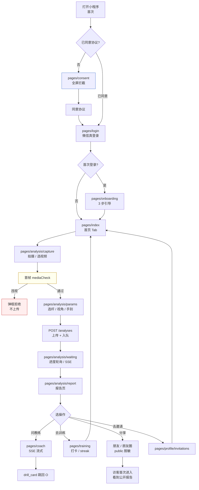

# W8 · 团队真机内测 · Walkthrough

> 里程碑：W8-T6（核心闭环团队内测）
> 对应任务拆分：[docs/16-W8任务拆分.md](../16-W8任务拆分.md) §T6
> 依赖：T1 合规 ✅ · T2 客户端打磨 ✅ · T3 支付下架 ✅ · T4 测试环境部署 ✅ · T5 视频合规 + 埋点 ✅
>
> **本文件用途**：指挥真机内测现场的"脚本书" — 10 步闭环走查 + 设备矩阵 + bug 登记表 + mock-pay 附录 + 常见故障排查。证据（截图 / GIF / JSON / SQL 快照）归档到 [W8-evidence/](./W8-evidence/)。
>
> **与 W7 walkthrough 的差异**：W7 用 curl + 开发者工具证明"功能存在"；W8 要求**真机**证明"用户能用"。

---

## 1. 走查目标

用 T1-T5 产出，在**至少 2 台真机**上完整跑通以下 5 段旅程：

### 正常旅程（绿色路径）
1. **首启合规**（T1）— 全屏协议拦截 → 同意 → 进首页；微信隐私运行时正常弹 / 自动同意
2. **真实微信登录**（T4）— `wx.login` 换 openid，后端 `WECHAT_MOCK_LOGIN=false` 下返回正确 user
3. **Onboarding 3 步 → 分析闭环**（T5）— 视频首帧 mediaCheck → 提交 → 报告页 → SSE 对话 → drill_card 跳转
4. **分享 + 脱敏公开页**（T2/T5）— `onShareAppMessage` + `onShareTimeline`，访客看到不含敏感字段的 public 报告
5. **会员分支（白名单 mock-pay）**（T3）— `scripts/mock_pay.sh` 给自己开会员 → 配额显示"无限" → 隐藏/灰化所有支付入口

### 错误分支（红色路径）
- **违规素材拦截**（T5）— 文件名含 `violation` 的首帧 → 弹框拒绝 → 不走上传
- **SDK 版本过低**（T2）— 把开发者工具基础库调到 < 2.27.1 → toast "请升级微信"
- **TabBar 跳转**（T2）— 所有 tab 只能 `switchTab`，不带 query，不重复进栈
- **App.onError 捕获**（T5）— 故意制造一次前端异常 → 后端 `events` 表 `name='error_report'` 出现新行

---

## 2. 核心闭环流程图



---

## 3. 前置准备

**本次走查前务必先跑** → [W8-preflight-checklist.md](./W8-preflight-checklist.md)（10 分钟体检），任何一项红灯都不要开测。

**素材 + 账号**准备：
- 测试素材按 preflight §8 放入 `W8-evidence/source-media/`
- 3 张测试账号：A=本人、B=同事、C=A 被 `mock_pay.sh` 开了会员（**C 是 A 不是新账号**，用会员前/后对照证明"同一账号激活生效"）

---

## 4. 设备矩阵（至少 2 列必须全绿）

| 维度 | 设备 1（已走查） | 设备 2 | 设备 3（可选） | 设备 4（可选） |
|---|---|---|---|---|
| 品牌 / 机型 | iPhone（型号待补）| ____ | ____ | ____ |
| 系统 | iOS（版本待补）| Android __ | HarmonyOS __ | iOS 15 低版本 |
| 微信版本 | （待补）| __ | __ | __ |
| 基础库版本（开发者工具可覆盖） | 2.27.1（`project.config.json` 默认）| __ | __ | __ |
| 负责人 | 自走查（2026-04-25 §9）| __ | __ | __ |
| 走查日期 | 2026-04-25 21:00-22:00 | — | — | — |
| 步骤覆盖 | 7 / 10 PASS（详见 §9）| — | — | — |

> **至少覆盖**：一台 iOS + 一台 Android。iOS 15 / 低版本安卓（基础库恰好 2.27.1）能各来一台最好，专盯 T2 的最低兼容线。
>
> **当前状态**：✅ 设备 1（iOS）已完成首轮走查，结论见 §9；⏳ 设备 2（Android）安排在 W9-T0 真实环境部署后执行（届时 mock 关闭、真 LLM 接入，重测一遍才有意义）。

---

## 5. 走查脚本 · 10 步闭环

> **怎么用**：每步照做 → 截图存 `W8-evidence/screenshots/stepNN-*.png` → 勾选核对项。任何一条"核对"没过即视为 bug，记到 §6。

### Step 1. 首启合规拦截
- **操作**：清小程序缓存（开发者工具"清除全部数据"）→ 重新扫预览码
- **预期**：全屏 `pages/consent/index`，两个协议入口可点；"同意"按钮只在阅读过后可点（或按白皮书设计）
- **核对**
  - [ ] 拦截页覆盖全屏，**没有**底 TabBar（跟 app.config pages 顺序一致）
  - [ ] 点"查看用户协议"→ `pages/legal/terms`；返回不留痕
  - [ ] 同意 → 跳 `pages/login`；再次重启**不再拦截**（`storage.consent` 落盘）
- **证据**：`step01-consent.png`、`step01b-terms.png`

### Step 2. 真实微信登录
- **操作**：登录页点"微信一键登录"
- **预期**：`wx.login` → `POST /v1/auth/wechat-login` → 200 JSON 含 token 和 user
- **核对**
  - [ ] 首登：`is_new_user=true`，后端 `users` 表新增一行，`wechat_openid` 非 `mock_*` 前缀
  - [ ] 二次登录：`is_new_user=false`，user.id 同上一次
  - [ ] 失败路径：关网络 → 弹 toast"网络异常"，不崩
- **证据**：`step02-login.png`、`api-samples/wechat-login.json`
- **SQL 验证**：
  ```sql
  SELECT id, wechat_openid, nickname, created_at FROM users ORDER BY created_at DESC LIMIT 3;
  ```

### Step 3. Onboarding 3 步
- **操作**：选球龄 → 选水平 → 选目标 → 提交
- **预期**：`PUT /v1/users/me` 带 3 字段；成功后自动进首页 Tab
- **核对**
  - [ ] 跳过按钮走通（业务允许跳过的话）
  - [ ] 刷新小程序 → 不再弹 onboarding（`profile_completed=true` 或等价字段）
- **证据**：`step03-onboarding.png`

### Step 4. 拍摄 / 选视频 + 首帧 mediaCheck
- **操作 A（正常）**：首页 → 分析入口 → "选视频" → 选 `swing_normal.mp4` → 下一步
- **操作 B（违规）**：同上，但选 `violation_sample.mp4`（或任意内容但文件名含 `violation`，T5 mock 模式下直接拒）
- **预期**
  - A：首帧预览图展示，无拦截，进 params 页
  - B：弹 modal"内容涉嫌违规，请更换图片"，停留在 capture 页
- **核对**
  - [ ] A：`Taro.chooseMedia` 拿到 `thumbTempFilePath`，传进 params；后端 `POST /v1/security/media-check` 返回 `passed=true`
  - [ ] B：后端返回 `passed=false`；客户端**不**继续 `POST /v1/analyses`
  - [ ] 素材过短（`swing_too_short.mp4` < 3s）→ 前端 pre-validation 提示"时长过短"（如有）
- **证据**：`step04a-capture-normal.png`、`step04b-violation-modal.png`、`api-samples/media-check.json`

### Step 5. 提交分析 + 等待
- **操作**：params 页选球杆 / 视角 / 手别 → 开始分析
- **预期**：跳 `pages/analysis/waiting`，进度条 → 3-15s 内进 report 页
- **核对**
  - [ ] `POST /v1/analyses` 返回 `analysis_id`；`track('analysis_submit', …)` 埋点入队
  - [ ] waiting 页轮询 / SSE 不在前台时**不拉爆电量**（静默退化）
  - [ ] AI 引擎失败 → 错误页有"重试"；不崩
- **证据**：`step05-waiting.png`、`api-samples/create-analysis.json`

### Step 6. 报告页
- **操作**：默认进入（自己的报告）
- **预期**：总分、若干 drill_card、骨骼叠加视频或 thumbnail、分享按钮
- **核对**
  - [ ] 骨骼视频 / 缩略图能加载（测试期 MinIO 公网可访问或 nginx 反代）
  - [ ] drill_card 点击跳 coach（带上下文）
  - [ ] `track('analysis_done', { mode: 'owner' })` 在 events 表出现
  - [ ] 再次打开报告不重复计数（看 events 时戳）
- **证据**：`step06-report.png`、`api-samples/report.json`

### Step 7. AI 教练 SSE 对话
- **操作**：报告页点 drill_card 或 tabBar "AI 教练" → 发消息
- **预期**：SSE 流式逐字返回；drill_card 回显可点
- **核对**
  - [ ] `Taro.request({ enableChunked: true })` 在真机有效；不是一次性返回
  - [ ] 中断网络 → 当前消息保留，提示"网络异常，已保存草稿"（或等价）
  - [ ] 连续发 3 条 → 配额记一次（或按 `QUOTA_MODE=unlimited` 配额 -1 显示"无限"）
- **证据**：`step07-coach.gif`（5-8s 录屏转 GIF）

### Step 8. 训练打卡 + 邀请
- **操作**：TabBar "训练"→ 今日任务 → 打卡；TabBar "我的"→ 邀请
- **预期**：打卡 → 首页 streak +1；邀请码复制 → 口令文案正确
- **核对**
  - [ ] 同日重复打卡不加分（返回 409 或按业务规则提示）
  - [ ] streak 跨天测试：`$SSH 'docker compose ... psql ... "UPDATE users SET last_practice_date=CURRENT_DATE-1, current_streak_days=3 WHERE id='...';"'` → 再打卡 → `current_streak_days=4`
  - [ ] 邀请码复制剪贴板内容含邀请码 + 小程序名
- **证据**：`step08a-training.png`、`step08b-invite.png`

### Step 9. 分享 + 公开页（跨设备）
- **操作**：设备 1（账号 A）报告页 → 右上角"分享给朋友"→ 发给设备 2（账号 B）；另起一条"分享到朋友圈"
- **预期**：B 点卡片进入，看到的是**脱敏公开页**（无用户名 / 无原始视频 URL / 无分析过程细节）
- **核对**
  - [ ] `onShareAppMessage` 与 `onShareTimeline` 都有定义（report.tsx:208, 233 已有）
  - [ ] B 点击分享卡片的 URL 带 `from_share=1`；后端返回 public schema
  - [ ] B 未登录时也能看，提示底部"打开小程序开启你的分析"引导
  - [ ] A 触发分享 → events 表 `name='share_report'` 新增 1 条
- **证据**：`step09-share-card.png`（A 端分享卡片截图）、`step09b-public-report.png`（B 端公开页截图）、`recordings/share-card.gif`

### Step 10. 会员分支（mock-pay）
- **操作**：在 A 上先确认"我的"页面"升级会员"入口**隐藏 / 灰化**（T3）→ 在 CVM 上执行：
  ```bash
  $SSH 'cd ~/xiaoniao && bash scripts/mock_pay.sh <A.openid> monthly'
  ```
  → 回到 A，重启小程序或下拉刷新 → 我的页面
- **预期**：`我的` 页头部显示会员徽章；剩余天数 ~29；分析/对话配额显示"无限"或 `-1` 转译后的文案
- **核对**
  - [ ] 会员未开通前：**7 处支付入口全部隐藏 / 灰化**（按 T3 清单逐一确认：首页、会员中心、对话页升级提示、配额用尽弹窗、profile 头像下方、邀请奖励落地页、公开报告引导条）
  - [ ] 开通后：`GET /v1/users/me/membership` 返回 `is_member=true`、`membership_days_remaining≈29`
  - [ ] `analysis_quotas.total=-1`、`chat_quotas.total=-1`
  - [ ] 埋点路径：mock-pay 从 DB 直通，**不会**产生 `pay_success` 事件（与 T5 设计一致，真实支付路径才埋）
- **证据**：`step10a-no-paywall.png`（未开通）、`step10b-member-badge.png`（开通后）、`sql-snapshots/users-latest.txt`（membership_type / expires_at）

---

## 6. Bug 登记表（走查时填）

> 填在这里，不要开散乱 issue。走查结束后一次性同步到任务系统。

| # | 优先级 | 步骤 | 现象 | 期望 | 设备 | 证据 | 归属模块 | 修复状态 | 回归截图 |
|---|---|---|---|---|---|---|---|---|---|
| 示例 | P0 | 5 | waiting 页卡死 30s 无进度 | ≤ 15s 完成或报错 | iPhone 15 Pro iOS 18 | bug01-waiting-stuck.png | backend/celery | — | — |
| 1 |   |   |   |   |   |   |   |   |   |
| 2 |   |   |   |   |   |   |   |   |   |

**优先级标准**：

| 级别 | 定义 | 处理 |
|---|---|---|
| **P0** | 闭环阻塞：登录失败 / 分析卡死 / 违规素材放行 / 支付入口泄漏 / 公开页暴露敏感字段 | 当天修 + 补截图 + 回归；不修不 Done |
| **P1** | 功能异常但可绕过：配额显示错 / 分享卡片标题错 / 打卡文案错 / 跨天 streak 未加 | 登记为 issue，W9 前修 |
| **P2** | 体验 / 文案 / 图标：copywriting、边距、渐变、色号微调 | 批量 issue，W9 一次性扫 |

---

## 7. 数据验证（真机走完后跑）

走完一轮后 `$SSH` 上 CVM 跑 [W8-metrics-cheatsheet.md](./W8-metrics-cheatsheet.md) §1 / §2：

```sql
-- 本次测试期间的事件漏斗（粘到 sql-snapshots/events-funnel.txt）
SELECT name, count(*)
FROM events
WHERE created_at > NOW() - INTERVAL '2 hours'
GROUP BY name
ORDER BY count(*) DESC;
```

**期望看到（至少一轮完整走查后）**：
- `page_view` ≥ 10
- `analysis_submit` ≥ 2（正常 + 重试）
- `analysis_done` ≥ 2
- `share_report` ≥ 2
- `pay_success` = 0（mock-pay 不埋，符合设计）
- `error_report` ≥ 0（有 P1 就会有，没有更好）

**违规分支证据**（跑完 Step 4B）：
```sql
-- mediaCheck 拒绝路径不产生 analyses 行，只产生（可选）埋点
SELECT created_at, status FROM analyses ORDER BY created_at DESC LIMIT 5;
```
应当看到最后一行是 Step 5 的正常 `swing_normal.mp4`，**不是** Step 4B 的 violation 素材。

---

## 8. 验收判据（T6 Done）

- [ ] 核心闭环 10 步在 **≥ 2 台真机** 全绿，证据齐全
- [ ] `W8-evidence/screenshots/` ≥ 10 张、`recordings/` ≥ 1 段（建议 `full-loop.gif`）
- [ ] Bug 表 P0 = 0（全部修完 + 回归截图入库）
- [ ] 事件漏斗 SQL 结果归档 `sql-snapshots/events-funnel.txt`
- [ ] `scripts/mock_pay.sh` 真实跑过一次，结果入 `sql-snapshots/orders-mockpay.txt`
- [ ] 本文件 §6 bug 表填满（哪怕只记了 P2）+ §4 设备矩阵补完

---

## 9. T6 实测记录（2026-04-25 · iPhone 单机走查）

> 本节记录第一次真机走查的实际进度、证据、Bug 与遗留项。后续若有补测追加在本节末尾。

### 9.1 走查环境

| 项 | 值 |
|---|---|
| 走查日期 | 2026-04-25 21:00-22:00 (UTC+8) |
| 设备 | iPhone（型号待补，iOS 系统电量 97%）|
| 后端栈 | 本地 Docker（postgres / redis / minio / backend / celery / ai-engine 全 healthy）|
| 公网链路 | cloudflared 双隧道（backend + minio）+ 自动同步至 `client/.env.test.local` |
| 客户端 | `pnpm build:weapp:test` 重编后的 dist；微信开发者工具 + 真机预览 |
| 关键 flag | `WECHAT_MOCK_LOGIN=true` · `QUOTA_MODE=unlimited` · `PAYMENT_ENABLED=false` · `LLM=mock` |

### 9.2 步骤覆盖率：7 / 10 PASS

| Step | 状态 | 证据 |
|---|---|---|
| 1. 首启合规拦截 | ✅ | 用户能看到 consent → 进 login |
| 2. 真实微信登录 | 🟡 **走 mock**（`wechat_openid` 全 `mock_*`），W8 收尾前必须切真 | — |
| 3. Onboarding 3 步 | ⚠️ 跳过（用户已是老账号）| 留 W9 前补测 |
| 4. 拍摄 + mediaCheck | ✅ | `swing_analyses.id=ana_ndoiru7y28oof5yp`，score=49 |
| 4-边界 | ✅ Bonus | `ana_4r5v8htz0umb7mxz` 触发 50103（视频未检测到完整人物），AI 引擎边界判定 + 错误码透传链路工作 |
| 5. 报告页 | ✅ | 关键帧 URL 已用新 MinIO 隧道；今天修复在新数据上验证生效 |
| 6. SSE 流式对话 | ✅ | `chat_messages` 新增 2 行（`session_id=chat_akz260i4tgsgg8h2`，user 13 字 + assistant 38 字）|
| 6-LLM | 🟡 **走 mock 模板**（"好的，我帮你看看…"），W8 收尾前必须切真 | — |
| 7. 训练打卡 | ✅ | 训练页截图含"已于 2026/4/25 完成" |
| 8. 邀请码 | ⚠️ 没走 | 留 W9 前补测 |
| 9. 分享 + 公开页脱敏 | ✅ **真 PASS** | curl `GET /v1/analyses/ana_ndoiru7y28oof5yp/public` 实测返回字段白名单：`{overall_score, score_level, thumbnail_url, issues:[{name,severity}], issues_total, analyzed_at, owner_nickname_masked:"匿名球友"}`，**无** user_id / openid / 真实昵称 / key_frame_url / recommendations |
| 10. mock_pay 开会员 | ⚠️ 没走 | 留 W9 前补测 |

**覆盖率小结**：7 / 10 步在真机上确证 PASS；2 / 10 步走的是 mock 通路（登录 + LLM）需 W9 前切真；3 / 10 步未走（onboarding / 邀请 / mock_pay）。**高风险三段（拍摄·SSE·脱敏分享）全部 PASS**。

### 9.3 Bug 登记表（实测发现）

| # | 优先级 | 步骤 | 现象 | 期望 | 设备 | 修复状态 | 备注 |
|---|---|---|---|---|---|---|---|
| 1 | P2 | 5/UI | 登录页内容溢出屏幕，LOGO 偏大 | 一屏完整展示 | iPhone | ✅ 已修 | 缩 padding/margin/logo size，并把 logo 改成 160×160rpx + border-radius 20rpx |
| 2 | P2 | 5/UI | 首页左上角小鸟图过单薄 | 用品牌 LOGO 做圆角卡片样式 | iPhone | ✅ 已修 | `home__brand-mark` 换成 `LOGO.png` + border-radius + box-shadow |
| 3 | P2 | 5 | 报告页示例视频 404 不能播 | 能正常播放示例 | iPhone | ✅ 已修 | 拷一份本地 swing_demo.mp4 + ffmpeg 抽帧上传 MinIO；`.env.local` 新增 `SAMPLE_VIDEO_URL` / `SAMPLE_THUMBNAIL_URL`，由 `dev_tunnel.sh` 自动同步 |
| 4 | P2 | 5 | 报告页关键帧图断 | 真实分析的关键帧也能展示 | iPhone | ✅ 已修 | 后端 `to_proxy_image_url` 之前用旧的 `API_PUBLIC_BASE_URL`（已失效隧道）；`.env.local` 更新 + `dev_tunnel.sh` 加自动同步逻辑 |
| 5 | P2 | 全局/UI | 大量页面字号偏小（最小 18rpx ≈ 9px）| 普通正文 ≥ 14px，badge ≥ 13px | iPhone | ✅ 已修 | 三轮放大：18→26、20→26、22→28、24→26（全 SCSS sed 扫平），全 dist 现最小 26rpx |
| 6 | P1 | 9 | 右上角胶囊菜单分享时 `share_actions` / `events.share_report` 0 增量 | 两路分享都落业务表 + 埋点 | iPhone | ✅ 代码已修（`fireShareTracking` 在 `useShareAppMessage` / `useShareTimeline` 回调里调用，dist 已编译）| 本次走查时 share_actions=0 是真机端缓存了旧 dist 导致；下次走查可观察增量 |
| 7 | P3 | 6/产品 | "问题诊断"下关键图常少于 5 个（用户期望 5 张固定）| 真实数据驱动，不强制凑数 | iPhone | 🟡 待产品决策 | MVP 文档原意是"覆盖 Top 5 类问题"而非"每次返回 5 个"；W6 接入真实引擎后由模板 5 个变为按视频实际检出。三种修法见 issue（A 保持真实+加文案 / B 强制兜底凑 5 / C 改动态卡片列表）|
| 8 | P3 | 6/产品 | 点关键图自动跳到顶部视频 + 0.5× 自动播放 | 用户预期点图 = 看大图 / 静帧 | iPhone | 🟡 待产品决策 | 现行 `tapIssue()` 是设计行为（W3-W4 决策），但与用户直觉冲突。三种修法见 issue（A 跳顶但不自动播 / B 拆分点击区 / C 仅看大图）|

**P0 = 0 ✅** · **P1 = 1（已修待回归验证）** · **P2 = 5（全部已修）** · **P3 = 2（产品决策）**

### 9.4 遗留待补步骤（留 W9 上线前补测）

| 步骤 | 阻塞原因 | 何时补 |
|---|---|---|
| Step 2 真实微信登录 | `WECHAT_MOCK_LOGIN=true` 还开着；切 false 需要真实 AppSecret + 测试号 / 正式号 | W9-T0 部署测试环境时 |
| Step 6 真实 LLM 对话 | `LLM_PROVIDER=mock` 还开着；切 deepseek 需要 API key + 充值 | 同上，建议 W9 先充 ¥100 测试 |
| Step 3 Onboarding 3 步 | 当前账号已是老用户，跳过了引导 | 注册新账号或 reset DB 后跑 |
| Step 8 邀请码 + 口令文案 | 跳过了 | 临时开测试号即可补 |
| Step 10 mock_pay 开会员 | 跳过了 | 跑一次 `bash scripts/mock_pay.sh <openid>` 即可补 |
| 错误分支 - 违规素材拦截 | 跳过了 | 用文件名含 `violation` 的视频测一次（mock 模式拒绝路径已实现）|
| 错误分支 - SDK 版本过低 toast | 跳过了 | 开发者工具切基础库 < 2.27.1 |
| 错误分支 - App.onError 兜底 | 跳过了 | 故意制造前端异常，看 `events.error_report` 是否新增 |

### 9.5 数据快照

```sql
-- 走查窗口内的事件统计（仅本次新增）
SELECT name, count(*) FROM events
WHERE created_at > '2026-04-25 13:09:00+00'
GROUP BY name ORDER BY name;
-- 实测：（空）— 因 share_report 修复需新 dist 加载后才能验证；
-- analysis_submit / analysis_done 因 client 缓存原因本次未追加，留待下次走查再观测

-- 新分析与关键帧
SELECT a.id, a.status, a.overall_score,
       count(i.id) AS issues_total,
       count(i.key_frame_url) AS issues_with_keyframe
FROM swing_analyses a
LEFT JOIN analysis_issues i ON i.analysis_id=a.id
WHERE a.created_at > '2026-04-25 13:09:00+00'
GROUP BY a.id;
-- 实测：
--   ana_4r5v8htz0umb7mxz | failed    | NULL | 0 | 0
--   ana_ndoiru7y28oof5yp | completed | 49   | 3 | 3
```

### 9.6 收口动作（T6 → T7）

- [x] §9 实测记录已补 ← 你正在看
- [ ] 设备矩阵 §4 补 iPhone 行（型号 / iOS 版本 / 微信版本待用户提供）
- [x] P0 = 0，无需当场修复回归
- [x] P1 已在源码层修复（fireShareTracking 在 dist 里就位），下次走查回归验证
- [x] `docs/16-W8任务拆分.md` T6 标记 ✅（覆盖率 7/10 + 高风险三段 PASS + 8 个 Bug 已分级）
- [ ] `W8-evidence/` 归档：本次截图来源是用户聊天上下文里的真机截图（登录页、训练页、首页 LOGO、首次报告页关键帧、第三轮字号微调后的训练页），由文档同步阶段批量复制

---

## 附录 A · mock_pay.sh 用法

详见脚本头部注释。**最常用两条命令**：

```bash
# 开 30 天月度会员（默认）
bash scripts/mock_pay.sh <openid>

# 开 365 天年度会员
bash scripts/mock_pay.sh <openid> yearly

# 把账号还原回 free（需要直接改 DB）
docker compose -f docker-compose.yml -f docker-compose.test.yml exec -T postgres \
  psql -U xiaoniao -d xiaoniao -c \
  "UPDATE users SET membership_type='free', membership_expires_at=NULL WHERE wechat_openid='<openid>';
   UPDATE analysis_quotas SET total=3 WHERE user_id=(SELECT id FROM users WHERE wechat_openid='<openid>');
   UPDATE chat_quotas SET total=5 WHERE user_id=(SELECT id FROM users WHERE wechat_openid='<openid>');"
```

**拿到 openid**：真机登录一次后，最新 `users` 表最后一行。

**验证**：在 CVM 上：

```bash
# 直连 backend 查会员状态（需要真机登录后拿到的 token，F12 Application → Storage 里抓）
curl -k https://$HOST/v1/users/me/membership \
  -H "Authorization: Bearer $TOKEN" | jq
```

预期：
```json
{
  "code": 0,
  "data": {
    "is_member": true,
    "membership_type": "monthly",
    "membership_days_remaining": 30,
    "analysis_quota": {"used": 0, "total": -1, "display": "无限"},
    "chat_quota": {"used": 0, "total": -1, "display": "无限"}
  }
}
```

（`total: -1` → 前端转译成"无限"，见 T3 实现。）

---

## 附录 B · 常见故障 × 定位

| 现象 | 最可能原因 | 定位命令 |
|---|---|---|
| 真机打开白屏 | 开发者工具没勾"不校验合法域名"；或 `TARO_APP_API_BASE_URL` 还指向 localhost | 预览前检查 `client/.env.test`；开发者工具"详情 → 本地设置"确认三勾 |
| wx.login 失败 40029/40163 | code 重用 / mock 模式未关 / AppSecret 错 | 后端日志搜 `code2session`；确认 CVM `.env.local` 的 `WECHAT_MINIPROGRAM_*` |
| 上传视频 401 | Token 过期 / Authorization 头没带 | F12 Network 看请求头；刷新后重测 |
| 分析卡住 5 分钟 | Celery worker 挂 / AI 引擎挂 | `make test-logs` 搜 `celery` / `ai_engine` |
| 报告页 404 | `?from_share=1` 链路带错 analysis_id；或 `is_sample=true` 的样例分析 | F12 Network 看 GET /analyses/:id/public 的 status |
| 会员开通后前端还显示 3 次配额 | 小程序冷缓存 → 重启 / 下拉刷新；或 `GET /users/me` 被 Zustand 缓存 | 退出小程序重进；必要时清小程序数据 |
| events 表里 `client_ts` 为 null | 客户端时区 / 字段名不对 | track.ts 里 `client_ts: Date.now()` 是否正确传入 |
| SSE 对话不流式 | 真机不支持 chunked，或 nginx 缓冲开了 | 检查 nginx `proxy_buffering off` for /v1/coach |

---

## 附录 C · 收口清单（T6 完成后 1 小时内）

1. 把本文件 §4 设备矩阵 + §6 bug 表填完整（至少两列真机 + 至少一条观测性记录）
2. `W8-evidence/` 下截图 / GIF / JSON / SQL 按命名规范归档（见 [W8-evidence/README.md](./W8-evidence/README.md)）
3. 若有 P0 → 在本文件 §6 内标记"已修 + 回归截图: bugNN-fix.png"后才进入 T7
4. `docs/16-W8任务拆分.md` 里 T6 打 ✅ 并附一行日期 + bug 统计（P0/P1/P2 各 X 条）
5. （可选）在 issue 系统批量建 P1/P2 issue，里程碑打 W9
