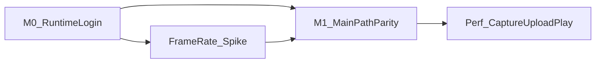

# App M0 / M1 开工清单（Q-D1 执行面）

> **状态**：已入队（2026-07-20）· **未开工**  
> **目标**：RN App 与小程序**主路径业务对等**（同一后端契约），并在拍摄 / 上传 / 报告播放上形成可量化的 App 优势。  
> **载体**：Taro 同构 [`client/`](../../client/)；平台差异只进 [`client/src/adapters/`](../../client/src/adapters/)（AGENTS §4）。  
> **真源互链**：[`docs/19`](../19-产品开发迭代计划-当前队列.md) **Q-D1 / Batch-E** · [`docs/18-W10`](../18-W10-RN-App端规划.md) · [`W10-rn-milestones.md`](./W10-rn-milestones.md) · [`W10-rn-smoke-checklist.md`](./W10-rn-smoke-checklist.md) · [`W10-weapp-apis-rn-matrix.md`](./W10-weapp-apis-rn-matrix.md)



---

## 0. 首期边界（锁定）

| 做 | 不做（本清单周期内） |
|----|----------------------|
| **iOS 优先**内测；Android 仅保持 `make client-check-rn` 不红 | Android 真机主验（可放 M1 末 / M1.5） |
| 主路径：拍 → 传 → 分析 → 报告 → 教练 → 训练打卡 | IAP / 复用小程序支付 |
| 分享：系统分享面板 | 微信胶囊 1:1 |
| 帧率 Spike（为默认拍摄档与后续 Q-D2 铺路） | Q-D2 弹道描线成片 |
| 支付入口关闭或只读会员（`TARO_APP_PAYMENT_*`） | 完整多语言（**I18N-00** 等本清单 M1 主路径勾完） |
| | 二期约球 / 教练端全量搬迁 |

**纪律**：禁止页面内 `TARO_ENV === 'weapp'`；新微信 API 先改 matrix 再改 adapter。

---

## 1. 门禁命令（每里程碑前跑）

```bash
# 首次 / 换机
make client-bootstrap-rn-shell

# RN bundle + type-check（已并入 make test / CI）
make client-check-rn
```

宿主说明见 [`client/RN_SHELL.md`](../../client/RN_SHELL.md)。Pods / 真机签 / 开放平台配置不在上述命令内。

| 项 | 值 |
|----|-----|
| API | `TARO_APP_API_BASE_URL=https://api.birdieai.cn/v1`（与体验版小程序同源） |
| 开放平台 | `TARO_APP_WECHAT_OPEN_APPID` 与移动应用一致；后端 `WECHAT_OPEN_*` + `POST /v1/auth/wechat-open-login` |

---

## 2. M0 · 运行时与账号

> 映射：**RN-1**（运行时与网络）+ 登录部分。约 1～2 周工程量。

| ID | 事项 | 验收 | 状态 |
|----|------|------|------|
| **M0-1** | `make client-bootstrap-rn-shell` + `make client-check-rn` 稳定绿 | 本地 / CI 门禁通过 | - [ ] |
| **M0-2** | API 指向 staging；EnvBadge / `BUILD_MARKER` 正确 | 非 localhost；可辨环境 | - [ ] |
| **M0-3** | 微信开放平台移动应用 + `wechat-open-login` + **unionid 合并** | 同账号小程序 / App 数据一致 | - [ ] |
| **M0-4** | 首启《用户协议》+《隐私政策》；系统相机 / 相册权限文案 | 对齐上架材料；**无**微信隐私 API | - [ ] |
| **M0-5** | `request` + 教练 SSE（`sseClient` RN 分支）冒烟 | 流式逐字出字；失败可理解 | - [ ] |

**M0 Done 条件**：上表全勾；iOS 包可安装不闪退（见 smoke §1）。

交叉参考：[W10-rn-smoke-checklist](./W10-rn-smoke-checklist.md) §1–2、§4、§8；matrix 登录 / SSE 行。

---

## 3. 帧率 Spike（M0 末 / M1 初）

> 与 Q-D2「启动第一步」对齐，**本阶段不做弹道成片**。  
> 锚点：[p2-phase2-dev-queue.md](./p2-phase2-dev-queue.md) Q-D2 决策备忘。

| ID | 事项 | 验收 | 状态 |
|----|------|------|------|
| **SP-1** | 三组对照：① 微信小程序约 30fps 片 ② 系统相机慢动作导入 ③ App 原生高帧率档 | 一页结果表：分辨率 / 帧率 / 体积 / 引擎可分析率（或硬拦率） | - [ ] |
| **SP-2** | 据此锁定 App **默认拍摄预设**（写入 adapter / 常量属下迭代编码） | 产品签字「默认档」；记入下表 | - [ ] |

### SP-1 结果表（填写）

| 组别 | 分辨率 | 标称/实测 fps | 体积（典型 5～10s） | 可分析 / 硬拦 | 备注 |
|------|--------|---------------|---------------------|---------------|------|
| 微信小程序 | | ~30 | | | |
| 系统慢动作导入 | | | | | |
| App 原生高帧率 | | | | | |

**默认档（产品签字）**：_______　日期：_______　签字：_______

---

## 4. M1 · 主路径对等（竖切）

> 映射：**RN-3**（UI 对等）+ 分析主路径；按序勾，每条与小程序同账号交叉验 1 次。

| ID | 路径 | 关键坑（matrix） | 状态 |
|----|------|------------------|------|
| **M1-1** | 首页 → 拍摄 / 相册 → params | `adapters/media` ↔ image-picker | - [ ] |
| **M1-2** | 上传 → waiting → 报告 | `uploadFile` 本地 URI；弱网重试 | - [ ] |
| **M1-3** | 报告：原片 / 骨骼 / 六维 / issue | `RadarChart.rn`、VideoContext | - [ ] |
| **M1-4** | AI 教练 SSE 闭环 | 与小程序同 session / 历史 | - [ ] |
| **M1-5** | 训练计划 + 打卡 | Tab IA 对齐 | - [ ] |

**M1 Done 条件**：M1-1～M1-5 全勾；回归对比 §6 至少完成「登录 + 一次完整分析 + 一条教练对话」。

---

## 5. 性能优势（与 M1 重叠，三项必验）

> 产品话术门槛：下列 **至少两项** 有填写记录，可对外讲「片源与传输更稳」。

| ID | 优势 | 对比方法 | 记录摘要 | 状态 |
|----|------|----------|----------|------|
| **P-1** | 拍摄清晰度 / 可用率 | 同机位同挥杆：App vs 小程序各 **5** 条；记可分析 / 硬拦比 | | - [ ] |
| **P-2** | 弱网上传成功率 | 切后台或限速；完成率与耗时 | | - [ ] |
| **P-3** | 报告 scrub 流畅度 | 长视频拖动体感 + 简要掉帧观察 | | - [ ] |

### P-1 简表（示例结构）

| # | 端 | 结果（可分析 / 硬拦码） | 备注 |
|---|-----|-------------------------|------|
| 1 | 小程序 | | |
| 1 | App | | |
| … | | | |

---

## 6. 回归对比（与小程序同账号）

- [ ] 登录后首页 / onboarding 一致（数据侧）
- [ ] 一次完整分析（拍或选片 → 报告）
- [ ] 一条教练对话（流式）
- [ ] 个人资料只读展示一致

---

## 7. 明确降级（本清单「不做」）

| 项 | 降级策略 |
|----|----------|
| 支付 | 隐藏入口或只读 `/users/me` 会员状态；**不接** `wx.requestPayment` / 首期 IAP |
| 订阅消息 | 本地推送占位，或引导「请至小程序订阅」 |
| 分享 | 系统分享面板；不追朋友圈卡片 |
| 多语言 | **I18N-00** 启动条件 = 本清单 **M1**（登录+拍+分析+报告）勾完；见 [app-i18n-market-plan.md](./app-i18n-market-plan.md) |
| 弹道 Q-D2 | 仅完成 **SP-***；描线成片另排期 |

---

## 8. 与里程碑 / 队列映射

| 本清单 | W10 milestones | docs/19 |
|--------|----------------|---------|
| M0 | **RN-1**（+ 登录） | **Q-D1** / **Batch-E** |
| SP-* | （Q-D2 前置，不占弹道交付） | Q-D2 Trigger 的「启动第一步」 |
| M1 | **RN-3** + 主路径 | **Q-D1** |
| 支付降级 | **RN-2**（本清单周期内保持降级） | — |
| 真机总表 | [W10-rn-smoke-checklist.md](./W10-rn-smoke-checklist.md) | — |

**并行关系**：公测窗口仍以 **PP-*** 为主；本清单为 App 并行泳道，**人力到位即开**，不抢 PP-12 为 P0。

---

## 9. 后续编码注意（勾选推进时）

- 默认拍摄档若变更上传体积 / 时长，须同步 [`docs/02`](../02-API接口设计文档.md) 与客户端时长门禁常量。
- 新 `wx.*` / 仅小程序 API：先补 [matrix](./W10-weapp-apis-rn-matrix.md) 再实现。

---

## 10. 修订记录

| 版本 | 日期 | 说明 |
|------|------|------|
| v0.1 | 2026-07-20 | 初版：M0 / SP / M1 / 性能三项 / 降级边界；挂 Q-D1 |
