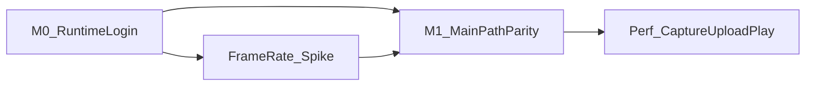

# App M0 / M1 开工清单（Q-D1 执行面）

> **状态**：**开发中（Batch-E）** · 开工日 2026-07-20  
> **目标**：RN App 与小程序**主路径业务对等**（同一后端契约），并在拍摄 / 上传 / 报告播放上形成可量化的 App 优势。  
> **载体**：Taro 同构 [`client/`](../../client/)；平台差异只进 [`client/src/adapters/`](../../client/src/adapters/)（AGENTS §4）。  
> **真源互链**：[`docs/19`](../19-产品开发迭代计划-当前队列.md) **Q-D1 / APP-*** · [`docs/18-W10`](../18-W10-RN-App端规划.md) · [`W10-rn-milestones.md`](./W10-rn-milestones.md) · [`W10-rn-smoke-checklist.md`](./W10-rn-smoke-checklist.md) · [`W10-weapp-apis-rn-matrix.md`](./W10-weapp-apis-rn-matrix.md)



---

## 0. 首期边界（锁定）

| 做 | 不做（本清单周期内） |
|----|----------------------|
| **iOS 优先**内测；Android 仅保持 `make client-check-rn` 不红 | Android 真机主验（可放 M1 末 / M1.5） |
| 主路径：拍 → 传 → 分析 → 报告 → 教练 → 训练打卡 | IAP / 复用小程序支付 |
| 分享：系统分享面板 | 微信胶囊 1:1 |
| 帧率 Spike（为默认拍摄档与后续 Q-D2 铺路） | Q-D2 弹道描线成片 |
| 支付入口关闭或只读会员（App 构建用 `.env.app`） | 完整多语言（**I18N-00** 等本清单 M1 主路径勾完） |
| | 二期约球 / 教练端全量搬迁 |

**纪律**：禁止页面内 `TARO_ENV === 'weapp'`；新微信 API 先改 matrix 再改 adapter。

---

## 1. 门禁命令（每里程碑前跑）

```bash
# 首次 / 换机
make client-bootstrap-rn-shell

# RN bundle + type-check（已并入 make test / CI）
make client-check-rn

# App 联调 / 内测包（指向 api.birdieai.cn，支付关闭）
cd client && pnpm build:rn:app
# 或 watch：pnpm dev:rn:app
```

宿主说明见 [`client/RN_SHELL.md`](../../client/RN_SHELL.md)。Pods / 真机签 / 开放平台配置不在上述命令内。

| 项 | 值 |
|----|-----|
| API（App 模式） | `client/.env.app` → `TARO_APP_API_BASE_URL=https://api.birdieai.cn/v1` |
| 开放平台 | `TARO_APP_WECHAT_OPEN_APPID`（`.env.app.local` 覆盖，勿提交）；后端 `WECHAT_OPEN_*` + `POST /v1/auth/wechat-open-login` |

---

## 2. M0 · 运行时与账号

> 映射：**RN-1**（进行中）+ 登录。`docs/19` PLAN-ID = **APP-M0-***。

| 清单 ID | PLAN-ID | 事项 | 验收 | 状态 |
|---------|---------|------|------|------|
| **M0-1** | **APP-M0-1** | `make client-bootstrap-rn-shell` + `make client-check-rn` 稳定绿 | 本地 / CI 门禁通过 | - [x] 工程：shell 幂等；`dist/index.bundle` + type-check |
| **M0-2** | **APP-M0-2** | App 构建走 `.env.app`（staging API）；EnvBadge / `BUILD_MARKER` 可辨 | `pnpm build:rn:app`；非 localhost | - [x] 工程：`.env.app` + `build:rn:app`；角标 `staging·{hash}` |
| **M0-3** | **APP-M0-3** | 微信开放平台移动应用 + `wechat-open-login` + **unionid 合并** | 配置清单见 RN_SHELL；同账号数据一致（真机） | - [x] 工程：契约 + RN_SHELL 清单<br>- [ ] **真机**：本机 AppID 授权 + unionid 合并 |
| **M0-4** | **APP-M0-4** | 首启协议；系统相机 / 相册权限文案 | 隐私 API 在 RN no-op；Info.plist 用途说明齐 | - [x] 工程：privacy no-op；`patch-rn-shell-privacy-plist.sh` |
| **M0-5** | **APP-M0-5** | `request` + 教练 SSE（`sseClient` RN 分支）冒烟 | 流式出字；失败可理解 | - [x] 工程：API health + SSE RN 单测<br>- [ ] **真机/模拟器**：教练 Tab 流式出字 |

**M0 Done 条件**：工程项全勾 **且** 真机项（M0-3 / M0-5）补签；iOS 包可安装不闪退（见 smoke §1）。

交叉参考：[W10-rn-smoke-checklist](./W10-rn-smoke-checklist.md) §1–2、§4、§8；matrix 登录 / SSE 行。

---

## 3. 帧率 Spike（M0 末 / M1 初）

> 与 Q-D2「启动第一步」对齐，**本阶段不做弹道成片**。PLAN-ID = **APP-SP-***。

| 清单 ID | PLAN-ID | 事项 | 验收 | 状态 |
|---------|---------|------|------|------|
| **SP-1** | **APP-SP-1** | 三组对照：微信 ~30fps · 系统慢动作导入 · App 原生高帧率 | 结果表填齐 | - [ ] 工具就绪 · [runbook](./app-sp1-framerate-spike-runbook.md) · `scripts/probe-video-meta.sh` |
| **SP-2** | **APP-SP-2** | 锁定 App 默认拍摄预设（编码下迭代） | 产品签字「默认档」 | - [ ] |

操作：见 [app-sp1-framerate-spike-runbook.md](./app-sp1-framerate-spike-runbook.md)。探针：`bash scripts/probe-video-meta.sh <video…>`。

### SP-1 结果表（填写）

| 组别 | 分辨率 | 标称/实测 fps | 体积（典型 5～10s） | 可分析 / 硬拦 | 备注 |
|------|--------|---------------|---------------------|---------------|------|
| 微信小程序 | | ~30 | | | |
| 系统慢动作导入 | | | | | |
| App 原生高帧率（best-effort） | | | | | 机型： |

**默认档（产品签字）**：_______　日期：_______　签字：_______

---

## 4. M1 · 主路径对等（竖切）

> PLAN-ID = **APP-M1-***。按序勾，每条与小程序同账号交叉验 1 次。

| 清单 ID | PLAN-ID | 路径 | 关键坑 | 状态 |
|---------|---------|------|--------|------|
| **M1-1** | **APP-M1-1** | 首页 → 拍摄 / 相册 → params | `adapters/media` | - [x] 工程：URI/时长规范化、RN tips、校验抽离、单测<br>- [ ] **真机**：首页→拍/相册→params |
| **M1-2** | **APP-M1-2** | 上传 → waiting → 报告 | `uploadFile` URI | - [ ] |
| **M1-3** | **APP-M1-3** | 报告：原片 / 骨骼 / 六维 / issue | `RadarChart.rn` | - [ ] |
| **M1-4** | **APP-M1-4** | AI 教练 SSE 闭环 | 同 session | - [ ] |
| **M1-5** | **APP-M1-5** | 训练计划 + 打卡 | Tab IA | - [ ] |

**M1 Done 条件**：M1-1～M1-5 全勾；回归对比 §6 至少「登录 + 一次完整分析 + 一条教练对话」。

---

## 5. 性能优势（与 M1 重叠）

> PLAN-ID = **APP-P-***。至少两项有记录。

| 清单 ID | PLAN-ID | 优势 | 对比方法 | 记录摘要 | 状态 |
|---------|---------|------|----------|----------|------|
| **P-1** | **APP-P-1** | 拍摄清晰度 / 可用率 | App vs 小程序各 5 条 | | - [ ] |
| **P-2** | **APP-P-2** | 弱网上传成功率 | 切后台 / 限速 | | - [ ] |
| **P-3** | **APP-P-3** | 报告 scrub 流畅度 | 长视频拖动 | | - [ ] |

---

## 6. 回归对比（与小程序同账号）

- [ ] 登录后首页 / onboarding 一致（数据侧）
- [ ] 一次完整分析（拍或选片 → 报告）
- [ ] 一条教练对话（流式）
- [ ] 个人资料只读展示一致

---

## 7. 明确降级（本清单「不做」）

| 项 | 降级策略 |
|----|----------|
| 支付 | `.env.app` 中 `TARO_APP_PAYMENT_ENABLED=false`；只读会员 |
| 订阅消息 | 本地推送占位，或引导小程序 |
| 分享 | 系统分享面板 |
| 多语言 | **I18N-00** 等 **M1** 勾完；见 [app-i18n-market-plan.md](./app-i18n-market-plan.md) |
| 弹道 Q-D2 | 仅 **SP-***；描线另排期 |

---

## 8. 与里程碑 / 队列映射

| 本清单 | W10 milestones | docs/19 PLAN-ID |
|--------|----------------|-----------------|
| M0 | **RN-1（进行中）** | **APP-M0-1～5** |
| SP-* | Q-D2 前置 | **APP-SP-1～2** |
| M1 | **RN-3** | **APP-M1-1～5** |
| 性能 | 体验优势 | **APP-P-1～3** |
| 支付降级 | **RN-2** | — |

**下一迭代入口（M0 Done 后）**：**APP-SP-1**（帧率对照采集）+ **APP-M1-1**（`adapters/media` 拍摄/相册）。

---

## 9. 后续编码注意

- 默认拍摄档若变更上传体积 / 时长，须同步 [`docs/02`](../02-API接口设计文档.md) 与客户端时长门禁。
- 新 `wx.*`：先补 [matrix](./W10-weapp-apis-rn-matrix.md)。

---

## 10. 修订记录

| 版本 | 日期 | 说明 |
|------|------|------|
| v0.1 | 2026-07-20 | 初版：挂 Q-D1 |
| v0.2 | 2026-07-20 | **开发中**：PLAN-ID APP-* 全表入队；`.env.app` / `build:rn:app`；Batch-E 开工 |
| v0.3 | 2026-07-20 | **M0 工程勾完**：client-check-rn 绿；RN Canvas 占位；sanitize/metro；下一迭代 **APP-SP-1 + APP-M1-1** |
| v0.4 | 2026-07-20 | EnvBadge 按 `@hash` 解析；M0-3/5 真机项拆出待签；`client-build-rn` 要求 Writing bundle |
| v0.5 | 2026-07-20 | SP-1 runbook + probe 脚本；M1-1 media 硬化（URI/preset/tips/单测） |
