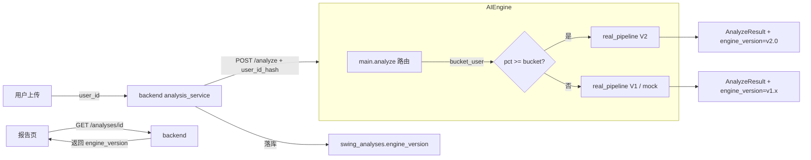

# P2-M7-14 · engine_version 字段 + AB 灰度 + V1 兜底保留 · 启动包（W14 起跑）

> 版本：v0.1（2026-05-25）
> 状态：启动输入稿
> 适用范围：二期 Phase 2.1-2.5 全周期，作为所有 M7 V2 任务的灰度框架与回滚总闸
> 上游真源（待 PR #20 合并后生效）：[`docs/23 §3.14 · P2-M7-14`](../23-二期可编码规格说明书.md#314-p2-m7-14--engine_version-字段--ab-灰度--v1-兜底保留)
> 关联：[`docs/02 §11.8 灰度策略通用规约`](../02-API接口设计文档.md)（拟）/ [`docs/03 §8.1 swing_analyses.engine_version`](../03-数据库设计文档.md)（拟）

---

## 一、文档目的与边界

### 1.1 目的

为 **P2-M7-14 engine_version 字段 + AB 灰度 + V1 兜底保留**落地一份「**W14 即可起跑、W16 灰度框架可用、W22+ 服务所有 M7 V2 任务**」的工程 SOP，让 AI 工程 + 后端 + DevOps 明确：

- 一期 `mock_pipeline` vs `real_pipeline` 单一开关现状与 V2 灰度新需求
- `engine_version` 字段写入位点 + 分桶逻辑 + 配置中心生效路径
- V1 容器双跑策略：保留 ≥6 个月，可一键全量回滚 / 按用户回滚
- 历史报告永久按落库 `engine_version` 渲染（无二次评分）
- 失败率监控自动冻档（>1.5x V1 基线）

本任务是 **M7-04 / M7-05 / M7-06 / M7-07 / M7-08 / M7-10 / M7-11 / M7-12 / M7-13** 等 9 个评分相关任务的**共同灰度门**。

### 1.2 边界（**不**做项）

| 不做 | 原因 |
| --- | --- |
| 不修改 [`docs/22`](../22-二期开发迭代计划.md) / [`docs/23`](../23-二期可编码规格说明书.md) / [`docs/05`](../05-AI模型技术规格文档.md) 字段 | 避免与 #18 / #19 / #20 race |
| 不动一期 `AI_ENGINE_MOCK_MODE` env var | 与 mock/real 单一开关并存（详 §3.5） |
| 不实现完整管理后台 UI | 灰度比例 W14-W22 走 env var + 配置中心 API；管理后台 W23+（不阻塞本任务） |
| 不实现"按 user_id 白名单"灰度 | MVP 期只做哈希分桶；白名单需求待 W23+ 评估 |
| 不引入 LaunchDarkly / Unleash 等外部 feature flag SaaS | MVP 期用 Redis + env var 自建 |

### 1.3 与其他文档的关系

```
docs/23 §3.14         ← 需求真源
docs/05 §8.9          ← 工程形态调整（已就位）
docs/02 §11.8         ← 灰度策略通用规约（拟）
docs/03 §8.1          ← engine_version 列（拟，migration 0007 加列）
本文件                 ← 分桶 + 配置 + 监控 + 回滚 SOP
  ↓ W22 回流
docs/20 §3.1 / §3.2   ← Trust / Calibration 主线共享本机制
```

---

## 二、现状盘点

### 2.1 一期 mock vs real 单一开关

```
ai_engine/app/config.py L21
  → AI_ENGINE_MOCK_MODE: bool = False   # env var 单一开关
ai_engine/app/main.py L13
  → from app.mock_pipeline import run_mock_analysis
ai_engine/app/main.py L37
  → log.info("ai_engine_starting", mock_mode=settings.AI_ENGINE_MOCK_MODE)
# 实际推理时按 mock_mode 二选一：run_mock_analysis 或 run_real_analysis
```

**结论**：一期是**进程级整库切换**——一个 ai_engine 容器只能 mock 或 real，无法在同一容器里按用户分流。M7 V2 灰度要求"5% 用户走 V2 / 95% 用户走 V1"，必须做**请求级路由**。

### 2.2 一期相关代码

| 文件 | 行数 / 要点 | V2 改造 |
| --- | --- | --- |
| `ai_engine/app/config.py` L19-22 | `AI_ENGINE_MOCK_MODE` env var | **保留**；**新增** `M7_V2_ROLLOUT_PCT` env var |
| `ai_engine/app/main.py` L13 / L36-39 / L60-90 analyze 路由 | mock vs real 单选 | **改造**：先做 V2 分桶判定，再选 mock/real V1 / real V2 |
| `ai_engine/app/__init__.py` `__version__` | 进程级 version | **保留**；**新增** `_get_engine_version(user_id_hash)` 函数 |
| `ai_engine/app/schemas.py` `AnalyzeResult` | 无 `engine_version` 字段 | **新增**：`engine_version: str`（必填，每报告都有） |
| `backend/app/models/analysis.py` | 无 `engine_version` 列 | **新增**：migration 0007 加列 `String(20)`，default `'v1'` |
| `backend/app/services/analysis_service.py` | 调 AI engine 时不传 `user_id_hash` | **改造**：调用 AI engine 时传 hint `user_id` 或 `target_engine_version` |
| `backend/app/api/v1/analyses.py` 报告查询 | 返回报告时不带 engine_version | **改造**：响应携带 `engine_version` 字段 |
| `client/src/types/analysis.ts` `AnalysisReportResponse` | 无 engine_version | **新增**：可选字段（兼容 V1 老数据） |

### 2.3 已知缺口（vs docs/23 §3.14 FR）

| FR | 现状 | 缺口 |
| --- | --- | --- |
| FR-1 `swing_analyses.engine_version` 入库 | ❌ 无 | Alembic 0007 + ORM model |
| FR-2 哈希分桶 5/25/50/100 | ❌ 无 | `bucket_user(user_id, pct)` 函数 + env var |
| FR-3 配置中心控制 pct | env var only | Redis 读取 + 60s ttl + 管理 API（admin endpoint） |
| FR-4 V1 容器/代码保留 ≥6 个月 | mock+real 同一容器 | **新增** docker-compose V1 / V2 双容器；docker tag `ai-engine:v1.x` / `v2.x` |
| FR-5 旧报告按 engine_version 渲染 | 客户端不感知 | report.tsx 按 engine_version 走不同字段读取（V1 无 confidence，不展示） |
| FR-6 失败率监控 >1.5x 自动冻档 | 无失败率分版本统计 | Prometheus / log 聚合 + alertmanager 规则 |

---

## 三、模块设计

### 3.1 架构图



### 3.2 新增/改造一览

| 模块 | 路径 | 职责 | 工程量 |
| --- | --- | --- | --- |
| 分桶 | `ai_engine/app/version_router.py`（新） | `bucket_user(user_id, pct) -> bool` + `get_engine_version()` | 1 PD |
| 配置中心 | `ai_engine/app/version_router.py` 同模块 | Redis 读取 pct，60s ttl | 1 PD |
| 路由集成 | `ai_engine/app/main.py` analyze 路由 | V1 / V2 分流 + engine_version 写入 | 1 PD |
| Schema | `ai_engine/app/schemas.py` + `backend/app/schemas/analysis.py` | 增 `engine_version` | 0.5 PD |
| DB migration | `backend/alembic/versions/0007_*.py` | `swing_analyses.engine_version VARCHAR(20) DEFAULT 'v1'` | 0.5 PD |
| Admin API | `backend/app/api/v1/admin/rollout.py`（新） | `POST /admin/engine-rollout {pct: 25}` | 1 PD |
| Docker 双容器 | `infra/deploy/docker-compose.ai-v2.yml` | `ai-engine:v1.x` + `ai-engine:v2.x` | 1 PD |
| 监控 | `infra/monitoring/alerts/engine-version-failure-rate.yml` | Prometheus rule + alertmanager | 1 PD |
| 单测 | `tests/test_version_router.py` 等 | 分桶分布 + 配置切换 | 1 PD |

**合计：~8 PD**（与 docs/23 §3.14 估时 4 PW 略宽，含双容器 docker-compose + monitoring buffer）

### 3.3 `version_router.py` 分桶逻辑

```python
import hashlib
from typing import Literal

EngineVersion = Literal["v1.x", "v2.0"]

def _user_bucket(user_id: str) -> int:
    """user_id → [0, 100) 整数桶。md5 hash 取后 32 bit % 100"""
    h = hashlib.md5(user_id.encode("utf-8")).hexdigest()
    return int(h[-8:], 16) % 100

def get_engine_version(user_id: str, current_pct: int) -> EngineVersion:
    """current_pct 来自 Redis 缓存（60s ttl）；fallback env var M7_V2_ROLLOUT_PCT；fallback 0"""
    if _user_bucket(user_id) < current_pct:
        return "v2.0"
    return "v1.x"
```

**关键不变量**：

- 同一 `user_id` 在 pct 不变期间**永远落同一桶**（哈希稳定）
- pct 从 25 升到 50 时：原 25% 用户**保持** V2；新 25% 用户**升级** V2（不回退）
- pct 从 50 降到 25 时：50% 用户中**有一半被降级回 V1**（紧急回滚场景，需提示运维）

### 3.4 配置中心契约

```
Redis Key: m7:v2:rollout_pct
Value:     "5" | "25" | "50" | "100"
TTL:       60 秒（强制刷新）
```

Admin API（仅 admin role 可调）：

```
POST /v1/admin/engine-rollout
Body: { "pct": 25 }
Response: { "previous_pct": 5, "current_pct": 25, "effective_at": "...", "users_affected_estimate": 20000 }
```

> **降级保护**：当 `new_pct < previous_pct` 时返回 `confirm_required: true`，需要 admin 再次确认（防止误操作）。

### 3.5 与一期 `AI_ENGINE_MOCK_MODE` 并存

| 场景 | AI_ENGINE_MOCK_MODE | M7_V2_ROLLOUT_PCT | 实际走 |
| --- | --- | --- | --- |
| 本地开发 | true | * | mock |
| 生产 W14 前 | false | (未设) | real V1 |
| 生产 W17 灰度启动 5% | false | 5 | 5% real V2，95% real V1 |
| 生产灰度 100% | false | 100 | real V2 |
| 紧急回滚 | false | 0 | real V1 |
| CI 单测 | true | 0 | mock |

**路由优先级**：`AI_ENGINE_MOCK_MODE=true` → mock；否则按 pct 分桶选 V1/V2。

### 3.6 V1 容器双跑策略

| 阶段 | docker tag | 副本数 | 触发条件 |
| --- | --- | --- | --- |
| W14-W16 | `ai-engine:v1.x` only | 2 | V2 未上线 |
| W17 灰度启动 | `ai-engine:v1.x` ×2 + `ai-engine:v2.0` ×1 | 3 | 5% V2 |
| W22 灰度 50% | `ai-engine:v1.x` ×2 + `ai-engine:v2.0` ×2 | 4 | 流量均分 |
| W30 灰度 100% | `ai-engine:v1.x` ×1 + `ai-engine:v2.0` ×3 | 4 | V1 仍保留 1 副本"冷待"以防回滚 |
| W30+6mo 退役 | `ai-engine:v2.x` only | 3 | 无回滚需求 |

> **关键**：W14-W30+6mo **保留** `ai-engine:v1.x` 镜像 / 代码分支，git tag `engine-v1-frozen-YYYYMMDD`。

### 3.7 失败率监控（FR-6）

```yaml
# infra/monitoring/alerts/engine-version-failure-rate.yml
- alert: EngineV2FailureRateExceedsBaseline
  expr: |
    (rate(ai_engine_failed_total{engine_version="v2.0"}[5m]) /
     rate(ai_engine_total{engine_version="v2.0"}[5m]))
    > 1.5 *
    (rate(ai_engine_failed_total{engine_version="v1.x"}[5m]) /
     rate(ai_engine_total{engine_version="v1.x"}[5m]))
  for: 10m
  labels:
    severity: critical
  annotations:
    summary: "V2 失败率 > V1 基线 1.5x，自动冻档"
    action: "调用 POST /admin/engine-rollout {pct: 0} 并通知 @ai-team"
```

触发后**自动**调 `/admin/engine-rollout {pct: 0}` 冻档；alertmanager 发企微 / 飞书。

---

## 四、字段 / 配置草案 v0.1

### 4.1 数据库

```sql
-- migration 0007_swing_analyses_v2_columns.py（与 P2-M7-04 / M7-06 共用 migration）
ALTER TABLE swing_analyses ADD COLUMN engine_version VARCHAR(20) NOT NULL DEFAULT 'v1';
CREATE INDEX idx_swing_analyses_engine_version ON swing_analyses(engine_version);
```

回滚脚本：

```sql
DROP INDEX idx_swing_analyses_engine_version;
ALTER TABLE swing_analyses DROP COLUMN engine_version;
```

### 4.2 响应字段

```jsonc
// GET /v1/analyses/{id}
{
  "analysis_id": "...",
  "engine_version": "v2.0",       // FR-1 必填
  // ... 其他字段
}
```

V1 报告 `engine_version: "v1"`（migration default）；V2 报告 `engine_version: "v2.0"`。

### 4.3 客户端渲染分支

```ts
// client/src/pages/analysis/report.tsx
const isV2 = report.engine_version?.startsWith('v2');
// V2 才展示 analysis_confidence 色块 / 重拍 CTA / 双套标尺脚注
{isV2 && <TrustBadge confidence={report.analysis_confidence} />}
```

---

## 五、验证数据

### 5.1 单测（必）

- `tests/test_version_router.py`：
  - 1000 个随机 user_id 走 `_user_bucket`，桶分布卡方检验（10% 容差）
  - pct 5/25/50/100 升序变化时桶覆盖单调递增
  - pct 降序变化时检测"用户降级"日志

### 5.2 灰度切换演练（AC-1）

- staging 环境：模拟 1000 user_id 调用 100 次 → 验证 V1 / V2 比例符合 pct ±5%
- W17 起每周演练一次 pct 切换：5→25→50→100→0（紧急回滚）

### 5.3 V1 / V2 双跑稳定性（AC-2）

- W17-W21 ≥4 周双跑；监控 V1 / V2 各自的失败率、P95 延迟、分数分布
- 历史报告 100 条采样：V1 落库报告查询响应字段无 V2 新字段（兜底 null）

### 5.4 失败率冻档演练（AC-4）

- staging 故意往 V2 注入 100% 失败：alert 触发 ≤10min；自动冻档 pct=0 ≤30s

---

## 六、W14-W22 周计划

> 本任务是基础设施，W14 启动后**所有** M7 V2 任务共享其灰度能力。

| 周 | 任务 | DoD |
| --- | --- | --- |
| **W14** | 本文件评审；冻结分桶哈希算法；migration 0007 PR | ☑ migration 评审通过；☑ `version_router.py` 接口签名 review |
| **W15** | `version_router.py` 实现 + 单测；admin API 后端 | ☑ 单测桶分布 ≤5% 偏差；☑ admin API smoke |
| **W16** | main.py 路由改造 + AnalyzeResult schema | ☑ 端到端 smoke：env var pct=50 → V1/V2 大致均分 |
| **W17** | docker-compose 双容器 + V1 image tag `engine-v1-frozen-W17` | ☑ V1 / V2 双容器 staging 跑通；☑ git tag 落定 |
| **W18** | Prometheus metrics labels（engine_version）+ alert rule | ☑ Grafana 看板 V1 / V2 分版本失败率可视化 |
| **W19** | 配置中心 Redis 接入 + 60s ttl | ☑ Redis 改 pct 后 60s 内生效（端到端验证） |
| **W20** | 失败率自动冻档演练 | ☑ AC-4 通过 |
| **W21** | 客户端 report.tsx 按 engine_version 分支渲染 | ☑ 老 V1 报告查询不展示 V2 字段；新 V2 报告完整展示 |
| **W22** | 与首个 M7 V2 任务（M7-04 / M7-06）联调启动 5% 灰度 | ☑ AC-1/2/3 全勾；☑ 监控周报启动 |

---

## 七、责任 / 风险 / 验收

### 7.1 责任

| 角色 | 责任 |
| --- | --- |
| AI 工程 Lead | 总 owner；version_router + main 路由 + V1 双跑 |
| 后端 | migration 0007 + admin API + 报告响应字段 |
| DevOps | docker-compose 双容器 + Prometheus alert |
| 客户端 | report.tsx 按 engine_version 分支渲染 |
| 算法（M7 各任务 owner） | 各自 V2 实现挂 `engine_version=v2.0` |

### 7.2 风险

| ID | 风险 | 兜底 |
| --- | --- | --- |
| R-01 | 哈希分桶不均匀（少数桶用户 >> 多数桶） | 单测卡方检验；偏差超 ±5% 改用 sha256 哈希 |
| R-02 | 紧急回滚后部分 V2 报告查询失败 | 历史 V2 报告**永远**可用：response 兜 `engine_version=v2.0` 字段，客户端按版本渲染 |
| R-03 | V1 容器代码 6 个月后被误删 | git tag `engine-v1-frozen-YYYYMMDD`；docker registry 双区域备份 |
| R-04 | 失败率分母过小导致假警报 | alert 加 `for: 10m` + `min request count >= 100` 双过滤 |
| R-05 | 灰度 pct 切换瞬间用户体验切换（同一用户连续两次报告版本不同） | 单 user_id 哈希稳定不变；pct 仅在升档时影响"边缘"用户 |
| R-06 | docs/03 §8.7 已规划 migration 0007 但与 M7-04 / M7-06 共用导致 PR 顺序冲突 | 三任务共用 PR-A（仅 migration 0007），各任务 PR 引用；详 §9.1 协作 |

### 7.3 AC 兜底（复述 docs/23 §3.14）

- [ ] **AC-1**：管理后台 / API 一键调整 pct（5/25/50/100）→ 60s 内生效
- [ ] **AC-2**：V1 / V2 双容器 staging 稳定 ≥4 周
- [ ] **AC-3**：历史报告渲染始终按落库时的 `engine_version` 数据
- [ ] **AC-4**：失败率 >1.5x 基线 → 自动冻档（pct=0）+ 报警

---

## 八、附录

### 8.1 与所有 M7 V2 任务的协作

| M7 任务 | 灰度挂载点 |
| --- | --- |
| M7-04 机位标尺 | 双 angle scoring 在 V2 容器；V1 容器只跑单套 |
| M7-05 球杆标尺 | category scoring 在 V2 容器 |
| M7-06 置信度 | analysis_confidence 字段仅 V2 容器输出 |
| M7-07 阶段分割 V2 | 新 segmenter 仅在 V2 容器加载 |
| M7-08 新特征 5 个 | 新 features 仅 V2 容器计算 |
| M7-10 诊断 V2 | RuleEngine 仅 V2 容器加载 |
| M7-11 推杆 pipeline | 独立 pipeline 仅 V2 容器路由 |
| M7-12 切杆 pipeline | 同上 |
| M7-13 多挥识别 | 多挥识别仅 V2 容器启用 |
| M7-15 用户反馈 | 反馈数据带 engine_version 标签便于回归 |
| M7-16 LLM 文案 | 差异化文案仅 V2 报告启用 |

### 8.2 监控指标清单

| 指标 | 标签 | 告警阈值 |
| --- | --- | --- |
| `ai_engine_total{engine_version}` | v1.x / v2.0 | — |
| `ai_engine_failed_total{engine_version}` | v1.x / v2.0 | V2 / V1 > 1.5x（FR-6） |
| `ai_engine_p95_latency_seconds{engine_version}` | v1.x / v2.0 | V2 > V1 × 1.3 |
| `ai_engine_overall_score{engine_version}` direct distribution | v1.x / v2.0 | V2 vs V1 KS-test p < 0.01 时人工 review |

### 8.3 V1 代码冻结清单

- `ai_engine/app/pipeline/constants.py`（一期 15 特征 + 单套权重）
- `ai_engine/app/pipeline/diagnose.py`（一期 15 rule）
- `ai_engine/app/pipeline/scoring.py`（单套打分）
- `ai_engine/app/pipeline/real_pipeline.py`（一期主入口）
- git tag：`engine-v1-frozen-2026-MM-DD`（W17 时打 tag）

---

## 九、变更记录

| 版本 | 日期 | 变更 |
| --- | --- | --- |
| v0.1 | 2026-05-25 | 初版；分桶 + 配置中心 + 双容器 + 监控 + W14-W22 周计划 |
| v0.2 | W22 收尾 | 与 M7-04 / M7-06 联调后回流 docs/02 §11.8 + docs/05 §8.9 |
